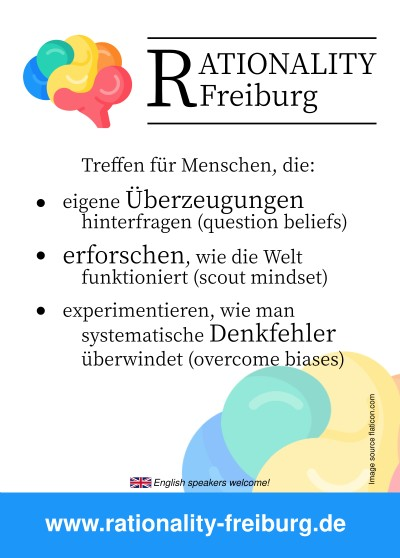
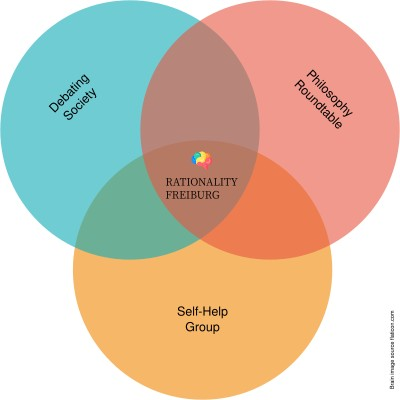

# Design

Graphical and such resources e.g. flyers, logos.

The .svg files are all edited with Inkscape.

# Licenses

## flyer.svg

[flyer.svg](flyer.svg) is licensed under [Attribution-ShareAlike 4.0
International](http://creativecommons.org/licenses/by-sa/4.0/) excepting the
brain icon which has its own license and which needs to be credited separately
(but can be used for free for commercial and non-commercial purposes) as
flaticon.com . Please credit the work with www.rationality-freiburg.de .

## about-venn-diagram.svg

[about-venn-diagram.svg](about-venn-diagram.svg) is licensed under
[Attribution-ShareAlike 4.0
International](http://creativecommons.org/licenses/by-sa/4.0/) excepting the
brain icon which has its own license and which needs to be credited separately
(but can be used for free for commercial and non-commercial purposes) as
flaticon.com . Please credit the work with www.rationality-freiburg.de .
