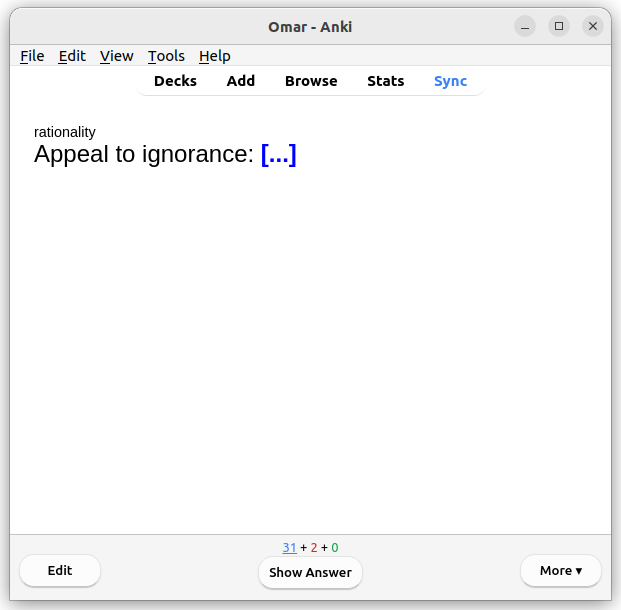

<!-- Global style -->

<!-- _class: title-slide -->

# Rationality 101
## Part 1

Jan 31st 2025

[www.rationality-freiburg.de](https://www.rationality-freiburg.de)

---

# What will you get?

* Understand what **rationality** is:
  * epistemic rationality 
  * instrumental rationality
* Why this matters and why you should **care**
* Dismiss some common **myths**
* Learn a few useful **techniques** to become _more rational_

---

# So ... what is rationality?

* Write down your answers
* No fancy definitions, just your own words
* What is _epistemic_ rationality?
* What is _instrumental_ rationality?
* Let's compare

---

# Rationality: Definition 1

**Judgement** and **decision making** under _uncertainty_.

* **Judgement:** What should I believe? → epistemic
* **decision making**: What should I do? → instrumental
* _uncertainty_: I don't have all the information. The world is complicated.

---

# Rationality: Definition 2

The art of thinking in ways that result in **true beliefs** and **good decisions**.

* **true beliefs:** What should I believe? → epistemic
* **good decisions**: What should I do? → instrumental

---

# True Belief

* Correlates with reality
* High(er) explanatory power (past)
  * Germ theory vs. miasma theory.
* High(er) predictive power (future)
  * Judging traffic to cross safely.
* ... relative to some other belief
* _True(er) belief_

---

# Good decision

* Gets you closer to YOUR goals

---

# Myth: Rationality is Cold and Emotionless

* **Reality:** Emotions inform goals.
* Rationality helps align actions with what you **care about**.
* Your emotions drive your desires. Rationality ensures your actions match those desires.
* Even the pursuit of knowledge for its own sake is driven by your desire for knowledge!

---

# Accurate models also include people and yourself

* What makes other people tick?
* What makes YOU tick?
* Does your boss reward the wrong colleagues?
* Would you like to go to the gym early in the morning?

---

# Embrace errors

* It's not about being right but ...
* ... becoming less wrong
* Please do NOT change your answers

---

<!-- Scoped style -->

# Q1

* Lake with a patch of water lilies.
* Every week the patch doubles in size.
* After 10 weeks the lake is completely covered.
* (Approx.) after how many weeks is the lake **half covered**?

---

# Amanda

* This is Amanda, 38 years old.
* Grew up and lives in Baltimore, USA.
* Attended all BLM marches in her city from 2020 to 2022.
* Enjoys Italian-style espresso.
* **Task:** Assign probabilities to the next statements.

---

# Q2

How likely is Amanda to be a primary school teacher by profession?

---

# Q3

How likely is it that Amanda grew up in a single-parent home?

---

# Q4

How likely is Amanda to be a primary school teacher that is also active in the feminist movement?

---

# Let's compare answers

---

# Exponential Growth: Why We Fail

- Exponential processes don't exist naturally for long.

---

# The Conjunction Fallacy: Why We Fall for It

* Usually when another person presents us with information it's relevant
* We judge likelihood by how easy something is to imagine.
  * In our mind: more details = more probable.
  * In reality: more details = less probable.

---

# Why care?

* There are good reasons for the previous _mistakes_.
* Are they really mistakes?
* Why should we even care?
* Because:
  * We live in a world where exponentials exist: pandemics, economic growth, retirement savings
  * We live in a world where bad actors can exploit the conjunction fallacy
  * ... the same is true for all other cognitive biases

---

# Defenses Against Bias

* Exponentials: Ignore intuitions, **do the math**.
* Conjunction fallacy: Beware of detailed stories.
  * Every "and" significantly lowers the probability.

---

# Think About Things

<!-- Pay attention to the lyrics, not the video -->

[youtu.be/VFZNvj-HfBU](https://youtu.be/VFZNvj-HfBU)

---

# Q5

What is the song about? Write down you answer.

---

Samantha boarded the 8:15 AM train, just like every weekday, settling into her usual window seat. She glanced at her phone — 7% battery. She put it away and looked out the window as the train rumbled forward.

At the next stop, a man in a gray coat took the seat across from her. He nodded politely, then unfolded a newspaper. Samantha barely noticed—she had seen him before, though she wasn’t sure where.

The train slowed, and she absently glanced at the display above the doors: “Next Stop: Westford”. The doors slid open, and Samantha stepped onto the platform.

---

# Write down thoughts

---

# Noticing Confusion

* Huh?
* I am surprised!
* I just heard something that is in conflict with something I believe.
* ... it's probably nothing.

---

# Noticing Confusion - Examples

* My boss suggested a meeting next Monday, even though he shouldn't be here plus Monday is his travel day
* At the doctor's when measuring blood pressure - why are there two numbers instead of one? I notice I have a patchy understanding.
* While playing _Diplomacy_ a player said we were in winter even though I "knew" we were in fall.
* Peditrician's voice mail instructing to call after 9 a.m.
* Old files in a warehouse (from rationality.org)

---

# Table tennis

A player and trainer with decades of experience tries to encourage me to sign up my kids for table tennis lessons because he claims they improve concentration and focus, which is beneficial for school.

* Q6: Do you expect he is right about this? Why?
* Q7: Assume the opposite i.e. he is in fact wrong/right, figure out a plausible explanation why.

---

# Table tennis 2

* He may very well be right, I simply don't know!
* BUT, the fact that he observes kids playing table tennis displaying better concentration than average is not enough evidence. Why?
* Possible explanation:
  * To play table tennis successfully you need great concentration
  * Kids who lack great concentration are more likely to give up
  * End result: population of kids that are great at table tennis and have good concentration
  * Pure selection

---

# Swimmer's Body Illusion

---

# Coin flipping

* Everyone needs one coin
* The side with a number is T **tails** (the other H heads)

<!-- Survivorship bias, data snooping -->
<!-- I made person X flip N times heads/tail. Amazing right? I chose N because... -->
<!-- It's easy to see patterns after the fact. -->

---

# Faulty Reasoning (Clearer Thinking)

[programs.clearerthinking.org/faulty_reasoning_quiz.html](https://programs.clearerthinking.org/faulty_reasoning_quiz.html)

- Do "Learn about the fallacies first"
- ... and all extra activities

---

# Why Facts Don’t Change Our Minds

https://www.newyorker.com/magazine/2017/02/27/why-facts-dont-change-our-minds

---

# Group discussion

---

# Summary

* Rationality (epistemic and instrumental).
* Some reasoning mistakes to watch out for.
* A technique: Noticing Confusion.
* It's not about perfection, it's about being incrementally _less wrong_.
* Meta-rationality: Explicit reasoning and modelling is ONE tool in your toolbelt.
  * It's very valuable but also expensive (time, energy).

---

---

---

---

---

---

---

---

---

---

---

---

---

---

---

---

---

---

---

# Anki Deck

[Anki installation](https://apps.ankiweb.net/#download) (Windows, macOS, Linux, Android, iOS).

There is an Anki deck with the previous questions and more for you to download on the event page:

[rationality-freiburg.de/events/2025-01-31-rationality-101-part1/](https://www.rationality-freiburg.de/events/2025-01-31-rationality-101-part1/)

---

# The Scout Mindset

Available as printed book, audio book and ebook in all the usual places.

---

# Rationality

Available as printed book, audio book and ebook in all the usual places.

---

# Harry Potter and the Methods of Rationality

- Audio book (Audible)
- [hpmor.com](https://hpmor.com/)

---

# The Sequences

- Rationality: From AI to Zombies on Amazon
  - Printed book
  - Audio book (Audible)
  - Kindle ebook
- [readthesequences.com](https://www.readthesequences.com/)

---

# Clearer Thinking - Podcast & Tools

[clearerthinking.org](https://www.clearerthinking.org/)

---

# See you in 2 weeks!

## Rationality 101 - Part 2

Friday, February 14th

[rationality-freiburg.de/events/2025-02-14-rationality-101-part2/](https://www.rationality-freiburg.de/events/2025-02-14-rationality-101-part2/)

---

# Newcomer Form

## First time at our meetups?

[rationality-freiburg.de/nf](https://www.rationality-freiburg.de/nf/)

Also available in paper form!

---

# Feedback Form

## Everyone!

### (also newcomers)

[rationality-freiburg.de/ff](https://www.rationality-freiburg.de/ff/)

Also available in paper form!

---

# Sources

- Lily pad: https://pixabay.com/photos/leaves-plants-lily-pads-water-lily-238452/
- Woman smiling: https://pixabay.com/photos/woman-smiling-portrait-outdoors-7175038/
- Swimmer: https://pixabay.com/illustrations/swimming-swimmer-pool-race-athlete-7004451/
