<!-- Global style -->

<!-- _class: title-slide -->

# Rationality 101
## Part 2

Feb 14th 2025

[www.rationality-freiburg.de](https://www.rationality-freiburg.de)

---

# What will you get?

* Reminder what **rationality** is:
  * epistemic rationality 
  * **Today's focus:** instrumental rationality
* What are good decisions?
* Expected value (EV) calculations
* The value of your time
* Discussion group "Stupidity: Our biggest threat?"
* (Maybe: Signal Detection Theory)

---

# So ... what is rationality?

* Write down your answers
* No fancy definitions, just your own words
* What is _epistemic_ rationality?
* What is _instrumental_ rationality?
* Let's compare

---

# Rationality: Definition 1

The study of **judgement** and **decision making** under _uncertainty_.

* **Judgement:** What should I believe? → epistemic
* **decision making**: What should I do? → instrumental
* _uncertainty_: I don't have all the information. The world is complicated.

---

# Rationality: Definition 2

The art of thinking in ways that result in **true beliefs** and **good decisions**.

* **true beliefs:** What should I believe? → epistemic
* **good decisions**: What should I do? → instrumental

---

# True Belief

* Correlates with reality
* High(er) explanatory power (past)
  * Germ theory vs. miasma theory.
* High(er) predictive power (future)
  * Judging traffic to cross safely.
* ... relative to some other belief
* _True(er) belief_

---

# Decisions

* Think of any bad decision you made in the last 12 months. Big or small. You don't have to share.
* Think of any good decision you made in the last 12 months.

---

# Good decisions?

* Emily spent half her paycheck on lottery tickets. She won a million dollars.
* Javier invested in a diversified index fund. Five years later, his savings had doubled.
* Aisha followed her doctor's advice and got the flu vaccine. A rare side effect caused her to feel sick for weeks.
* Tom decided to drive home drunk. He got pulled over and lost his license.

---

# What IS a good decision?

* What is the purpose of **classifying** into good and bad decision?
* Frequently we judge only based on the **outcome**. Good outcome, good decision. Bad outcome, bad decision.
  * Regret for regret's sake is **pointless**.
  * (Feeling joy for joy's sake about a past decision _may_ be good.)
* The only reason for classifying: Making better decision in the **future**.
* **Good decision:** Given my constraints at the time it had a better **EV** than the alternatives.

---

# Expected Value (EV)

* (_Erwartungswert_ in German)
* We use it intuitively all the time
* ... but we also frequently ignore it

---

# The Taxi Dilemma

You're in a foreign city for an important meeting. It's rush hour, and you need to get to your destination **as quickly as possible**.  

There are two taxis available:  

- One is a **shiny new sedan**, driven by a well-dressed driver who looks calm and professional.  
- The other is an **older, slightly dented car**, with a driver who seems restless, tapping the steering wheel impatiently.  

You really can’t afford to be late. **Which taxi do you take? Why?**  

---

# Bet

* If a **six** comes up I give you 100€
* Any **other number**, you give me 1€
* Do you take the bet?

* Let's say we played three rounds. Numbers were five, two, two. **You lost 3€**. Was it a **mistake** to play?

---

# EV

The average outcome you’d get if you made the same decision many times.

It combines the possible results with how likely they are, helping you choose the option that leads to the best long-term gains—even if a single outcome might be unlucky.

Calculation: Multiply each outcome's value by its probability; then add everything up.

---

# EV Calculation

$$  
EV = \sum P(x_i) \cdot x_i  
$$  

- Chance of rolling a **six**: 1/6, payout = **100€**  
- Chance of rolling **one to five**: 5/6, payout = **-1€**  

$$  
EV = \left(\frac{1}{6} \times 100\right) + \left(\frac{5}{6} \times (-1)\right)  
$$  

$$
EV = \frac{100}{6} - \frac{5}{6} = \frac{95}{6} \approx \text{16€}
$$

---

# Exercise: Backup

* Personal PC/laptop with your data
  * Combine multiple devices into one
* Do you have a backup?
  * If yes, imagine you don't.
* Visualize total data loss
  * How much would you pay for recovery? Write it down.

---

# Exercise: Backup 2

* Imagine 1,000 people in very similar life circumstances as you currently.
* How many of them will suffer a total data loss within the next 3 years? Your best guess. (hardware crash, water damage, laptop lost, ...)
* Convert that to a probability and write it down:
  * e.g. 500 people = 500 / 1000 = 50%
  * e.g. 1 person = 1 / 1000 = 0.1%
* This is your probability of data loss within the next 3 years.

---

# Exercise: Backup 3

* What would be the monetary costs for a backup?
  * External hard disk(s) (e.g. 100€)
  * Cloud service (e.g. 10€/month)
  * Backup software (e.g. 50€/year)
* How much do you dislike taking care of this, shopping, configuring etc.?
  * How much would you pay someone else to do it for you?
* Add it all up for total 3 year costs.

---

# Exercise: Backup 4

* EV of setting up a backup: ...
* EV of NOT setting up a backup: ...
* So ... what does this mean?
* Did the result surprise you? (it surprised me!)
* Use it as additional input for your decision. Explicit EV calculations are a tool to **help** making decisions.
* Don't let a spreadsheet tell you what to do with your life 😉

---

# Some techniques/tips

* Commitment buddies
* Yoda timers
* [_Half-assing it with everything you've got_](https://mindingourway.com/half-assing-it-with-everything-youve-got/)
  * [minimum effective dose](https://winnielim.org/journal/minimum-effective-dose/)
* TAPs

---

# Some techniques/tips 2

* Murphyjitsu
* Beeminder
* Focusmate
* Internal double crux
* Aversion factoring
* Gendlin's focusing

---

# Value Of Your Time (Clearer Thinking)

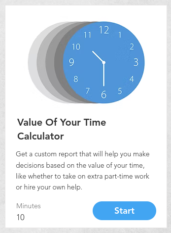

[programs.clearerthinking.org/what_is_your_time_
really_worth_to_you.html](https://programs.clearerthinking.org/what_is_your_time_really_worth_to_you.html)

- Read the texts carefully
- Even if you have done it before, consider doing it again (my value changed since two years ago)

---

# Stupidity: Our biggest threat?

If you did NOT read it, do so now.

[onepercentrule.substack.com/p/stupidity-our-biggest-threat](https://onepercentrule.substack.com/p/stupidity-our-biggest-threat)

---

# Group discussion

- 5 people per group
- Choose one moderator
- Make sure to (also) discuss [Stupidity: Our biggest threat?](https://onepercentrule.substack.com/p/stupidity-our-biggest-threat)
- Who read [The Spiral of Wrath: The crash of Armavia flight 967](https://admiralcloudberg.medium.com/the-spiral-of-wrath-the-crash-of-armavia-flight-967-c7d84541f0f7)?

---

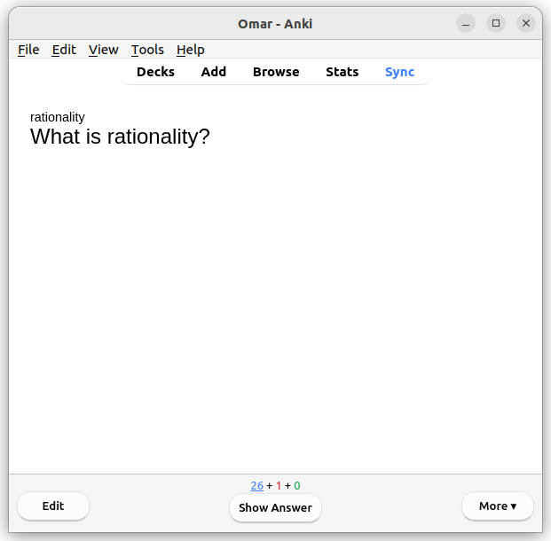

---

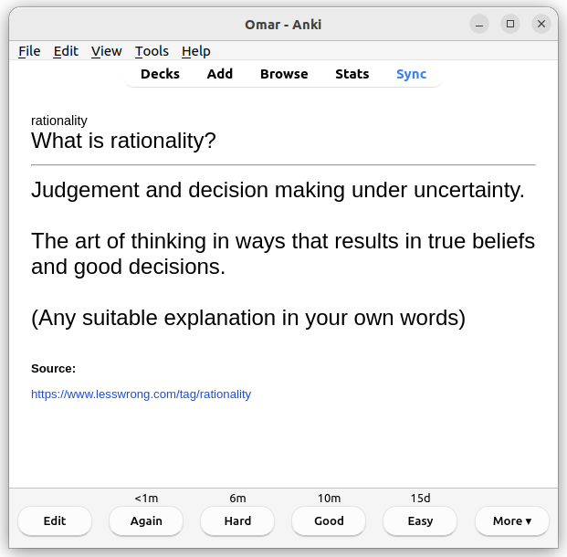

---

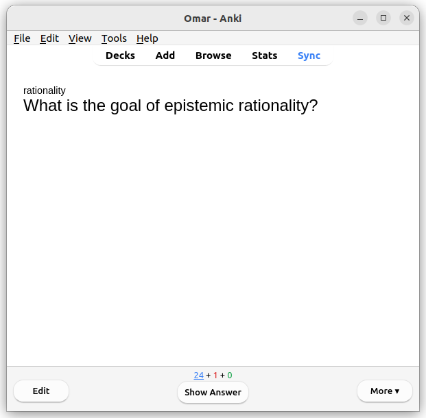

---

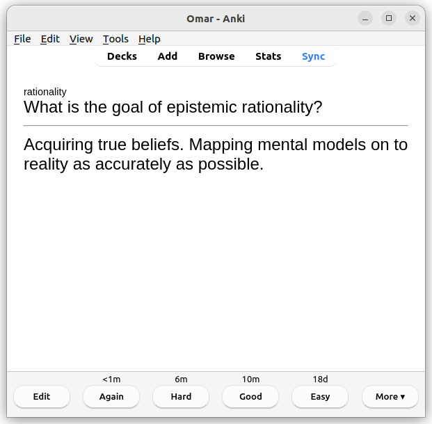

---

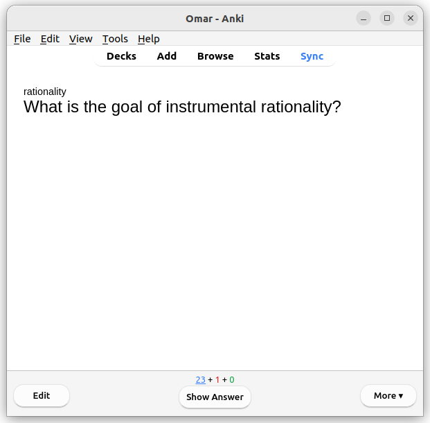

---

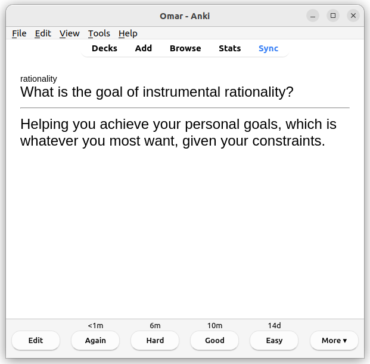

---

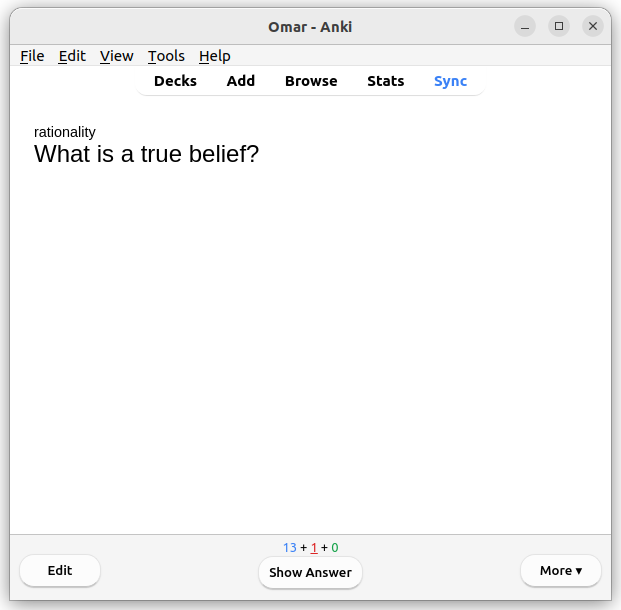

---

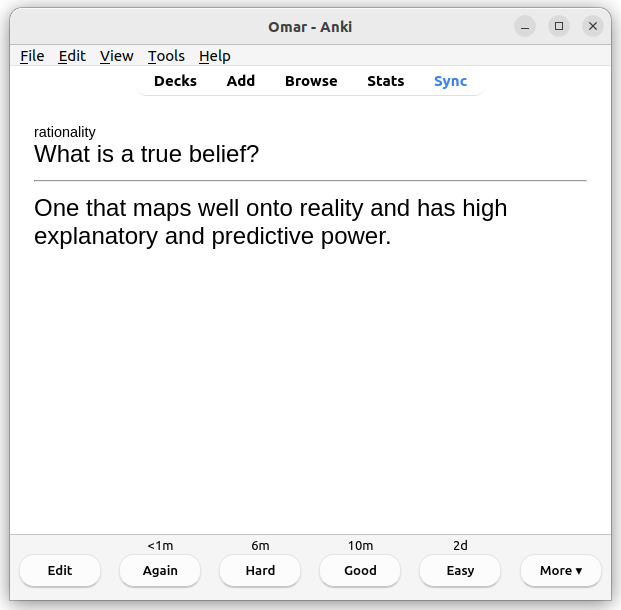

---

# What is a good decision?

* One that given the constraints at the time had higher EV than other options.
* One that I would repeat in the future.

---

# What is expected value?

* The average outcome you’d get if you made the same decision many times.

---

# Can you calculate the EV?

* You get 2€ if a fair coin comes up heads and you pay 1€ otherwise.
* EV = 0.5€ = 50 cent

---

# Why is it valuable to know the monetary value of your time?

* Because we frequently trade time for money (e.g not taking a cab, queuing for a free item) and it's useful to make this tradeoff consciously.

---

# Anki Deck

[Anki installation](https://apps.ankiweb.net/#download) (Windows, macOS, Linux, Android, iOS).

There is an Anki deck with the previous questions and more for you to download on last event's page:

[rationality-freiburg.de/events/2025-01-31-rationality-101-part1/](https://www.rationality-freiburg.de/events/2025-01-31-rationality-101-part1/)

---

# The Scout Mindset

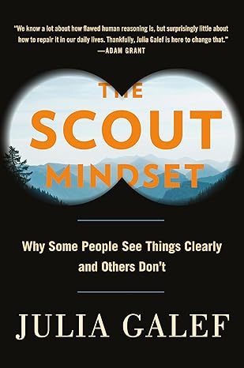

Available as printed book, audio book and ebook in all the usual places.

---

# Rationality

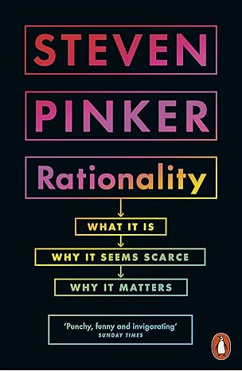

Available as printed book, audio book and ebook in all the usual places.

---

# Sources of Power

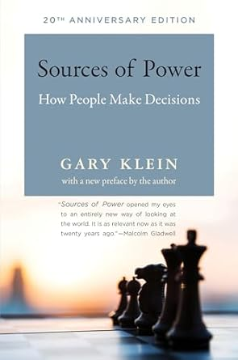

Available as printed book, audio book and ebook in all the usual places.

---

# Harry Potter and the Methods of Rationality

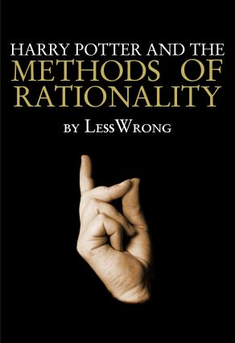

- Audio book (Audible)
- [hpmor.com](https://hpmor.com/)

---

# The Sequences

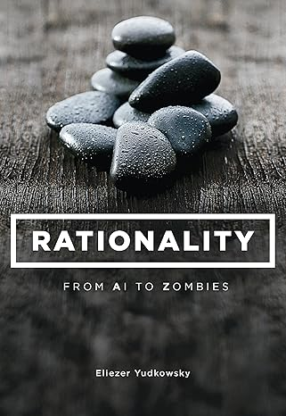

- Rationality: From AI to Zombies on Amazon
  - Printed book
  - Audio book (Audible)
  - Kindle ebook
- [readthesequences.com](https://www.readthesequences.com/)

---

# Clearer Thinking - Podcast & Tools

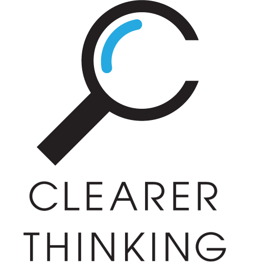

[clearerthinking.org](https://www.clearerthinking.org/)

---

# Clearer Thinking - Tools To Try

[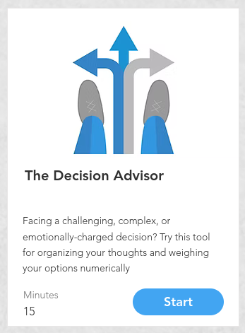](https://programs.clearerthinking.org/decisionmaker.html)

[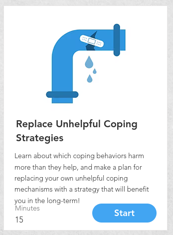](https://programs.clearerthinking.org/replace_unhelpful_coping_strategies.html)

---

# See you in 2 weeks!

## Cognitive Reading Strategies

Friday, February 28th

[rationality-freiburg.de/events/2025-02-28-cognitive-reading-strategies/](https://www.rationality-freiburg.de/events/2025-02-28-cognitive-reading-strategies/)

---

# Newcomer Form

## First time at our meetups?

[rationality-freiburg.de/nf](https://www.rationality-freiburg.de/nf/)

Also available in paper form!

---

# Feedback Form

## Everyone!

### (also newcomers)

[rationality-freiburg.de/ff](https://www.rationality-freiburg.de/ff/)

Also available in paper form!

---

# Sources

* Die: https://pixabay.com/vectors/dice-games-play-1294902/
