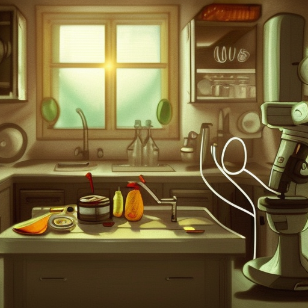

## Vorbereitung

Keine.

## Was werden wir tun?

Die wissenschaftliche Methode ist nicht etwas, das nur Menschen mit weißen
Kitteln im Labor machen. Vielmehr ist es eine Denkweise, die du jeden Tag im
eigenen Leben anwenden kannst.

Wir werden Möglichkeiten zur Anwendung der wissenschaftlichen Methode erörtern
und dann konkrete Experimente entwerfen, die jeder für sich selbst durchführen
kann. Solche Experimente könnten Folgendes beinhalten: Gartenarbeit (welche
Pflanzen wachsen am besten in welchem Boden oder bei welchen
Lichtverhältnissen?), Kochen (welche Methode eignet sich am besten, um die
perfekte Salzkartoffel zuzubereiten?), Menschen (wie werden Kollegen auf
verschiedene Snacks zu verschiedenen Tageszeiten reagieren?), deine eigene
Stimmung oder psychische Verfassung (wie wirkt sich deine abendliche Aktivität
darauf aus, wie du dich beim Aufwachen fühlst?), die Wirkung der Einnahme von
Vitamin D, ...

## Organisatorisches

Du hast Angst nichts beitragen zu können? Keine Sorge! Jeder ist willkommen!

Wir werden uns für Deutsch oder Englisch als Hauptsprache entscheiden, je
nachdem, welche Leute kommen. Kommt einfach, das klappt!

Der heutige Gastgeber ist Omar.

Es wird Snacks und Getränke geben.

Nach dem Meetup gehen wir Essen. Jede/r der/die Zeit hat ist herzlich
eingeladen mitzukommen.

## Sonstiges

[Erfahre mehr über uns]().

<small>Bild mit der _Dreams AI_ von Manifold Markets generiert.</small>
