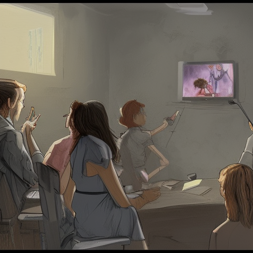

## Vorbereitung

Keine.

## Was werden wir tun?

Zwei Personen halten einen kurzen (20-minütigen) Vortrag über ein interessantes
Thema ihrer Wahl. In der Präsentation werden sie 7 Dinge verstecken, die falsch
sind. Die Zuhörer machen sich Notizen und versuchen, diese Unwahrheiten zu
erkennen.

Nach jeder Präsentation erklären die Spieler der Reihe nach, was ihrer Meinung
nach die Lügen waren. Der Vortragende kann sie dann vom Gegenteil überzeugen.
Der Vortragende erhält Punkte dafür, dass er die Leute dazu bringt, Lügen zu
glauben und an wahren Tatsachen zu zweifeln. Die Zuhörer erhalten Punkte für
das Erkennen der Lügen.

Die Vortragenden erhalten die maximale Punktzahl, wenn jede ihrer Lügen von
genau einem Zuhörer erkannt wird. Auf diese Weise hat der Vortragende einen
Anreiz, die Lügen schwer, aber nicht unmöglich zu erkennen zu machen.

## Organisatorisches

Du hast Angst nichts beitragen zu können? Keine Sorge! Jeder ist willkommen!

Wir werden uns für Deutsch oder Englisch als Hauptsprache entscheiden, je
nachdem, welche Leute kommen. Kommt einfach, das klappt!

Der heutige Gastgeber ist Omar.

Es wird Snacks und Getränke geben.

Nach dem Meetup gehen wir Essen. Jede/r der/die Zeit hat ist herzlich
eingeladen mitzukommen.

## Sonstiges

[Erfahre mehr über uns]().

<small>Bild mit der _Dreams AI_ von Manifold Markets generiert.</small>
