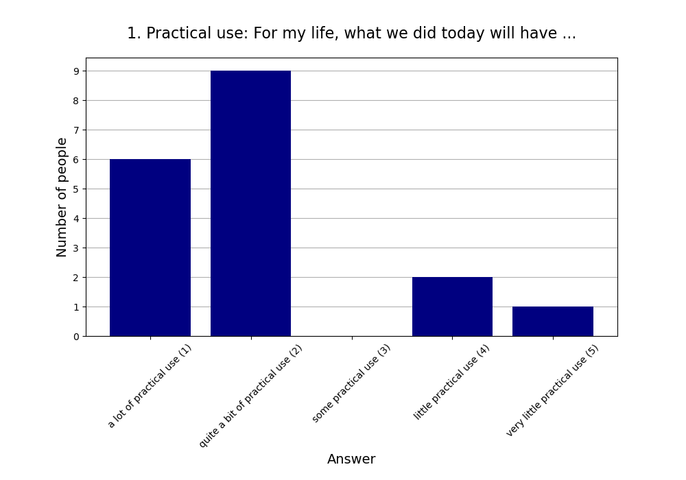
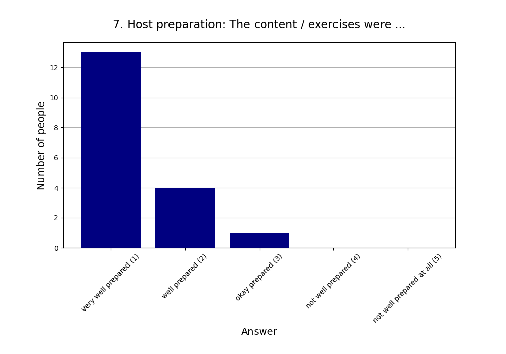
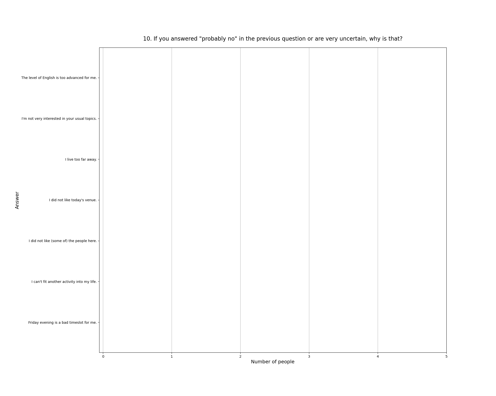

Read more about [this event]().

See also the [2024 summary]().

## Attendees

* **Total:** 19 people
* **Recurring:** 16 people
* **New:** 3 people

## Feedback

* **Responses:** 18 people (94.74% of attendees)

### 1. Practical use: For my life, what we did today will have ...

* **Responses:** 18 people (94.74% of attendees)
* **Answers:**
  * a lot of practical use (1): 6 people
  * quite a bit of practical use (2): 9 people
  * some practical use (3): 0 people
  * little practical use (4): 2 people
  * very little practical use (5): 1 person
* **Average answer:** 2.06 (σ=1.16)

### 2. The atmosphere / vibe was ...

* **Responses:** 18 people (94.74% of attendees)
* **Answers:**
  * fantastic (1): 9 people
  * good (2): 8 people
  * okay (3): 0 people
  * bad (4): 0 people
  * horrible (5): 1 person
* **Average answer:** 1.67 (σ=0.97)

### 3. The amount of content / exercises covered was ...

* **Responses:** 18 people (94.74% of attendees)
* **Answers:**
  * way too much (1): 0 people
  * too much (2): 2 people
  * just right (3): 15 people
  * too little (4): 1 person
  * way too little (5): 0 people
* **Average answer:** 2.94 (σ=0.42)

### 4. The difficulty level of the content / discussion was ...

* **Responses:** 18 people (94.74% of attendees)
* **Answers:**
  * much too easy (1): 0 people
  * too easy (2): 3 people
  * just right (3): 12 people
  * too difficult (4): 3 people
  * much too difficult (5): 0 people
* **Average answer:** 3.00 (σ=0.59)

### 5. Structure: On the whole the event needed ...

* **Responses:** 18 people (94.74% of attendees)
* **Answers:**
  * much more structure (1): 0 people
  * more structure (2): 1 person
  * (was just right) (3): 15 people
  * less structure (4): 2 people
  * much less structure (5): 0 people
* **Average answer:** 3.06 (σ=0.42)

### 6. The moderation should have been ...

* **Responses:** 18 people (94.74% of attendees)
* **Answers:**
  * much more relaxed (1): 0 people
  * more relaxed (2): 0 people
  * (was just right) (3): 15 people
  * more assertive (4): 2 people
  * much more assertive (5): 1 person
* **Average answer:** 3.22 (σ=0.55)

### 7. Host preparation: The content / exercises were ...

* **Responses:** 18 people (94.74% of attendees)
* **Answers:**
  * very well prepared (1): 13 people
  * well prepared (2): 4 people
  * okay prepared (3): 1 person
  * not well prepared (4): 0 people
  * not well prepared at all (5): 0 people
* **Average answer:** 1.33 (σ=0.59)

### 8. Changing your mind: The event made me ...

* **Responses:** 18 people (94.74% of attendees)
* **Answers:**
  * question many things (1): 3 people
  * question some things (2): 7 people
  * question few things (3): 4 people
  * question very few things (4): 3 people
  * not question anything (5): 1 person
* **Average answer:** 2.56 (σ=1.15)

### 9. Do you think you will come to one (or more) of the next three events?

* **Responses:** 18 people (94.74% of attendees)
* **Answers:**
  * probably no: 2 people
  * probably yes: 16 people

### 10. If you answered "probably no" in the previous question or are very uncertain, why is that?

* **Responses:** 0 people (0.00% of attendees)
* **Answers:**
  * Friday evening is a bad timeslot for me.: 0 people
  * I can't fit another activity into my life.: 0 people
  * I did not like (some of) the people here.: 0 people
  * I did not like today's venue.: 0 people
  * I live too far away.: 0 people
  * I'm not very interested in your usual topics.: 0 people
  * The level of English is too advanced for me.: 0 people

### 11. What did you like the most today? What did you like the least?

* **Responses:** 3 people (15.79% of attendees)

> I liked the „make the elephants like each other idea“

> Schade war, dass viel Zeit dafür verwendet wurde Dinge zu wiederholen, die man auch vorher hätte lesen können. Andererseits bereue ich das Lesen nicht, da dort viel mehr interessantes stand. Ich sehe auch, dass man nicht erwarten kann, dass alle vorbereitet zum Meeting kommen. Deshalb eine Idee, welche sich vielleicht praktisch umsetzen lässt: Beim Bilden von Untergruppen teilen wir die Leute auf zwischen denen, die zur Vorbereitung gelesen haben, und den anderen. So profitiert man zumindest dadurch von der eigenen Vorbereitung, dass man mit besser informierten Personen diskutieren kann. Ausnahme evtl. für Leute, die zum ersten Mal auftauchen.

> Preconditions to ensure before using the method would be interesting to formalise. A list of common typical cruxes would be nice
