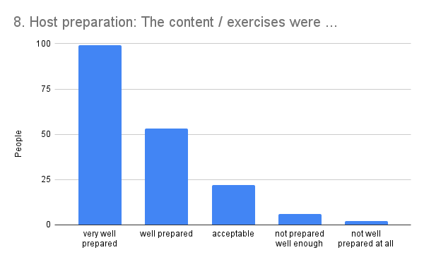

In 2023 there were 24 public events (not counting book club, statistics study
group and meta-meetup). Some interesting facts and graphs.

<!--more-->

## Attendees

* 24 events.
* 11.38 people per event on average (σ=3.80).
* 2.38 newcomers per event	(σ=1.71).
* Maximum number of attendees was 21 and minimum was 4 people.
* 76 unique people came to one or more events.
* Out of those, 34 people came to two or more events.
* Out of those, 14 people came to 5 or more events.

**Recurring** is any person coming for the second, third etc. time whereas
**New** is anyone coming for the first time to a Rationality Freiburg event.

## Feedback

The aggregate of the feedback forms attendees filled out after the events.

