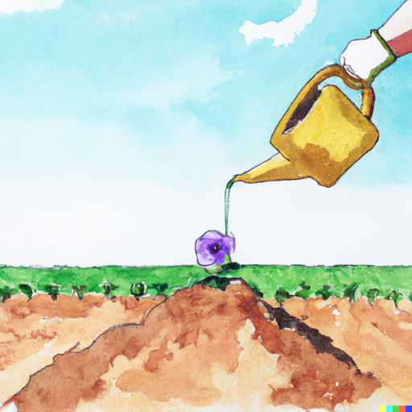

## Vorbereitung

Keine.

## Was werden wir tun?

Matthias wird einen Vortrag halten und danach werden wir die vorgestellten
Ideen diskutieren. Dies ist Teil 1 von 2. Der zweite Teil wird zwei Wochen
später vorgestellt werden.

Es gibt viele offensichtliche Möglichkeiten, deinen ökologischen Fußabdruck zu
reduzieren: Weniger Fleisch essen, auf Flugzeuge oder Verbrennungsmotoren
verzichten, usw. Ihr kennt diese bereits, daher werden wir nicht darüber
sprechen. Stattdessen werden wir einige weniger offensichtliche Ideen erkunden.

Wenn ihr bereits all die offensichtlichen Dinge umsetzt, ist dieser Vortrag
definitiv für euch. Wenn ihr nicht alle offensichtlichen Dinge tut, könnte
dieser Vortrag auch interessant für euch sein, da die meisten Dinge in diesem
Vortrag euch etwas Geld sparen werden. Viele von ihnen ohne eine (signifikante)
Beeinträchtigung eurer Lebensqualität.

## Organisatorisches

Du hast Angst nichts beitragen zu können? Keine Sorge! Jeder ist willkommen!

Wir werden uns für Deutsch oder Englisch als Hauptsprache entscheiden, je
nachdem, welche Leute kommen. Kommt einfach, das klappt! Die Folien werden auf
Deutsch sein.

Der heutige Gastgeber ist Matthias.

Es wird Snacks und Getränke geben.

Nach dem Meetup gehen wir Essen. Jede/r der/die Zeit hat ist herzlich
eingeladen mitzukommen.

## Sonstiges

[Erfahre mehr über uns]().

<small>Bild mit der _DALL·E_ generiert.</small>
