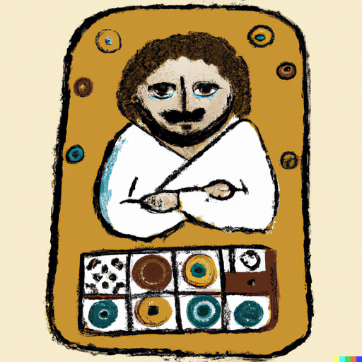

## Preparation

Bring you favorite boardgame!

## What will we do?

We will play boardgames.

## Organization

You are worried you have nothing to contribute? No worries! Everyone is
welcome!

There always is a mix of German and English speakers and we configure the
discussion rounds so that everyone feels comfortable participating. The primary
language is English.

This meetup will be hosted by Omar.

There will be snacks and drinks.

We will go and get dinner after the meetup. Anyone who has time is welcome to
join.

## Other

[Learn more about us]().

<small>Image generated with _DALL·E_.</small>
