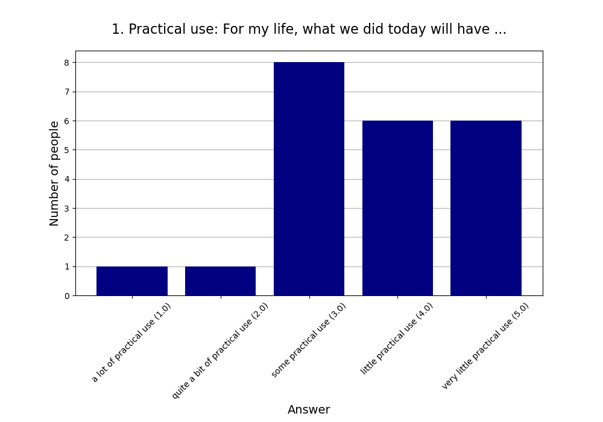
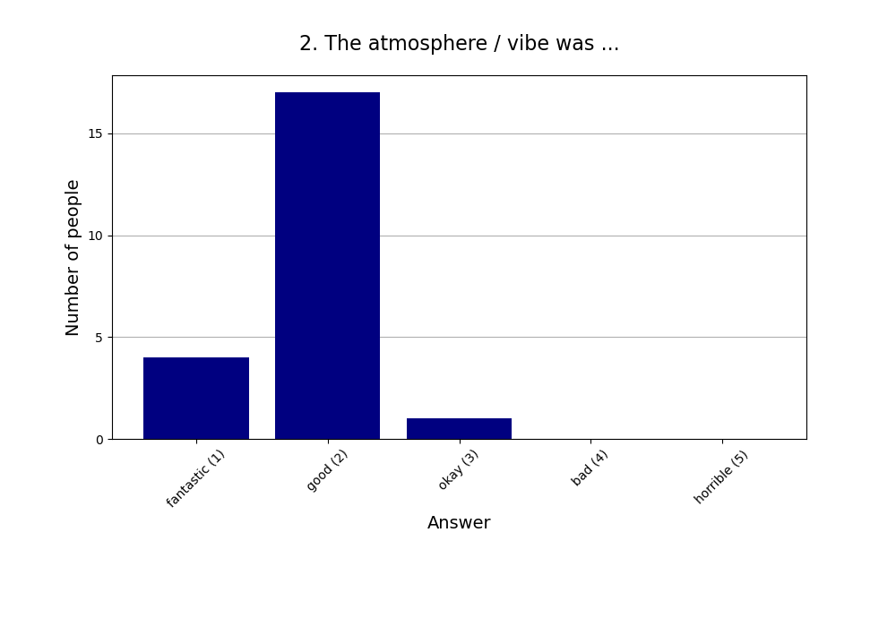
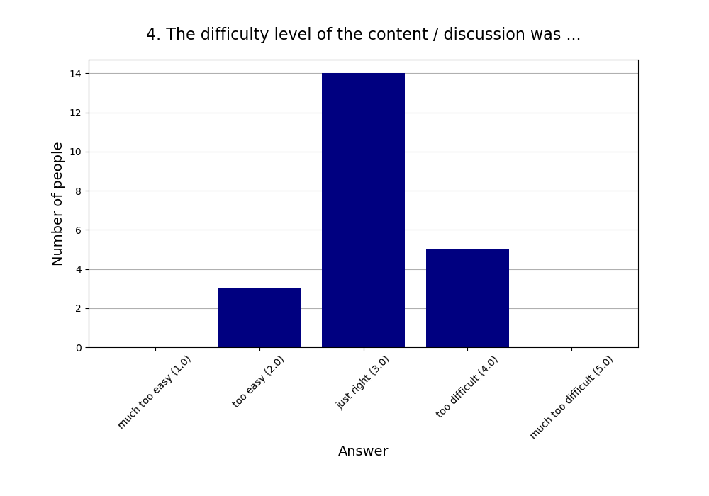
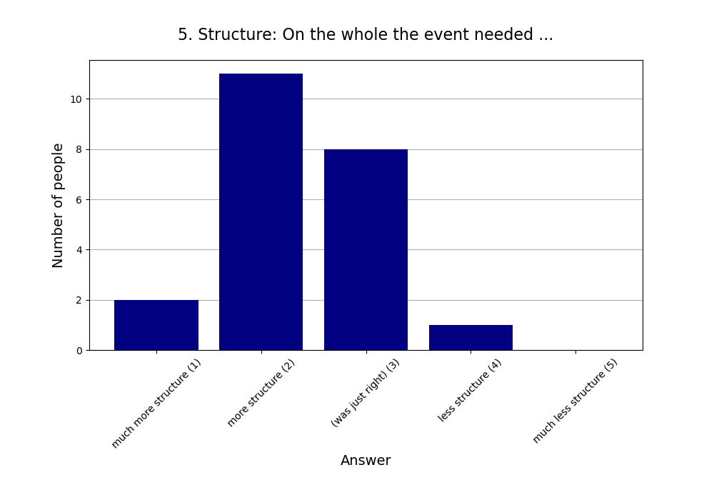
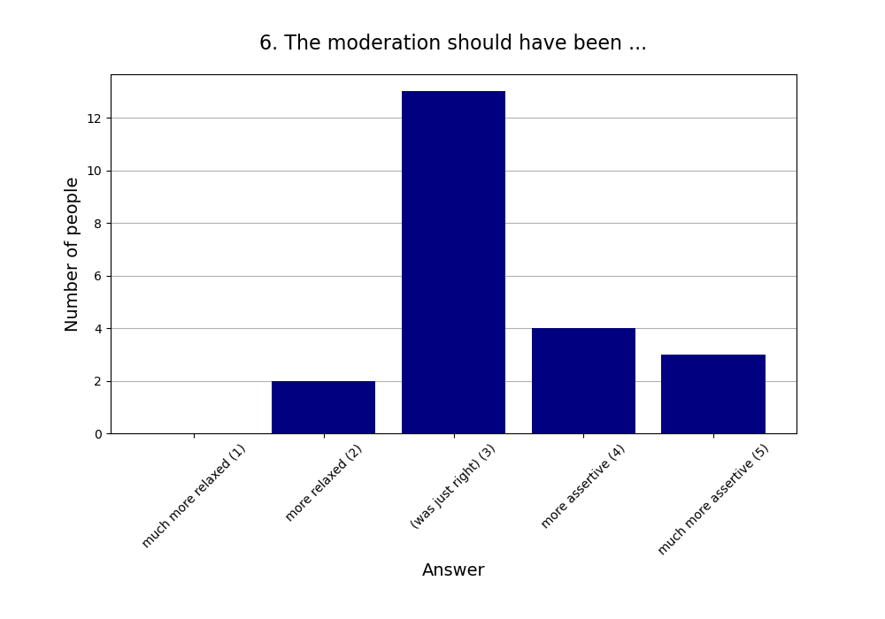
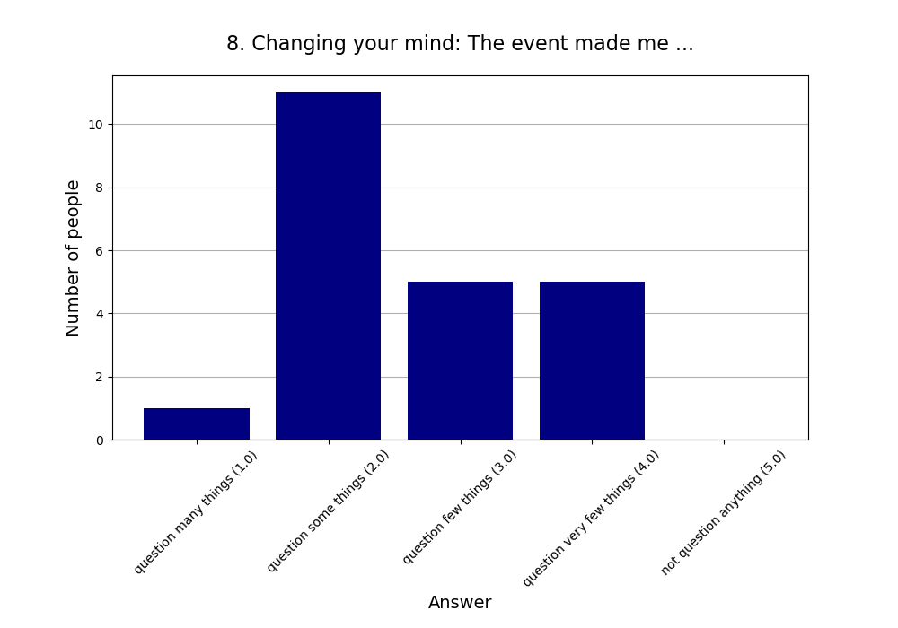

Read more about [this event]().

See also the [2024 summary]().

## Attendees

* **Total:** 26 people
* **Recurring:** 20 people
* **New:** 6 people

## Feedback

* **Responses:** 22 people (84.62% of attendees)

### 1. Practical use: For my life, what we did today will have ...

* **Responses:** 22 people (84.62% of attendees)
* **Answers:**
  * a lot of practical use (1): 1 person
  * quite a bit of practical use (2): 1 person
  * some practical use (3): 8 people
  * little practical use (4): 6 people
  * very little practical use (5): 6 people
* **Average answer:** 3.68 (σ=1.09)

### 2. The atmosphere / vibe was ...

* **Responses:** 22 people (84.62% of attendees)
* **Answers:**
  * fantastic (1): 4 people
  * good (2): 17 people
  * okay (3): 1 person
  * bad (4): 0 people
  * horrible (5): 0 people
* **Average answer:** 1.86 (σ=0.47)

### 3. The amount of content / exercises covered was ...

* **Responses:** 22 people (84.62% of attendees)
* **Answers:**
  * way too much (1): 2 people
  * too much (2): 13 people
  * just right (3): 6 people
  * too little (4): 1 person
  * way too little (5): 0 people
* **Average answer:** 2.27 (σ=0.70)

### 4. The difficulty level of the content / discussion was ...

* **Responses:** 22 people (84.62% of attendees)
* **Answers:**
  * much too easy (1): 0 people
  * too easy (2): 3 people
  * just right (3): 14 people
  * too difficult (4): 5 people
  * much too difficult (5): 0 people
* **Average answer:** 3.09 (σ=0.61)

### 5. Structure: On the whole the event needed ...

* **Responses:** 22 people (84.62% of attendees)
* **Answers:**
  * much more structure (1): 2 people
  * more structure (2): 11 people
  * (was just right) (3): 8 people
  * less structure (4): 1 person
  * much less structure (5): 0 people
* **Average answer:** 2.36 (σ=0.73)

### 6. The moderation should have been ...

* **Responses:** 22 people (84.62% of attendees)
* **Answers:**
  * much more relaxed (1): 0 people
  * more relaxed (2): 2 people
  * (was just right) (3): 13 people
  * more assertive (4): 4 people
  * much more assertive (5): 3 people
* **Average answer:** 3.36 (σ=0.85)

### 7. Host preparation: The content / exercises were ...

* **Responses:** 22 people (84.62% of attendees)
* **Answers:**
  * very well prepared (1): 8 people
  * well prepared (2): 9 people
  * okay prepared (3): 5 people
  * not well prepared (4): 0 people
  * not well prepared at all (5): 0 people
* **Average answer:** 1.86 (σ=0.77)

### 8. Changing your mind: The event made me ...

* **Responses:** 22 people (84.62% of attendees)
* **Answers:**
  * question many things (1): 1 person
  * question some things (2): 11 people
  * question few things (3): 5 people
  * question very few things (4): 5 people
  * not question anything (5): 0 people
* **Average answer:** 2.64 (σ=0.90)

### 9. Do you think you will come to one (or more) of the next three events?

* **Responses:** 22 people (84.62% of attendees)
* **Answers:**
  * probably no: 1 person
  * probably yes: 21 people

### 10. If you answered "probably no" in the previous question or are very uncertain, why is that?

* **Responses:** 1 person (3.85% of attendees)
* **Answers:**
  * Do not get much enlightened due to diverse of discussions.: 1 person
  * Friday evening is a bad timeslot for me.: 0 people
  * I can't fit another activity into my life.: 0 people
  * I did not like (some of) the people here.: 0 people
  * I did not like today's venue.: 0 people
  * I live too far away.: 0 people
  * I'm not very interested in your usual topics.: 0 people
  * The level of English is too advanced for me.: 0 people

### 11. What did you like the most today?

* **Responses:** 13 people (50.00% of attendees)

**Note:** Anything contained in square brackets [] is an edit by the organizers.

> topic

> Many interesting impulses.  
> Great atmosphere of discussions.

> the topic in general!

> Mind blown

> Some very interesting ideas popped up during presentation and discussion. [An older version of the feedback form had only one answer field for "best" and "worst". An organizer split that comment, making the best guess what the commenter was trying to say.]

> The topic, the progression.

> Gute Präsentationen, angenehme Stimmung.

> Open discussion. 

> Zivilisierte Diskussion in grosser Runde

> the small group discussion (was too little time though)

> Very interesting presentations focusing on two different aspects/approaches to the question of consciousness.

> The presentations and the discussions were really interesting and fun.

> Presentation is rich in content. [An older version of the feedback form had only one answer field for "best" and "worst". An organizer split that comment, making the best guess what the commenter was trying to say.]
### 12. What did you like the least?

* **Responses:** 9 people (34.62% of attendees)

**Note:** Anything contained in square brackets [] is an edit by the organizers.

> less time

> A little bit chaotic today, longer discussion in small groups would have nice, clear definition of consciousness was not given

> First part didn't really 'introduced' what was then presented by Nawid. Felt a bit irrelevant for the discussion part.

> I think some parts of the presentations were not really relevant for the topic.

> Will wasn't fully clear about the arguments are the end. But might just need to think more about it.

> Mehr Zeit, um tiefer in die Diskussion zu gehen wäre gut

> Time management

> I would have preferred more time for discussions, maybe by splitting up the content into several Meetups.

> The discussion is not structured or guided.
