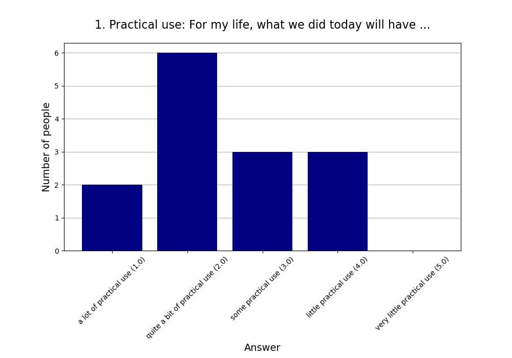
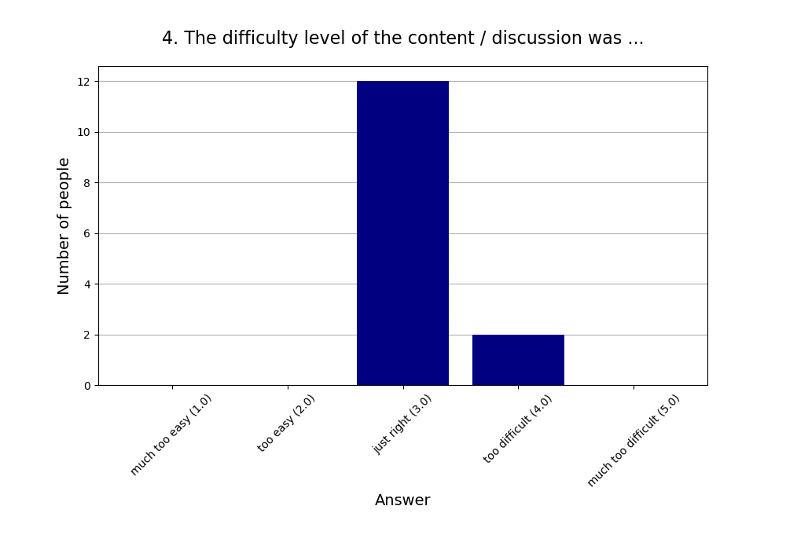
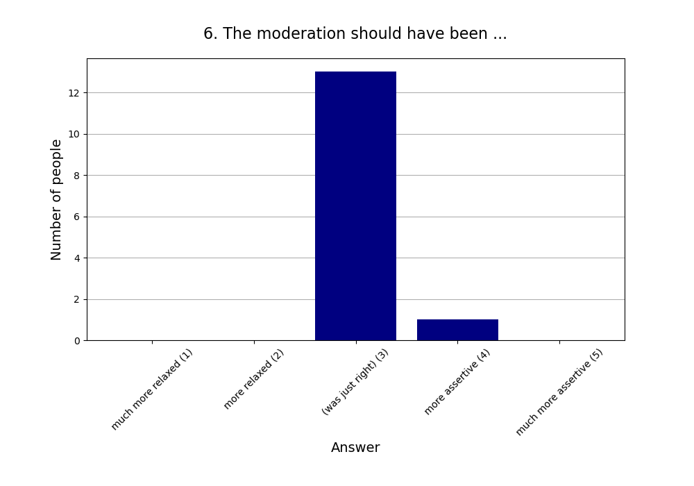
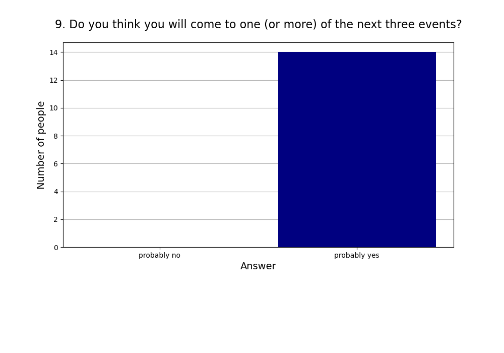

Read more about [this event]().

See also the [2024 summary]().

## Attendees

* **Total:** 14 people
* **Recurring:** 14 people
* **New:** 0 people

## Feedback

* **Responses:** 14 people (100.00% of attendees)

### 1. Practical use: For my life, what we did today will have ...

* **Responses:** 14 people (100.00% of attendees)
* **Answers:**
  * a lot of practical use (1): 2 people
  * quite a bit of practical use (2): 6 people
  * some practical use (3): 3 people
  * little practical use (4): 3 people
  * very little practical use (5): 0 people
* **Average answer:** 2.50 (σ=1.02)

### 2. The atmosphere / vibe was ...

* **Responses:** 14 people (100.00% of attendees)
* **Answers:**
  * fantastic (1): 6 people
  * good (2): 8 people
  * okay (3): 0 people
  * bad (4): 0 people
  * horrible (5): 0 people
* **Average answer:** 1.57 (σ=0.51)

### 3. The amount of content / exercises covered was ...

* **Responses:** 14 people (100.00% of attendees)
* **Answers:**
  * way too much (1): 0 people
  * too much (2): 1 person
  * just right (3): 12 people
  * too little (4): 1 person
  * way too little (5): 0 people
* **Average answer:** 3.00 (σ=0.39)

### 4. The difficulty level of the content / discussion was ...

* **Responses:** 14 people (100.00% of attendees)
* **Answers:**
  * much too easy (1): 0 people
  * too easy (2): 0 people
  * just right (3): 12 people
  * too difficult (4): 2 people
  * much too difficult (5): 0 people
* **Average answer:** 3.14 (σ=0.36)

### 5. Structure: On the whole the event needed ...

* **Responses:** 14 people (100.00% of attendees)
* **Answers:**
  * much more structure (1): 0 people
  * more structure (2): 0 people
  * (was just right) (3): 14 people
  * less structure (4): 0 people
  * much less structure (5): 0 people
* **Average answer:** 3.00 (σ=0.00)

### 6. The moderation should have been ...

* **Responses:** 14 people (100.00% of attendees)
* **Answers:**
  * much more relaxed (1): 0 people
  * more relaxed (2): 0 people
  * (was just right) (3): 13 people
  * more assertive (4): 1 person
  * much more assertive (5): 0 people
* **Average answer:** 3.07 (σ=0.27)

### 7. Host preparation: The content / exercises were ...

* **Responses:** 14 people (100.00% of attendees)
* **Answers:**
  * very well prepared (1): 5 people
  * well prepared (2): 4 people
  * okay prepared (3): 5 people
  * not well prepared (4): 0 people
  * not well prepared at all (5): 0 people
* **Average answer:** 2.00 (σ=0.88)

### 8. Changing your mind: The event made me ...

* **Responses:** 14 people (100.00% of attendees)
* **Answers:**
  * question many things (1): 1 person
  * question some things (2): 7 people
  * question few things (3): 2 people
  * question very few things (4): 3 people
  * not question anything (5): 1 person
* **Average answer:** 2.71 (σ=1.14)

### 9. Do you think you will come to one (or more) of the next three events?

* **Responses:** 14 people (100.00% of attendees)
* **Answers:**
  * probably no: 0 people
  * probably yes: 14 people

### 10. If you answered "probably no" in the previous question or are very uncertain, why is that?

* **Responses:** 0 people (0.00% of attendees)
* **Answers:**
  * Friday evening is a bad timeslot for me.: 0 people
  * I can't fit another activity into my life.: 0 people
  * I did not like (some of) the people here.: 0 people
  * I did not like today's venue.: 0 people
  * I live too far away.: 0 people
  * I'm not very interested in your usual topics.: 0 people
  * The level of English is too advanced for me.: 0 people

### 11. What did you like the most today?

* **Responses:** 13 people (92.86% of attendees)

**Note:** Anything contained in square brackets [] is an edit by the organizers.

> Digging really deep into seemingly simple problems with other people was very enjoyable.

> Loved the structuring and that the number of exercises was not too high.

> Super interesting content.  
> Discovered many flaws in my thinking.  
> Physics is cool!

> The discussions with other people who I hadn't met before. The mindbogliness of the questions.

> Very intersting topic. I liked to discover the flaws in my reasoning and thinking strategies. 

> Demonstrated my lack of intuitive, on-hand knowledge of physics and also that given enough time and effort, can understand (most of) it, even from just thinking and mulling over the problem

> Problems 

> Working in smaller groups depending on our level

> The book I got to know. :-)

> Diskussion

> Die Rätsel

> Noticing my own confusion

> Zu erkennen, dass eine gefühlte 80%ige Sicherheit leicht wieder kippen kann, wenn man länger nachdenkt.
### 12. What did you like the least?

* **Responses:** 8 people (57.14% of attendees)

**Note:** Anything contained in square brackets [] is an edit by the organizers.

> Maybe spend slightly more time on the solutions.

> Nothing. 

> Very Minor: didn't explicitly include "some ways to problem solve" except what came up during discussion. E.g. maybe one attempt without any such discussion and then one attempt after discussing such approaches. But then, would have had time crunch

> Problems

> The long discussion at the end about the details of a problem that has not been discussed/looked into in our group

> /

> Nichts

> Drinking water color [The tap water at the location was yellowish, which had never happened before]
