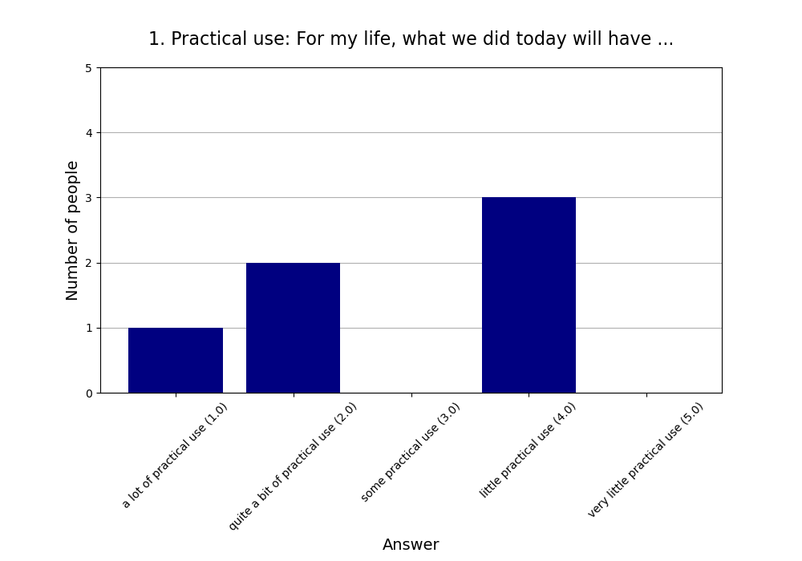
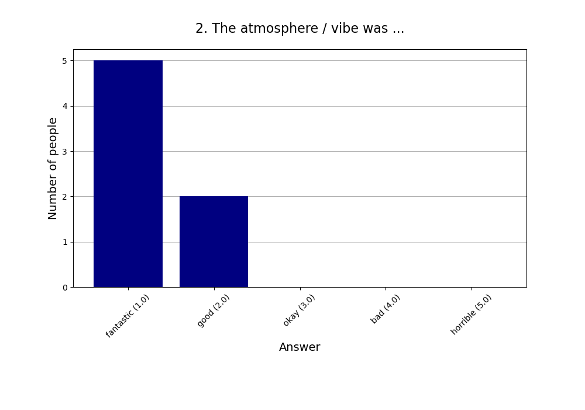
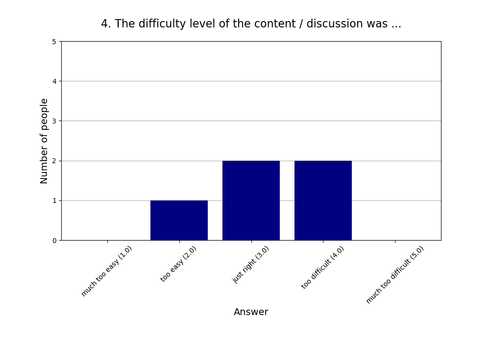
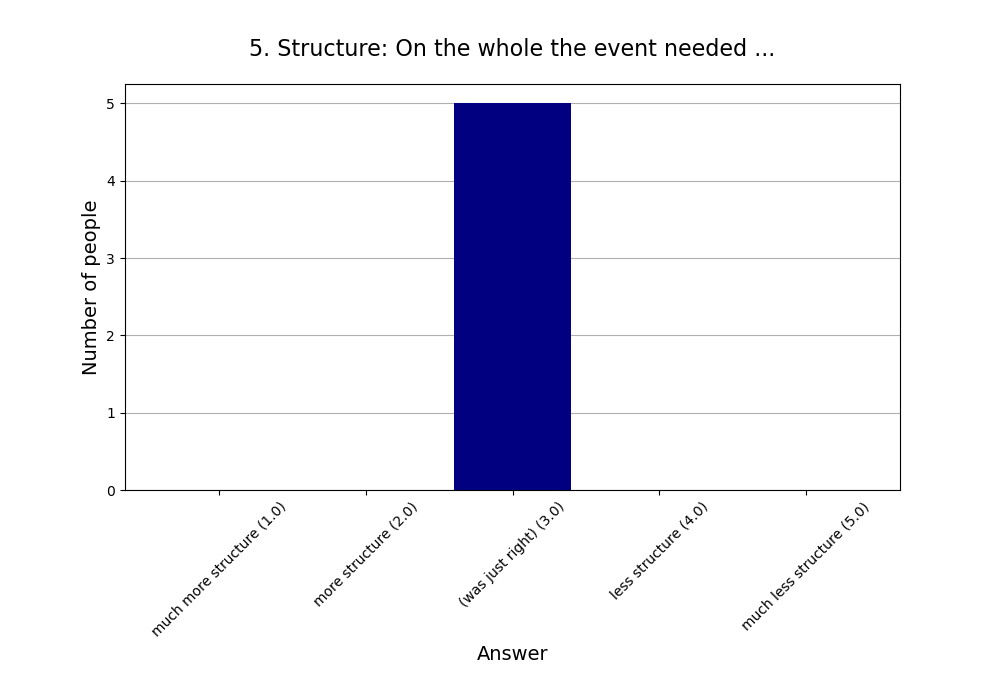
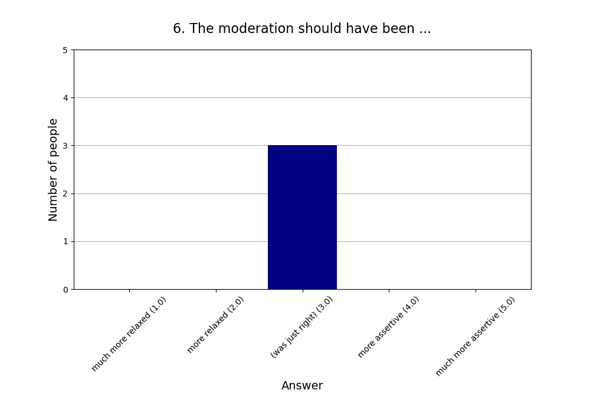
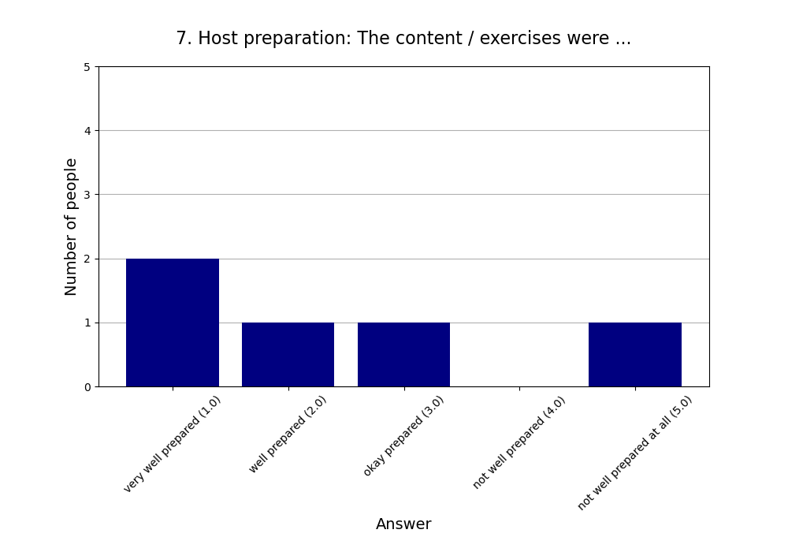
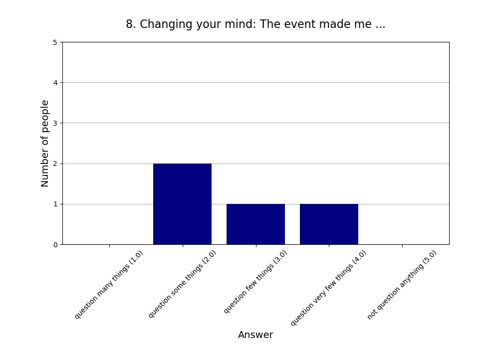
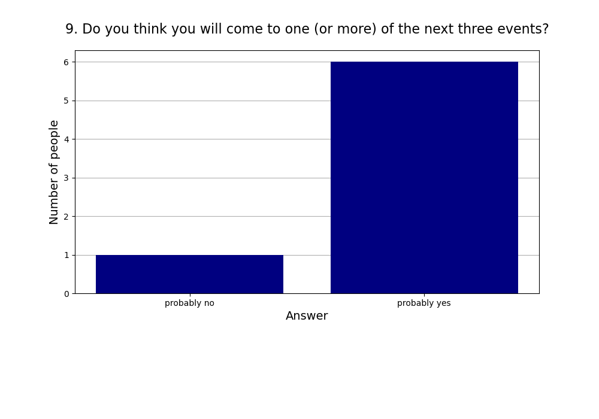

Read more about [this event]().

See also the [2024 summary]().

## Attendees

* **Total:** 13 people
* **Recurring:** 12 people
* **New:** 1 person

## Feedback

* **Responses:** 8 people (61.54% of attendees)

### 1. Practical use: For my life, what we did today will have ...

* **Responses:** 6 people (46.15% of attendees)
* **Answers:**
  * a lot of practical use (1): 1 person
  * quite a bit of practical use (2): 2 people
  * some practical use (3): 0 people
  * little practical use (4): 3 people
  * very little practical use (5): 0 people
* **Average answer:** 2.83 (σ=1.33)

### 2. The atmosphere / vibe was ...

* **Responses:** 7 people (53.85% of attendees)
* **Answers:**
  * fantastic (1): 5 people
  * good (2): 2 people
  * okay (3): 0 people
  * bad (4): 0 people
  * horrible (5): 0 people
* **Average answer:** 1.29 (σ=0.49)

### 3. The amount of content / exercises covered was ...

* **Responses:** 4 people (30.77% of attendees)
* **Answers:**
  * way too much (1): 0 people
  * too much (2): 1 person
  * just right (3): 3 people
  * too little (4): 0 people
  * way too little (5): 0 people
* **Average answer:** 2.75 (σ=0.50)

### 4. The difficulty level of the content / discussion was ...

* **Responses:** 5 people (38.46% of attendees)
* **Answers:**
  * much too easy (1): 0 people
  * too easy (2): 1 person
  * just right (3): 2 people
  * too difficult (4): 2 people
  * much too difficult (5): 0 people
* **Average answer:** 3.20 (σ=0.84)

### 5. Structure: On the whole the event needed ...

* **Responses:** 5 people (38.46% of attendees)
* **Answers:**
  * much more structure (1): 0 people
  * more structure (2): 0 people
  * (was just right) (3): 5 people
  * less structure (4): 0 people
  * much less structure (5): 0 people
* **Average answer:** 3.00 (σ=0.00)

### 6. The moderation should have been ...

* **Responses:** 3 people (23.08% of attendees)
* **Answers:**
  * much more relaxed (1): 0 people
  * more relaxed (2): 0 people
  * (was just right) (3): 3 people
  * more assertive (4): 0 people
  * much more assertive (5): 0 people
* **Average answer:** 3.00 (σ=0.00)

### 7. Host preparation: The content / exercises were ...

* **Responses:** 5 people (38.46% of attendees)
* **Answers:**
  * very well prepared (1): 2 people
  * well prepared (2): 1 person
  * okay prepared (3): 1 person
  * not well prepared (4): 0 people
  * not well prepared at all (5): 1 person
* **Average answer:** 2.40 (σ=1.67)

### 8. Changing your mind: The event made me ...

* **Responses:** 4 people (30.77% of attendees)
* **Answers:**
  * question many things (1): 0 people
  * question some things (2): 2 people
  * question few things (3): 1 person
  * question very few things (4): 1 person
  * not question anything (5): 0 people
* **Average answer:** 2.75 (σ=0.96)

### 9. Do you think you will come to one (or more) of the next three events?

* **Responses:** 7 people (53.85% of attendees)
* **Answers:**
  * probably no: 1 person
  * probably yes: 6 people

### 10. If you answered "probably no" in the previous question or are very uncertain, why is that?

* **Responses:** 1 person (7.69% of attendees)
* **Answers:**
  * Friday evening is a bad timeslot for me.: 0 people
  * I can't fit another activity into my life.: 0 people
  * I did not like (some of) the people here.: 0 people
  * I did not like today's venue.: 0 people
  * I live too far away.: 1 person
  * I'm not very interested in your usual topics.: 0 people
  * The level of English is too advanced for me.: 0 people

### 11. What did you like the most today?

* **Responses:** 8 people (61.54% of attendees)

**Note:** Anything contained in square brackets [] is an edit by the organizers.

> Die Aussicht.

> vibes, the route, nature, discussions

> Most- everyone was inclusive and kind. Other things- hike location, organisation with the public transport

> Getting to know some people

> Fantastic weather, beautiful route and many interesting conversations.

> Good training impulse 😃  
> Group was relaxed, everyone seemed to enjoy the speed

> Walking together, talking to each other 

> Für mich haben Uhrzeit, Dauer und Niveau der Wanderung perfekt gepasst.
### 12. What did you like the least?

* **Responses:** 6 people (46.15% of attendees)

**Note:** Anything contained in square brackets [] is an edit by the organizers.

> Zu viele und anstrengende Steigungen. Der letzte Abstieg. Zeigt mir aber nur, dass ich mehr wandern muss ;)

> it wasn't an official cult hike

> Least- no hike songs and need more group photos at the start-middle-end of the hike.

> Arriving home late 

> The stairs and that I need more training 😃

> Nothing
