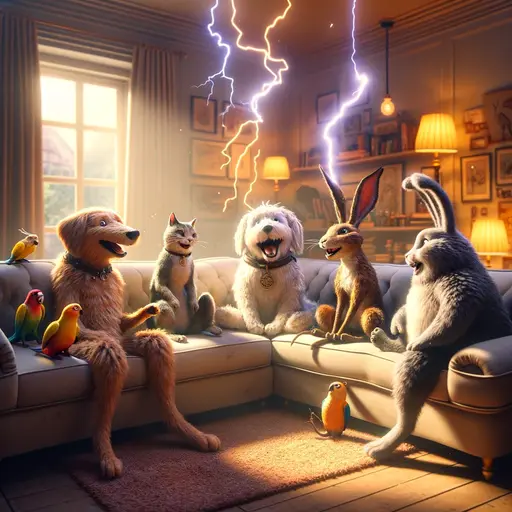

## Vorbereitung

Schreibe den Organisatoren (info@rationality-freiburg.de), wenn du ein Thema
hast, über das du gerne eine Blitzdiskussion führen möchtest. Du wirst das Thema
in 2-3 Minuten präsentieren können, und dann wird es 15-20 Minuten Diskussion
geben.

## Was werden wir tun?

Kurze Diskussionsrunden zu einer Vielzahl von Themen. Ich habe die Idee von
[Chicago
Rationality](https://chicagorationality.com/meetups/october-meetup-lightning-discussions/)
geklaut.

## Organisation

Mach dir keine Sorgen, wenn du denkst, dass du nichts beitragen kannst! Jede/r
ist willkommen!

Es gibt immer eine Mischung aus deutsch- und englischsprachigen Teilnehmern, und
wir gestalten die Diskussionsrunden so, dass sich jeder wohl fühlt. Die
Hauptsprache ist Englisch.

Dieses Treffen wird von Omar moderiert.

Es wird Snacks und Getränke geben.

Wir werden nach dem Treffen zum Abendessen gehen. Jeder, der Zeit hat, ist
herzlich eingeladen, sich anzuschließen.

<small>Auf der obigen Karte ist der Ort markiert, an dem du dein Fahrrad
abstellen solltest (blau) und der Eingang mit einem roten Kreuz.</small>

## Sonstiges

[Erfahre mehr über uns]().

<small>Bild generiert mit _DALL·E_.</small>