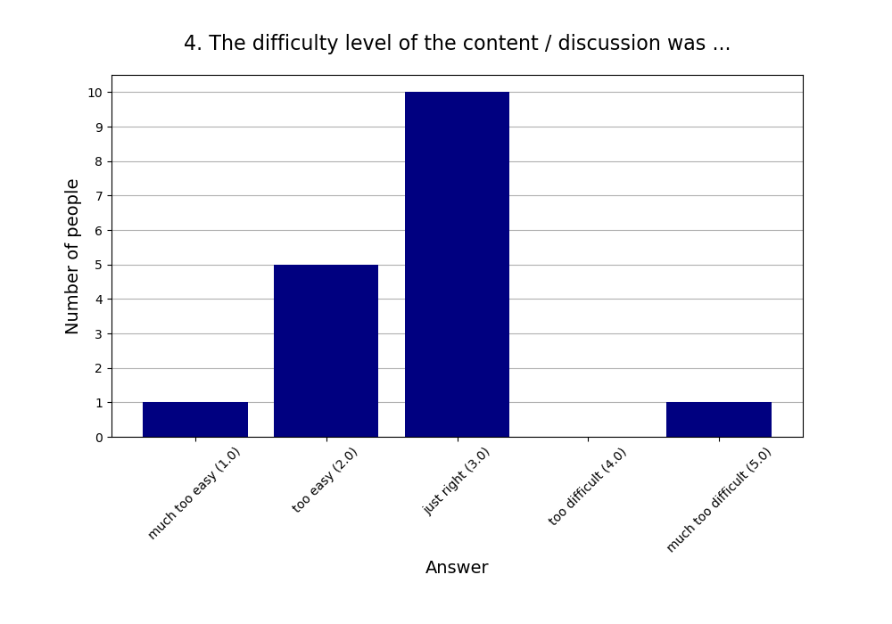
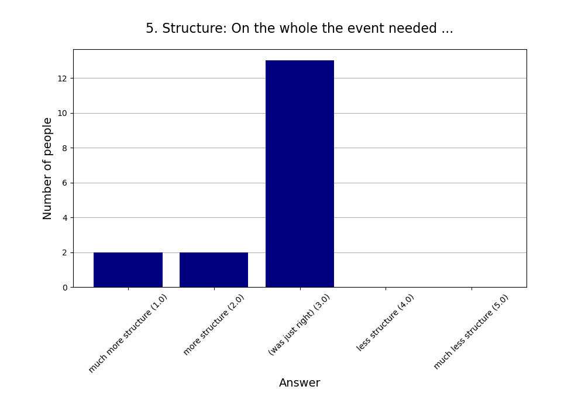
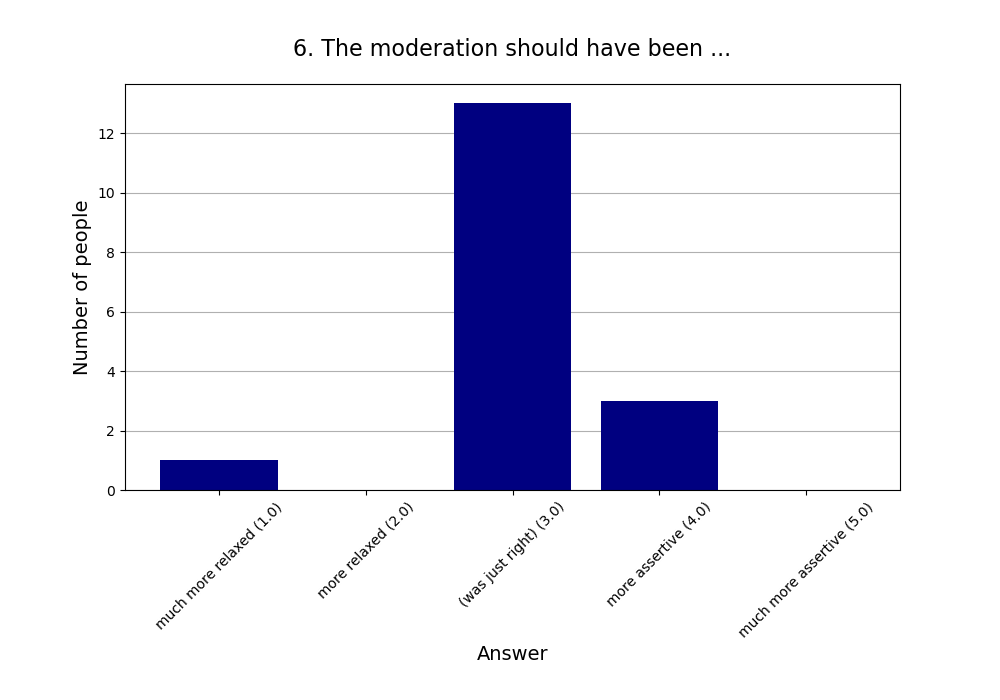
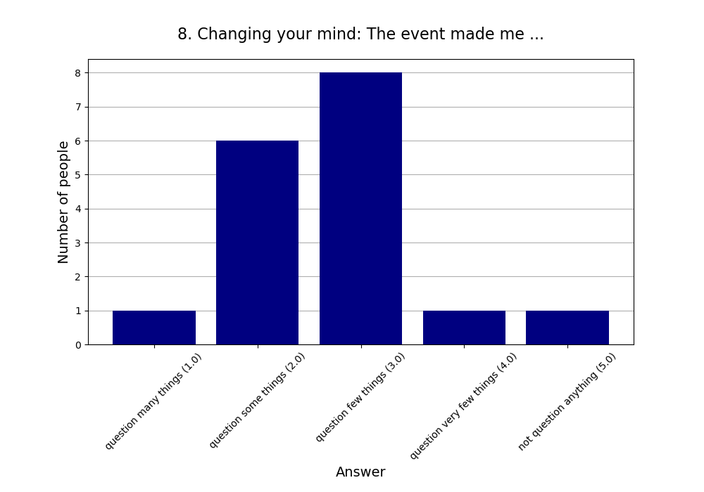

Read more about [this event]().

See also the [2024 summary]().

## Attendees

* **Total:** 18 people
* **Recurring:** 15 people
* **New:** 3 people

## Feedback

* **Responses:** 17 people (94.44% of attendees)

### 1. Practical use: For my life, what we did today will have ...

* **Responses:** 17 people (94.44% of attendees)
* **Answers:**
  * a lot of practical use (1): 4 people
  * quite a bit of practical use (2): 4 people
  * some practical use (3): 4 people
  * little practical use (4): 4 people
  * very little practical use (5): 1 person
* **Average answer:** 2.65 (σ=1.27)

### 2. The atmosphere / vibe was ...

* **Responses:** 17 people (94.44% of attendees)
* **Answers:**
  * fantastic (1): 10 people
  * good (2): 5 people
  * okay (3): 1 person
  * bad (4): 1 person
  * horrible (5): 0 people
* **Average answer:** 1.59 (σ=0.87)

### 3. The amount of content / exercises covered was ...

* **Responses:** 17 people (94.44% of attendees)
* **Answers:**
  * way too much (1): 0 people
  * too much (2): 1 person
  * just right (3): 15 people
  * too little (4): 1 person
  * way too little (5): 0 people
* **Average answer:** 3.00 (σ=0.35)

### 4. The difficulty level of the content / discussion was ...

* **Responses:** 17 people (94.44% of attendees)
* **Answers:**
  * much too easy (1): 1 person
  * too easy (2): 5 people
  * just right (3): 10 people
  * too difficult (4): 0 people
  * much too difficult (5): 1 person
* **Average answer:** 2.71 (σ=0.85)

### 5. Structure: On the whole the event needed ...

* **Responses:** 17 people (94.44% of attendees)
* **Answers:**
  * much more structure (1): 2 people
  * more structure (2): 2 people
  * (was just right) (3): 13 people
  * less structure (4): 0 people
  * much less structure (5): 0 people
* **Average answer:** 2.65 (σ=0.70)

### 6. The moderation should have been ...

* **Responses:** 17 people (94.44% of attendees)
* **Answers:**
  * much more relaxed (1): 1 person
  * more relaxed (2): 0 people
  * (was just right) (3): 13 people
  * more assertive (4): 3 people
  * much more assertive (5): 0 people
* **Average answer:** 3.06 (σ=0.66)

### 7. Host preparation: The content / exercises were ...

* **Responses:** 16 people (88.89% of attendees)
* **Answers:**
  * very well prepared (1): 4 people
  * well prepared (2): 5 people
  * okay prepared (3): 5 people
  * not well prepared (4): 1 person
  * not well prepared at all (5): 1 person
* **Average answer:** 2.38 (σ=1.15)

### 8. Changing your mind: The event made me ...

* **Responses:** 17 people (94.44% of attendees)
* **Answers:**
  * question many things (1): 1 person
  * question some things (2): 6 people
  * question few things (3): 8 people
  * question very few things (4): 1 person
  * not question anything (5): 1 person
* **Average answer:** 2.71 (σ=0.92)

### 9. Do you think you will come to one (or more) of the next three events?

* **Responses:** 17 people (94.44% of attendees)
* **Answers:**
  * probably no: 3 people
  * probably yes: 14 people

### 10. If you answered "probably no" in the previous question or are very uncertain, why is that?

* **Responses:** 4 people (22.22% of attendees)
* **Answers:**
  * Fitting it in the calendar is tricky atm.: 1 person
  * Friday evening is a bad timeslot for me.: 0 people
  * I can't fit another activity into my life.: 0 people
  * I did not like (some of) the people here.: 0 people
  * I did not like today's venue.: 0 people
  * I live too far away.: 3 people
  * I'm not very interested in your usual topics.: 0 people
  * The level of English is too advanced for me.: 0 people

### 11. What did you like the most today?

* **Responses:** 12 people (66.67% of attendees)

**Note:** Anything contained in square brackets [] is an edit by the organizers.

> Talking about new things, ideas

> Gruppendiskussionen

> The variety of discussion topics

> Very diverse topics, enlightening discussion 

> Diskussionen im Allgemeinen und ihre Struktur (2 Minuten für These, 20 Minuten Gruppendiskussion)

> Escalator came before escalate

> Diskussion über Autokratien. 

> Condensing a topic to a short discussion worked well and made it very interesting.

> Ich durfte 2 minuten am Stück reden

> Örtlichkeit ist sehr schön, Menschen sind super nett und impulse waren cool

> Being actively involved (through the opportunity of bringing a topic)

> Small group discussion
### 12. What did you like the least?

* **Responses:** 7 people (38.89% of attendees)

**Note:** Anything contained in square brackets [] is an edit by the organizers.

> Nothing

> We unstructured at times but maybe a feature

> Abdriften vom Thema

> Die anderen durften auch

> powerpoint 

> discussions were a bit long, there was no moderation

> No known initial topic
