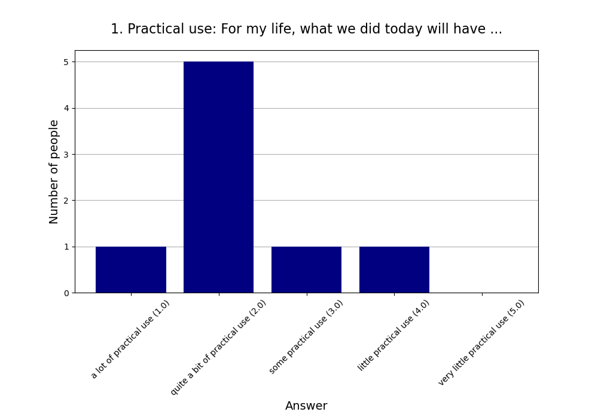
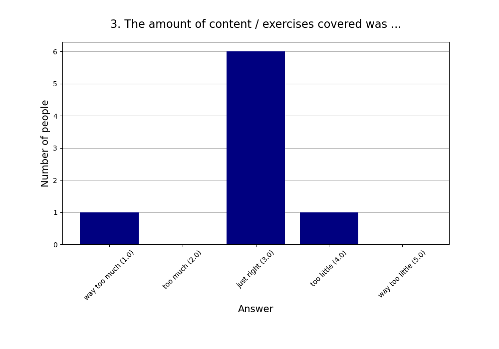
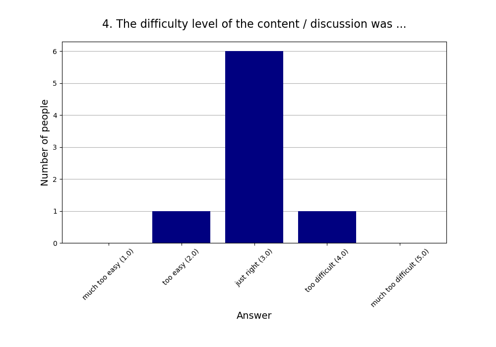

Read more about [this event]().

See also the [2024 summary]().

## Attendees

* **Total:** 9 people
* **Recurring:** 9 people
* **New:** 0 people

## Feedback

* **Responses:** 8 people (88.89% of attendees)

### 1. Practical use: For my life, what we did today will have ...

* **Responses:** 8 people (88.89% of attendees)
* **Answers:**
  * a lot of practical use (1): 1 person
  * quite a bit of practical use (2): 5 people
  * some practical use (3): 1 person
  * little practical use (4): 1 person
  * very little practical use (5): 0 people
* **Average answer:** 2.25 (σ=0.89)

### 2. The atmosphere / vibe was ...

* **Responses:** 8 people (88.89% of attendees)
* **Answers:**
  * fantastic (1): 5 people
  * good (2): 3 people
  * okay (3): 0 people
  * bad (4): 0 people
  * horrible (5): 0 people
* **Average answer:** 1.38 (σ=0.52)

### 3. The amount of content / exercises covered was ...

* **Responses:** 8 people (88.89% of attendees)
* **Answers:**
  * way too much (1): 1 person
  * too much (2): 0 people
  * just right (3): 6 people
  * too little (4): 1 person
  * way too little (5): 0 people
* **Average answer:** 2.88 (σ=0.83)

### 4. The difficulty level of the content / discussion was ...

* **Responses:** 8 people (88.89% of attendees)
* **Answers:**
  * much too easy (1): 0 people
  * too easy (2): 1 person
  * just right (3): 6 people
  * too difficult (4): 1 person
  * much too difficult (5): 0 people
* **Average answer:** 3.00 (σ=0.53)

### 5. Structure: On the whole the event needed ...

* **Responses:** 8 people (88.89% of attendees)
* **Answers:**
  * much more structure (1): 0 people
  * more structure (2): 1 person
  * (was just right) (3): 7 people
  * less structure (4): 0 people
  * much less structure (5): 0 people
* **Average answer:** 2.88 (σ=0.35)

### 6. The moderation should have been ...

* **Responses:** 8 people (88.89% of attendees)
* **Answers:**
  * much more relaxed (1): 0 people
  * more relaxed (2): 0 people
  * (was just right) (3): 8 people
  * more assertive (4): 0 people
  * much more assertive (5): 0 people
* **Average answer:** 3.00 (σ=0.00)

### 7. Host preparation: The content / exercises were ...

* **Responses:** 8 people (88.89% of attendees)
* **Answers:**
  * very well prepared (1): 1 person
  * well prepared (2): 5 people
  * okay prepared (3): 2 people
  * not well prepared (4): 0 people
  * not well prepared at all (5): 0 people
* **Average answer:** 2.12 (σ=0.64)

### 8. Changing your mind: The event made me ...

* **Responses:** 8 people (88.89% of attendees)
* **Answers:**
  * question many things (1): 0 people
  * question some things (2): 5 people
  * question few things (3): 2 people
  * question very few things (4): 1 person
  * not question anything (5): 0 people
* **Average answer:** 2.50 (σ=0.76)

### 9. Do you think you will come to one (or more) of the next three events?

* **Responses:** 8 people (88.89% of attendees)
* **Answers:**
  * probably no: 0 people
  * probably yes: 8 people

### 10. If you answered "probably no" in the previous question or are very uncertain, why is that?

* **Responses:** 0 people (0.00% of attendees)
* **Answers:**
  * Friday evening is a bad timeslot for me.: 0 people
  * I can't fit another activity into my life.: 0 people
  * I did not like (some of) the people here.: 0 people
  * I did not like today's venue.: 0 people
  * I live too far away.: 0 people
  * I'm not very interested in your usual topics.: 0 people
  * The level of English is too advanced for me.: 0 people

### 11. What did you like the most today?

* **Responses:** 4 people (44.44% of attendees)

**Note:** Anything contained in square brackets [] is an edit by the organizers.

> How hard and yet possibly useful SE is. Also the video was good. The exercise with climate change belief was great as it was directionally aligned with my bias and so was hard and made me think.

> Interesting topic 

> The discussion 

> Practical part
### 12. What did you like the least?

* **Responses:** 4 people (44.44% of attendees)

**Note:** Anything contained in square brackets [] is an edit by the organizers.

> 45 mins felt long at the start but the video was engaging and stood well; could see some other vids not working well for the purpose. Maybe <25 min of content would be good

> Might have been helpful to provide some example beliefs/topics to use for the practical part of street epistemology. Or ask people to find a topic at home on beforehand. 

> Not enough time for the practical exercise.

> Viel zu wenig Zeit zum Üben. Aber ich habe auch keine Idee, wie man das realistisch hätte verbessern können. _Wenn_ wir mehr Zeit zum Üben gehabt hätten (oder aber eine ungerade Zahl gewesen wären), hätte man auch Dreiergruppen bilden können: Die dritte Person beobachtet nur und schreibt auf, was man hätte verbessern können.
