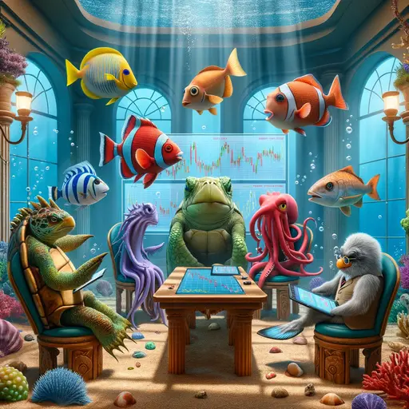

**IMPORTANT:** This is a closed meetup, meaning it is only meant for people who
have attended at least ONE previous event. Please do not come if this does not
apply to you! [Why? Read this.]() Check the
[list of events]() to find the next public event, where
everyone is welcome. Anything listed there is 100% open to anyone.

## Preparation

Bring your laptop.

## What will we do?

We will present and discuss our personal experience with investment in stocks
and ETFs as well as explain the fundamental underlying concepts.

Afterwards **if you want** you can set up something for yourself e.g. an ETF
savings plan and we will give you some guidance to the best of our knowledge
and ability.

**IMPORTANT:** We will not and cannot give investment advice and cannot accept
responsibility for your potential future losses. Investing always entails
risks. If we present a particular provider or platform it is because we have
some personal experience using it, that's it. To avoid conflicts of interest we
will NOT use affiliate links, recommendation bonuses or similar. **None of us
has any formal training in banking, finances or economics. We are not financial
advisors!**

## Organization

You are worried you have nothing to contribute? No worries! Everyone is
welcome!

There always is a mix of German and English speakers and we configure the
discussion rounds so that everyone feels comfortable participating. The primary
language is English.

This meetup will be hosted by Nawid.

There will be snacks and drinks.

We will go and get dinner after the meetup. Anyone who has time is welcome to
join.

<small>In the above map the location where you should leave your bikes is marked
in blue and the entrance with a red cross.</small>

## Other

[Learn more about us]().

<small>Image generated with _DALL·E_.</small>
