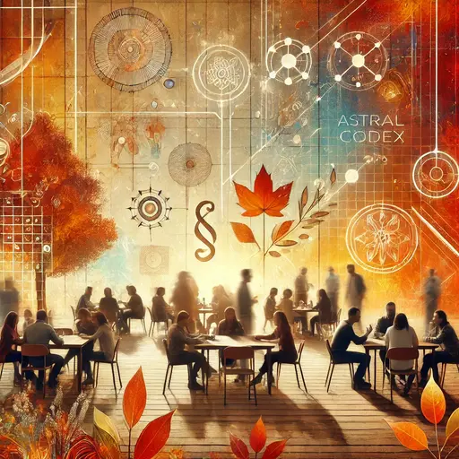

**Context:** ACX (Astral Codex Ten) is a blog popular in the rationality community. ACX Meetups are announced twice a year on that blog so readers can meet each other. We will discuss some recent articles (see link below), but as usual there will be at least one group that will just discuss any/every topic. On the whole we will chat, socialize and have fun.

## Preparation

Read one or several of the following articles:

* [Matt Yglesias Considered As The Nietzschean Superman](https://www.astralcodexten.com/p/matt-yglesias-considered-as-the-nietzschean)
  * optional: [Highlights From The Comments On Nietzsche](https://www.astralcodexten.com/p/highlights-from-the-comments-on-nietzsche)
* [Details That You Should Include In Your Article On How We Should Do Something About Mentally Ill Homeless People](https://www.astralcodexten.com/p/details-that-you-should-include-in)
  * optional: [Highlights From The Comments On Mentally Ill Homeless People](https://www.astralcodexten.com/p/highlights-from-the-comments-on-mentally)
* [Consciousness As Recursive Reflections](https://www.astralcodexten.com/p/consciousness-as-recursive-reflections)

## What will we do?

We will divide into several groups to discuss the different articles listed
above. There will be one group for people who did not read anything.

## Organization

You are worried you have nothing to contribute? No worries! Everyone is
welcome!

There always is a mix of German and English speakers and we configure the
discussion rounds so that everyone feels comfortable participating. The primary
language is English.

This meetup will be hosted by Omar.

There will be snacks and drinks.

We will go and get dinner after the meetup. Anyone who has time is welcome to
join.

<small>In the above map the location where you should leave your bikes is marked
in blue and the entrance (at the end of the metal ramp) with a red cross.</small>

## Other

[Learn more about us]().

<small>Image generated with _DALL·E_.</small>
