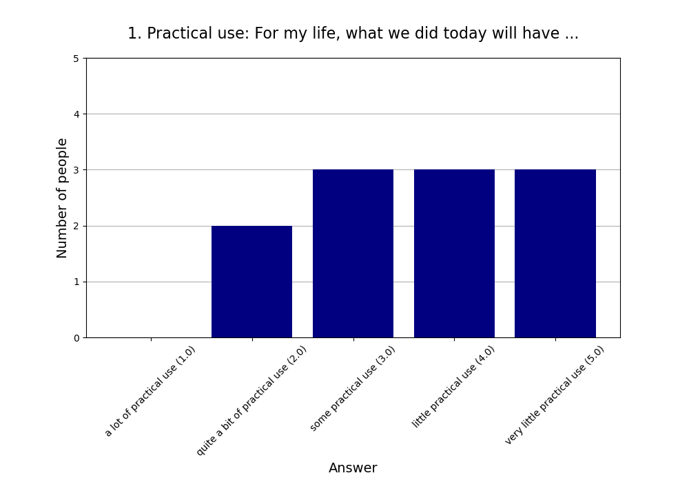
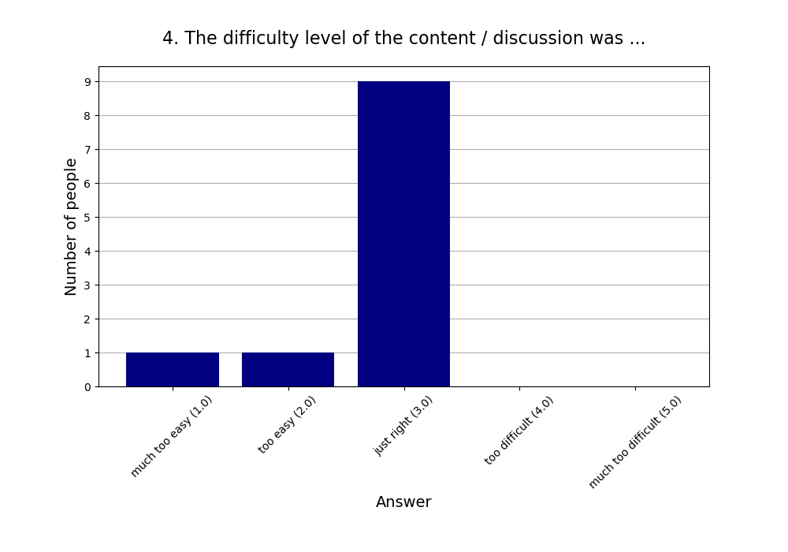
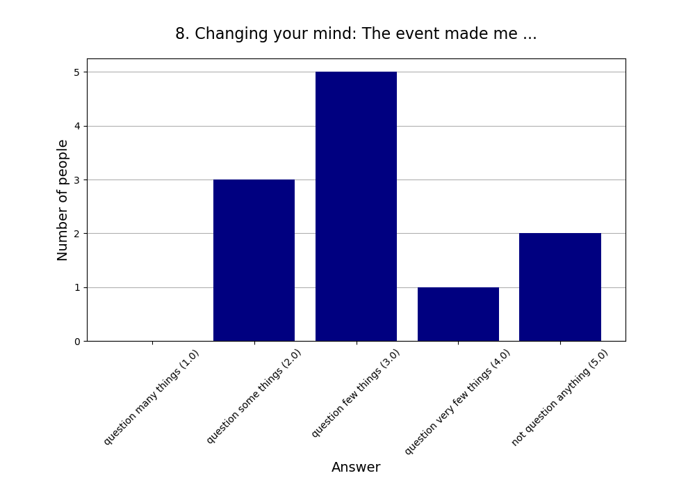

Read more about [this event]().

See also the [2024 summary]().

## Attendees

* **Total:** 14 people
* **Recurring:** 12 people
* **New:** 2 people

## Feedback

* **Responses:** 11 people (78.57% of attendees)

### 1. Practical use: For my life, what we did today will have ...

* **Responses:** 11 people (78.57% of attendees)
* **Answers:**
  * a lot of practical use (1): 0 people
  * quite a bit of practical use (2): 2 people
  * some practical use (3): 3 people
  * little practical use (4): 3 people
  * very little practical use (5): 3 people
* **Average answer:** 3.64 (σ=1.12)

### 2. The atmosphere / vibe was ...

* **Responses:** 11 people (78.57% of attendees)
* **Answers:**
  * fantastic (1): 3 people
  * good (2): 4 people
  * okay (3): 4 people
  * bad (4): 0 people
  * horrible (5): 0 people
* **Average answer:** 2.09 (σ=0.83)

### 3. The amount of content / exercises covered was ...

* **Responses:** 11 people (78.57% of attendees)
* **Answers:**
  * way too much (1): 0 people
  * too much (2): 0 people
  * just right (3): 9 people
  * too little (4): 1 person
  * way too little (5): 1 person
* **Average answer:** 3.27 (σ=0.65)

### 4. The difficulty level of the content / discussion was ...

* **Responses:** 11 people (78.57% of attendees)
* **Answers:**
  * much too easy (1): 1 person
  * too easy (2): 1 person
  * just right (3): 9 people
  * too difficult (4): 0 people
  * much too difficult (5): 0 people
* **Average answer:** 2.73 (σ=0.65)

### 5. Structure: On the whole the event needed ...

* **Responses:** 11 people (78.57% of attendees)
* **Answers:**
  * much more structure (1): 0 people
  * more structure (2): 4 people
  * (was just right) (3): 7 people
  * less structure (4): 0 people
  * much less structure (5): 0 people
* **Average answer:** 2.64 (σ=0.50)

### 6. The moderation should have been ...

* **Responses:** 11 people (78.57% of attendees)
* **Answers:**
  * much more relaxed (1): 0 people
  * more relaxed (2): 0 people
  * (was just right) (3): 9 people
  * more assertive (4): 2 people
  * much more assertive (5): 0 people
* **Average answer:** 3.18 (σ=0.40)

### 7. Host preparation: The content / exercises were ...

* **Responses:** 11 people (78.57% of attendees)
* **Answers:**
  * very well prepared (1): 1 person
  * well prepared (2): 0 people
  * okay prepared (3): 10 people
  * not well prepared (4): 0 people
  * not well prepared at all (5): 0 people
* **Average answer:** 2.82 (σ=0.60)

### 8. Changing your mind: The event made me ...

* **Responses:** 11 people (78.57% of attendees)
* **Answers:**
  * question many things (1): 0 people
  * question some things (2): 3 people
  * question few things (3): 5 people
  * question very few things (4): 1 person
  * not question anything (5): 2 people
* **Average answer:** 3.18 (σ=1.08)

### 9. Do you think you will come to one (or more) of the next three events?

* **Responses:** 11 people (78.57% of attendees)
* **Answers:**
  * probably no: 0 people
  * probably yes: 11 people

### 10. If you answered "probably no" in the previous question or are very uncertain, why is that?

* **Responses:** 0 people (0.00% of attendees)
* **Answers:**
  * Friday evening is a bad timeslot for me.: 0 people
  * I can't fit another activity into my life.: 0 people
  * I did not like (some of) the people here.: 0 people
  * I did not like today's venue.: 0 people
  * I live too far away.: 0 people
  * I'm not very interested in your usual topics.: 0 people
  * The level of English is too advanced for me.: 0 people

### 11. What did you like the most today?

* **Responses:** 4 people (28.57% of attendees)

**Note:** Anything contained in square brackets [] is an edit by the organizers.

> People

> Invest in children

> The vibes. Feeling welcome and included despite me being shy.

> Vibe
### 12. What did you like the least?

* **Responses:** 3 people (21.43% of attendees)

**Note:** Anything contained in square brackets [] is an edit by the organizers.

> That I didn't prepare... :-(

> Nobody (myself included) seemed to be really well prepared so the discussions were a little shallow.

> No exercises 
