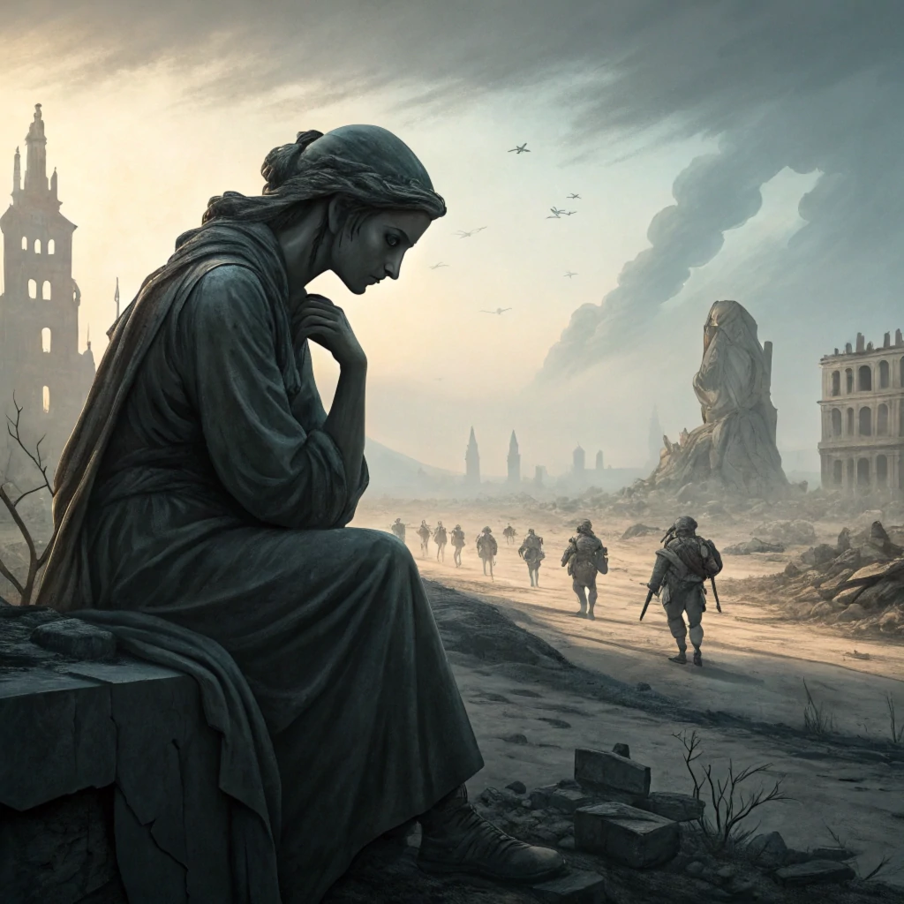

## Vorbereitung

Dieser Event basiert auf Ideen die ich hier gelernt habe:

[ACX - The Extinction Tournament](https://www.astralcodexten.com/p/the-extinction-tournament)

Den Text zu lesen ist empfohlen, aber nicht notwendig.

## Was werden wir tun?

Wir werden herausfinden, wie wahrscheinlich globale katastrophale Ereignisse in den nächsten Jahren/Jahrzehnten sein werden.

Ich werde das Gesamtbild des Events vorstellen und was die Experten über unseren möglicherweise bevorstehenden Untergang denken.
Dann teilen wir uns in kleine Gruppen auf, um verschiedene Teilaspekte wie Aussterben durch Biowaffen, KI-Übernahme, Atomkrieg usw. zu diskutieren.
Das Ziel der Diskussionen sollte sich um drei Fragen drehen:

 - Wie wahrscheinlich ist es, dass dies zu einem Problem wird?
 - Sollten wir persönlich etwas dagegen tun?
 - Was könnten wir persönlich dagegen tun?

Am Ende kommen wir wieder zusammen und tauschen uns darüber aus, ob und was wir als nächstes tun sollten.

## Organisation

Mach dir keine Sorgen, wenn du denkst, dass du nichts beitragen kannst! Jeder ist willkommen!

Es gibt immer eine Mischung aus Deutsch- und Englischsprachigen, und wir gestalten die Diskussionsrunden so, dass sich jeder wohlfühlt. Die Hauptsprache ist Englisch.

Dieses Treffen wird von Omar moderiert.

Es wird Snacks und Getränke geben.

Wir werden nach dem Treffen zum Abendessen gehen. Jeder, der Zeit hat, ist herzlich eingeladen, sich anzuschließen.

<small>In der obigen Karte ist der Ort markiert, an dem du dein Fahrrad abstellen solltest (blau) und der Eingang (am Ende der Metallrampe) mit einem roten Kreuz.</small>

## Sonstiges

[Erfahre mehr über uns]().

<small>Bild generiert mit _Recraft_.</small>
