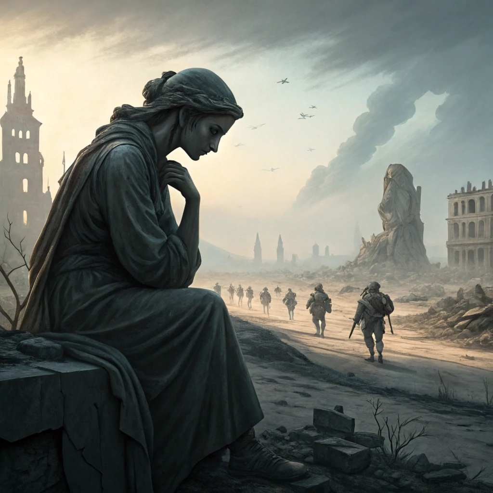

## Preparation

This event will be based on ideas I learned here:

[ACX - The Extinction Tournament](https://www.astralcodexten.com/p/the-extinction-tournament)

Reading it is recommended, but not required.

## What will we do?

We will figure out, how likely we expect global catastrophic events to be within the next years / decades.

I will present the overall picture of the extinction tournament and what the experts think about our maybe upcoming demise is.
Then we split up in small groups to discuss various sub-aspects like extinction through bio-weapons, AI-takeover, nuclear war, etc.
The goal of the discussions should be around three questions:

 - How likely will this become a problem?
 - Should we personally do something about that?
 - What could we personally do about it?

In the end we gather again and share if and what we should do next.

## Organization

You are worried you have nothing to contribute? No worries! Everyone is
welcome!

There always is a mix of German and English speakers and we configure the
discussion rounds so that everyone feels comfortable participating. The primary
language is English.

This meetup will be hosted by Ben.

There will be snacks and drinks.

We will go and get dinner after the meetup. Anyone who has time is welcome to
join.

<small>In the above map the location where you should leave your bikes is marked
in blue and the entrance (at the end of the metal ramp) with a red cross.</small>

## Other

[Learn more about us]().

<small>Image generated with _Recraft_.</small>
