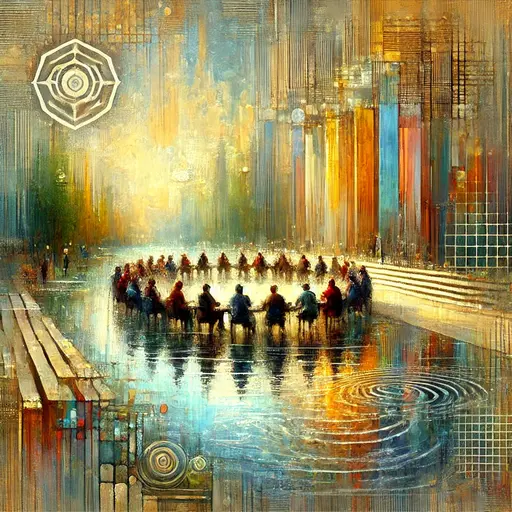

## Update 15.02

* Folien: [2025-02-14-rationality101-v1.pdf](https://raw.githubusercontent.com/omarkohl/rationality-freiburg.de/9352ff1b/slides/2025-02-14-rationality101/2025-02-14-rationality101-v1.pdf)

## Vorbereitung

Falls möglich, bringe einen **Laptop** oder ein **Smartphone** mit zum Treffen.

Lies den folgenden Artikel. Wenn du das nicht schaffst, ist das in Ordnung – es wird dir während des Treffens Zeit gegeben, dies nachzuholen:

- [Stupidity: Our biggest threat?](https://onepercentrule.substack.com/p/stupidity-our-biggest-threat) (Englisch)

Während du liest, mache **schriftliche Notizen** (Papier, Handy, Laptop) zu den folgenden vier Punkten:

- Das wusste ich bereits **vorher**
- Das habe ich **nicht verstanden**
- Das möchte ich gerne **diskutieren**
- Das sind **meine Ideen** zu diesem Thema

**Optional:** Zusätzlich kannst du [The Spiral of Wrath: The crash of Armavia flight 967](https://admiralcloudberg.medium.com/the-spiral-of-wrath-the-crash-of-armavia-flight-967-c7d84541f0f7) (Englisch) lesen. Es ist optional, da es zwar faszinierend, aber auch ziemlich lang ist. Es wird eine Diskussionsgruppe speziell für Personen geben, die diesen Text vorbereitet haben. Während du liest, notiere gute und schlechte Entscheidungen der beteiligten Personen und schreibe deine Gedanken zu den Ursachen in jedem Fall auf.

## Was werden wir tun?

Begleite uns zur zweiten Sitzung von Rationalität 101! Dieser interaktive Workshop konzentriert sich auf die **instrumentelle Rationalität** – die praktischen **Werkzeuge und Strategien**, um bessere **Entscheidungen** zu treffen und deine **Ziele** effektiv zu erreichen.

In dieser Sitzung tauchen wir in Themen wie **Entscheidungstheorie**, das Setzen kohärenter **Ziele** und die entscheidende Verbindung zwischen Rationalität und Erfolg ein. Du wirst lernen, wie du deine Handlungen mit deinen Zielen in Einklang bringst, Abwägungen bewertest und die Wirkung deiner Entscheidungen maximierst. Durch spannende **Diskussionen, praktische Übungen und gemeinsames Problemlösen** wirst du umsetzbare Erkenntnisse mitnehmen, die du in deinem persönlichen und beruflichen Leben anwenden kannst.

Egal, ob du an [Teil 1]() teilgenommen hast oder **zum ersten Mal dabei bist** – diese Sitzung ist so gestaltet, dass sie **für alle zugänglich und bereichernd** ist. Bring deine Neugier, deine Fragen und vielleicht einen Freund mit, um gemeinsam die Geheimnisse der praktischen Rationalität zu entschlüsseln!

## Organisation

Mach dir keine Sorgen, wenn du denkst, dass du nichts beitragen kannst! **Jeder ist willkommen!**

Es gibt immer eine Mischung aus **deutsch- und englischsprachigen Teilnehmern**, und wir gestalten die Diskussionsrunden so, dass sich jeder wohlfühlt. Die Hauptsprache ist Englisch.

Dieses Treffen wird von Omar moderiert.

Es wird Snacks und Getränke geben.

Nach dem Treffen werden wir **gemeinsam Abendessen gehen**. Jeder, der Zeit hat, ist herzlich eingeladen, sich anzuschließen.

<small>In der obigen Karte ist der Ort markiert, an dem du dein Fahrrad abstellen solltest (blau), und der Eingang (am Ende der Metallrampe) mit einem roten Kreuz.</small>

## Sonstiges

[Erfahre mehr über uns]().

<small>Bild generiert mit _DALL·E_.</small>