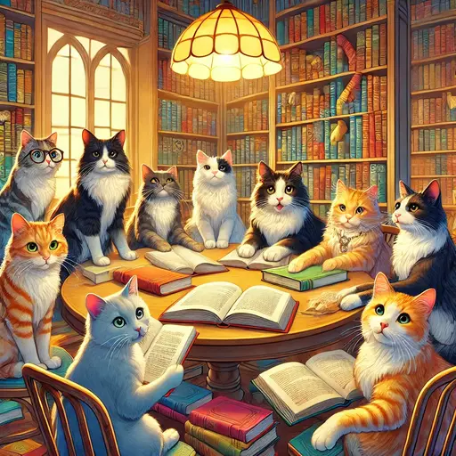

## Preparation

Please bring your **laptop**.

Downloads:
* [Material 1](<Material 1.pdf>)
* [Material 2](<Material 2.pdf>)
* [Material 3](<Material 3.pdf>)
* [Material 4](<Material 4.pdf>)
* [Material 5](<Material 5.pdf>)

## What will we do?

In this meeting we will deal with cognitive reading strategies which can
improve the ability to understand, to paraphrase, and to discuss even complex
texts. The participants are presented with the opportunity to try out a set of
strategies by applying them to different texts. Silent work and interaction
will complement one another.

My name is Tatjana. Among other topics, I’m engaged in research on German
literature, narratology, literary didactics, and, occasionally, reading
strategies.

## Organization

You are worried you have nothing to contribute? No worries! Everyone is
welcome!

There always is a mix of German and English speakers and we configure the
discussion rounds so that everyone feels comfortable participating. The primary
language is English.

This meetup will be hosted by Tatjana.

There will be snacks and drinks.

We will go and get dinner after the meetup. Anyone who has time is welcome to
join.

<small>In the above map the location where you should leave your bikes is marked
in blue and the entrance (at the end of the metal ramp) with a red cross.</small>

## Other

[Learn more about us]().

<small>Image generated with _DALL·E_.</small>
