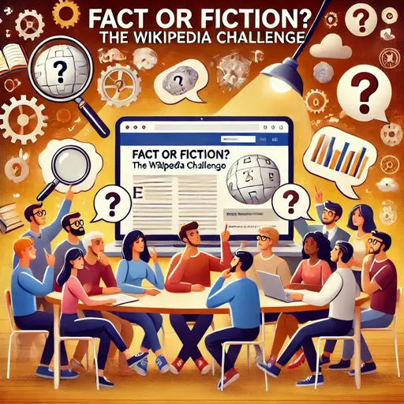

**WICHTIG:** Dies ist ein geschlossenes Treffen, das nur für Personen gedacht ist, die bereits mindestens EINE frühere Veranstaltung besucht haben. Bitte komm nicht, wenn dies nicht auf dich zutrifft! [Warum? Lies hier nach.]() Überprüfe die [Liste der Veranstaltungen](), um das nächste öffentliche Event zu finden, bei dem jeder willkommen ist. Alles, was dort aufgelistet ist, ist zu 100 % offen für alle.

## Vorbereitung

Bringe einen Laptop oder ein Smartphone mit.

## Was werden wir tun?

Wir werden uns in Zweiergruppen aufteilen, und jedes Team erhält einen **gekürzten Wikipedia-Artikel**. Diese Artikel enthalten **zwischen null und zehn sachliche Fehler** – aber ihr werdet nicht wissen, wie viele!  

### **Phase 1: Untersuchung**  
Jedes Paar wird seinen Artikel **analysieren**, mögliche Ungenauigkeiten identifizieren und alle Korrekturen vornehmen, die es für notwendig hält. Anschließend wird eine **Zusammenfassung** vorbereitet, die der Gruppe vorgestellt wird.  

### **Phase 2: Die Herausforderung**  
Sobald alle Gruppen bereit sind, **treffen wir uns wieder als Gruppe**, und jedes Paar stellt sein Thema vor. Der Clou? **Das Publikum muss versuchen, die ursprünglichen (möglicherweise nicht existierenden) Fehler zu entdecken!**  

### **Phase 3: Die Auflösung & Diskussion**  
Nachdem das Publikum seine Vermutungen geäußert hat, **werden die tatsächlichen Änderungen enthüllt**, die am Originaltext vorgenommen wurden. Abschließend führen wir eine **offene Diskussion**.  

Dieses Event ist eine unterhaltsame Möglichkeit, dein kritisches Denken zu testen, Annahmen zu hinterfragen und zu üben, wie es ist, sich zu irren.

Ursprüngliche Idee (Englisch): [Brief notes on the Wikipedia game](https://www.lesswrong.com/posts/4fqdfrDzFebsx8amf/brief-notes-on-the-wikipedia-game)

## Organisation

Mach dir keine Sorgen, wenn du denkst, dass du nichts beitragen kannst! **Jeder ist willkommen!**

Es gibt immer eine Mischung aus **deutsch- und englischsprachigen Teilnehmenden**, und wir gestalten die Diskussionsrunden so, dass sich jeder wohlfühlt. Die Hauptsprache ist Englisch.

Dieses Treffen wird von Omar moderiert.

Es wird Snacks und Getränke geben.

Nach dem Treffen gehen wir **gemeinsam essen**. Jeder, der Zeit hat, ist herzlich eingeladen, sich anzuschließen.

<small>In der obigen Karte ist der Ort markiert, an dem du dein Fahrrad abstellen solltest (blau), und der Eingang (am Ende der Metallrampe) mit einem roten Kreuz.</small>

## Sonstiges

[Erfahre mehr über uns]().

<small>Bild generiert mit _DALL·E_.</small>
