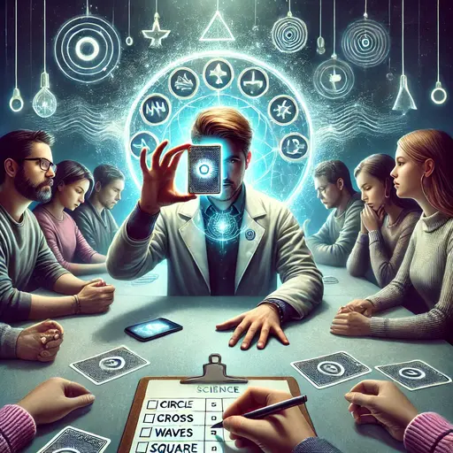

## Vorbereitung

Bringe einen Laptop mit.

## Was werden wir tun?

Glaubst du an ESP (außersinnliche Wahrnehmung)? Warum oder warum nicht? Was würde dich davon überzeugen, dass du falsch liegst? Heute werden wir ESP experimentell testen, indem wir uns in Gruppen aufteilen, eine Versuchsanordnung entwerfen, versuchen, die Gedanken der anderen zu lesen, und die Ergebnisse aufzeichnen.

Zum Abschluss wird jede Gruppe ihre Erkenntnisse allen Teilnehmern präsentieren, und wir werden sie gemeinsam diskutieren.

## Organisation

Mach dir keine Sorgen, wenn du denkst, dass du nichts beitragen kannst! **Jeder ist willkommen!**

Es gibt immer eine Mischung aus **deutsch- und englischsprachigen Teilnehmenden**, und wir gestalten die Diskussionsrunden so, dass sich jeder wohlfühlt. Die Hauptsprache ist Englisch.

Dieses Treffen wird von Omar moderiert.

Es wird Snacks und Getränke geben.

Nach dem Treffen gehen wir **gemeinsam essen**. Jeder, der Zeit hat, ist herzlich eingeladen, mitzukommen.

<small>In der obigen Karte ist der Ort markiert, an dem du dein Fahrrad abstellen solltest (blau), und der Eingang (am Ende der Metallrampe) mit einem roten Kreuz.</small>

## Sonstiges

[Erfahre mehr über uns]().

<small>Bild generiert mit _DALL·E_.</small>