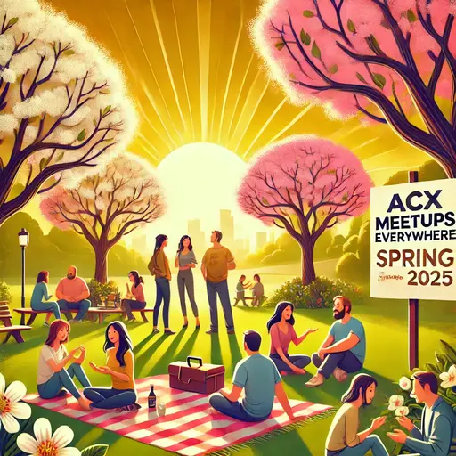

## Vorbereitung

Lies mindestens einen der folgenden Artikel:

* [(Englisch) Why I Am Not A Conflict Theorist](https://www.astralcodexten.com/p/why-i-am-not-a-conflict-theorist)
* [(Englisch) How To Stop Worrying And Learn To Love Lynn's National IQ Estimates](https://www.astralcodexten.com/p/how-to-stop-worrying-and-learn-to)
* (2 Artikel!) [(Englisch) Claude Fights Back](https://www.astralcodexten.com/p/claude-fights-back) und [(Englisch) Why Worry About Incorrigible Claude?](https://www.astralcodexten.com/p/why-worry-about-incorrigible-claude)

Bringe schriftliche Antworten zu folgenden Fragen mit:

* Das wusste ich bereits **vorher**
* Das habe ich **nicht verstanden**
* Das möchte ich gerne **diskutieren**
* Das sind **meine Ideen** zu diesem Thema

Teilnehmende, die keine Zeit zur Vorbereitung hatten, lesen während des Treffens den Artikel zu den „IQ Estimates“, da dieser der kürzeste ist, und nehmen erst danach an einer Diskussionsgruppe teil.

## Was werden wir tun?

Wir werden uns je nach gelesenem Artikel in Diskussionsgruppen aufteilen und dann die Antworten der Teilnehmenden besprechen.

## Organisation

Mach dir keine Sorgen, wenn du denkst, dass du nichts beitragen kannst! **Jeder ist willkommen!**

Es gibt immer eine Mischung aus **deutsch- und englischsprachigen Teilnehmenden**, und wir gestalten die Diskussionsrunden so, dass sich jeder wohlfühlt. Die Hauptsprache ist Englisch.

Dieses Treffen wird von Omar moderiert.

Es wird Snacks und Getränke geben.

Nach dem Treffen gehen wir **gemeinsam essen**. Jeder, der Zeit hat, ist herzlich eingeladen, mitzukommen.

<small>In der obigen Karte ist der Ort markiert, an dem du dein Fahrrad abstellen solltest (blau), und der Eingang (am Ende der Metallrampe) mit einem roten Kreuz.</small>

## Sonstiges

[Erfahre mehr über uns]().

<small>Bild generiert mit _DALL·E_.</small>