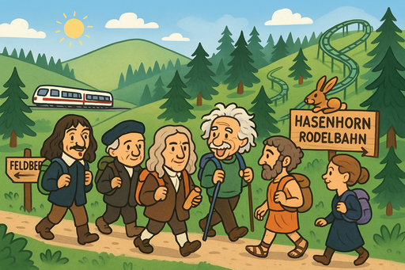

**WICHTIG:** Falls du noch nicht in unserer Signal-Chatgruppe bist und eine Teilnahme in Erwägung ziehst, melde dich bitte unter info@rationality-freiburg.de, damit wir dich über kurzfristige Änderungen (z. B. wegen schlechten Wetters) informieren können.

## Was werden wir machen?

Treffpunkt ist um Punkt 08:55 Uhr am Haupteingang des Freiburger Hauptbahnhofs.

Wir nehmen um 09:10 Uhr den Zug mit dem Endziel Hebelhof, Feldberg. Von dort wandern wir ca. 12 km bis zur **Hasenhorn Rodelbahn**, von wo aus wir in Todtnau ankommen. Von dort geht es mit öffentlichen Verkehrsmitteln zurück zum Freiburger Hauptbahnhof.  
Unterwegs machen wir ein Picknick – bringt also belegte Brote, Snacks etc. mit!

Hier ist die komplette Route: https://www.outdooractive.com/de/route/wanderung/schwarzwald/feldberg-herzogenhorn-hasenhorn/290359153/

Mehr über die Rodelbahn erfährst du hier: https://www.hasenhorn-rodelbahn.de/  
Wer sich auf der Bahn nicht wohlfühlt, kann alternativ mit der Seilbahn fahren oder zu Fuß absteigen (der Weg ist allerdings recht steil und dauert ca. 45 Minuten).

Die Wanderung ist kinderfreundlich geplant, und es gibt zwei Stellen, an denen man die Tour bei Bedarf abkürzen kann.

Wenn du möchtest, kannst du auch direkt in Feldberg zur Wanderung dazustoßen. Dort brechen wir um 10:30 Uhr auf.

---

## Sonstiges

[Mehr über uns erfährst du hier]().

<small>Bild generiert mit _DALL·E_.</small>