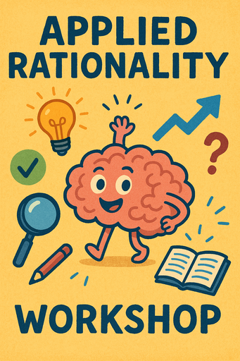

**WICHTIG:** Dies ist ein geschlossenes Meetup – das heißt, es ist nur für
Personen gedacht, die bereits **mindestens EIN früheres Event besucht haben**.
Bitte komm nicht, wenn das auf dich nicht zutrifft! [Warum? Hier erfährst du mehr.]() Sieh dir stattdessen die [Liste der Events]() an, um das nächste öffentliche Meetup zu finden, zu dem alle willkommen sind. Alles, was dort gelistet ist, ist zu 100 % offen für jede*n.

## Vorbereitung

Keine.

## Was machen wir?

Omar nimmt an einem Workshop zu angewandter Rationalität teil, und wir werden
einige der Dinge, die er daraus mitnimmt, gemeinsam in die Praxis umsetzen.

## Organisation

Du hast Sorge, nichts beitragen zu können? Keine Sorge! Jede*r ist willkommen!

Es gibt immer eine Mischung aus deutsch- und englischsprachigen Teilnehmer*innen
und wir gestalten die Diskussionsrunden so, dass sich alle wohlfühlen. Die
Hauptsprache ist Englisch.

Dieses Meetup wird von Omar moderiert.

Es wird Snacks und Getränke geben.

Nach dem Meetup gehen wir gemeinsam essen. Wer Zeit hat, ist herzlich eingeladen mitzukommen.

<small>Auf der obigen Karte ist der Fahrradabstellplatz blau markiert, der Eingang (am Ende der Metallrampe) mit einem roten Kreuz.</small>

## Sonstiges

[Erfahre mehr über uns]().

<small>Bild erstellt mit _GPT 4o_.</small>
