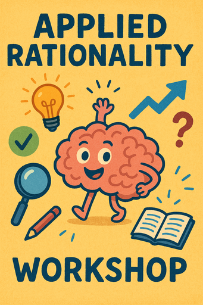

**IMPORTANT:** This is a closed meetup, meaning it is only meant for people who
have attended at least ONE previous event. Please do not come if this does not
apply to you! [Why? Read this.]() Check the
[list of events]() to find the next public event, where
everyone is welcome. Anything listed there is 100% open to anyone.

## Preparation

None.

## What will we do?

Omar is attending an applied rationality workshop and we will put some of the
things he took away into practice.

## Organization

You are worried you have nothing to contribute? No worries! Everyone is
welcome!

There always is a mix of German and English speakers and we configure the
discussion rounds so that everyone feels comfortable participating. The primary
language is English.

This meetup will be hosted by Omar.

There will be snacks and drinks.

We will go and get dinner after the meetup. Anyone who has time is welcome to
join.

<small>In the above map the location where you should leave your bikes is marked
in blue and the entrance (at the end of the metal ramp) with a red cross.</small>

## Other

[Learn more about us]().

<small>Image generated with _GPT 4o_.</small>
