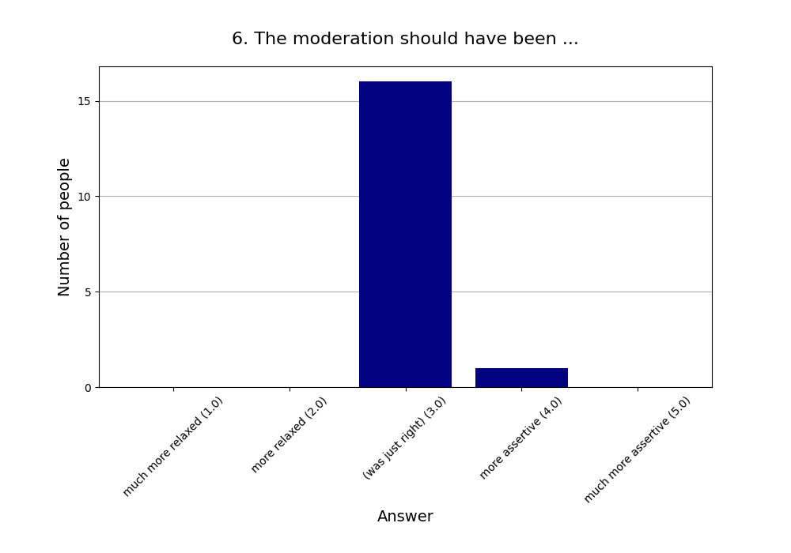

Read more about [this event]().

See also the [2025 summary]().

## Attendees

* **Total:** 18 people
* **Recurring:** 18 people
* **New:** 0 people

### 1. Practical use: For my life, what we did today will have ...

* **Responses:** 17 people (94.44% of attendees)
* **Answers:**
  * a lot of practical use (1): 3 people
  * quite a bit of practical use (2): 7 people
  * some practical use (3): 2 people
  * little practical use (4): 3 people
  * very little practical use (5): 2 people
* **Average answer:** 2.65 (σ=1.32)

### 2. The atmosphere / vibe was ...

* **Responses:** 17 people (94.44% of attendees)
* **Answers:**
  * fantastic (1): 8 people
  * good (2): 6 people
  * okay (3): 3 people
  * bad (4): 0 people
  * horrible (5): 0 people
* **Average answer:** 1.71 (σ=0.77)

### 3. The amount of content / exercises covered was ...

* **Responses:** 17 people (94.44% of attendees)
* **Answers:**
  * way too much (1): 0 people
  * too much (2): 4 people
  * just right (3): 12 people
  * too little (4): 1 person
  * way too little (5): 0 people
* **Average answer:** 2.82 (σ=0.53)

### 4. The difficulty level of the content / discussion was ...

* **Responses:** 17 people (94.44% of attendees)
* **Answers:**
  * much too easy (1): 0 people
  * too easy (2): 1 person
  * just right (3): 15 people
  * too difficult (4): 1 person
  * much too difficult (5): 0 people
* **Average answer:** 3.00 (σ=0.35)

### 5. Structure: On the whole the event needed ...

* **Responses:** 17 people (94.44% of attendees)
* **Answers:**
  * much more structure (1): 0 people
  * more structure (2): 2 people
  * (was just right) (3): 14 people
  * less structure (4): 1 person
  * much less structure (5): 0 people
* **Average answer:** 2.94 (σ=0.43)

### 6. The moderation should have been ...

* **Responses:** 17 people (94.44% of attendees)
* **Answers:**
  * much more relaxed (1): 0 people
  * more relaxed (2): 0 people
  * (was just right) (3): 16 people
  * more assertive (4): 1 person
  * much more assertive (5): 0 people
* **Average answer:** 3.06 (σ=0.24)

### 7. Host preparation: The content / exercises were ...

* **Responses:** 17 people (94.44% of attendees)
* **Answers:**
  * very well prepared (1): 2 people
  * well prepared (2): 13 people
  * okay prepared (3): 1 person
  * not well prepared (4): 1 person
  * not well prepared at all (5): 0 people
* **Average answer:** 2.06 (σ=0.66)

### 8. Changing your mind: The event made me ...

* **Responses:** 17 people (94.44% of attendees)
* **Answers:**
  * question many things (1): 1 person
  * question some things (2): 9 people
  * question few things (3): 3 people
  * question very few things (4): 3 people
  * not question anything (5): 1 person
* **Average answer:** 2.65 (σ=1.06)

### 9. Do you think you will come to one (or more) of the next three events?

* **Responses:** 17 people (94.44% of attendees)
* **Answers:**
  * probably no: 3 people
  * probably yes: 14 people

### 10. If you answered "probably no" in the previous question or are very uncertain, why is that?

* **Responses:** 7 people (38.89% of attendees)
* **Answers:**
  * Friday evening is a bad timeslot for me.: 2 people
  * I can't fit another activity into my life.: 2 people
  * I did not like (some of) the people here.: 0 people
  * I did not like today's venue.: 0 people
  * I live too far away.: 2 people
  * I'm not very interested in your usual topics.: 1 person
  * The level of English is too advanced for me.: 0 people

### 11. What did you like the most today?

* **Responses:** 13 people (72.22% of attendees)

**Note:** Anything contained in square brackets [] is an edit by the organizers.

> The hot seat activity

> The hot seat exercise made me feel more connected and have better understanding of the other people there.

> Anti Self Deception

> Die Hot Seat Übung 

> All activities were great. And also felt they were a good combination of whole group, individual, small group activities.

> The hot seat exercise 

> Topics and hot seat introduction 

> OODA loops and self deception info and hot seat

> hotseat und präsentationen

> hot seat - really great idea  
> the post about self-deception

> Focus on practical application

> Self deception

> Hot Seat
### 12. What did you like the least?

* **Responses:** 10 people (55.56% of attendees)

**Note:** Anything contained in square brackets [] is an edit by the organizers.

> Hot Seat (didn't think it had much use. Maybe better as a prepared Event so everyone can prepare good questions. Or with pre-printented questions and the option to go away from them any time)

> Die Einleitung zur Hostile Telepathy war etwas zu lang, aber trotzdem nützlich 

> The explanation for the last two activities took maybe longer than it could have.

> Explanation for hostile telepathy was too long.

> Self deception exercises

> median fragerunde

> The ice breaker exercises did not seem relevant for the later methods (since those were individual not group exercises)

> Ooda-too simple

> Hostile Telepath

> The topics discussed did not have much impact for me. I don't feel closer to enlightenment. (sorry! Not meant as an offense! They were well presented.)
