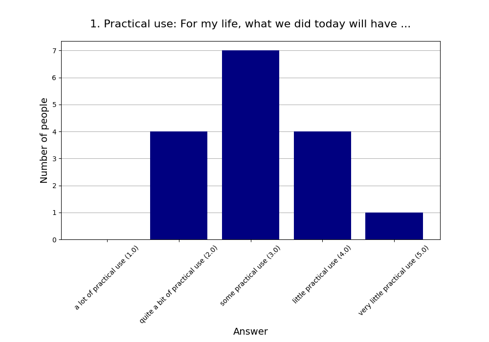
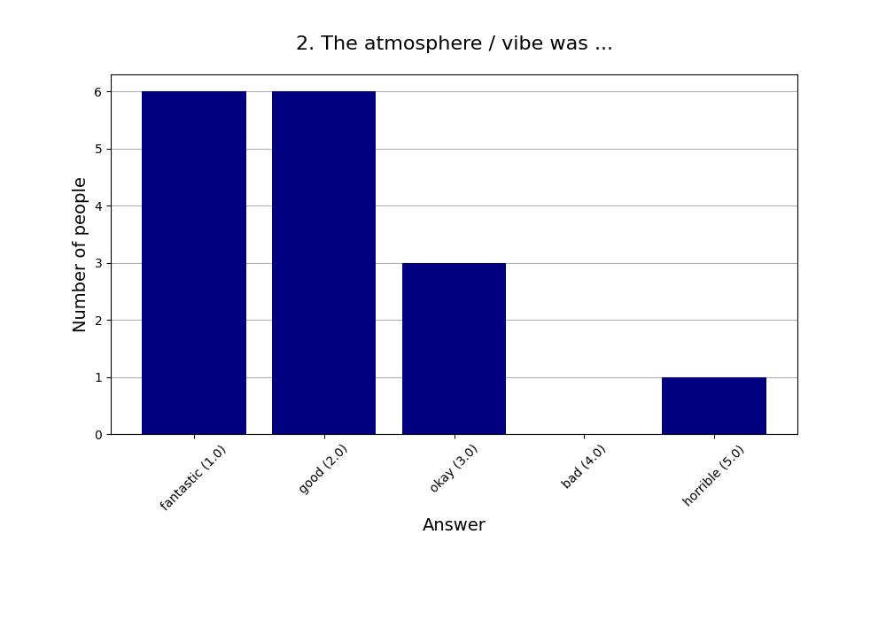
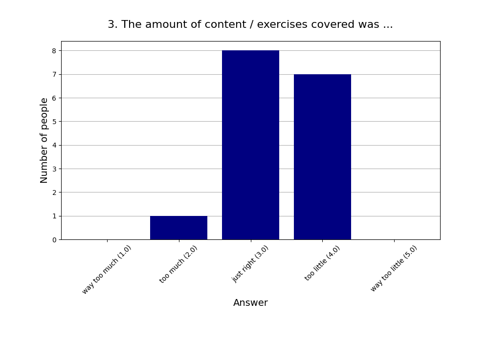
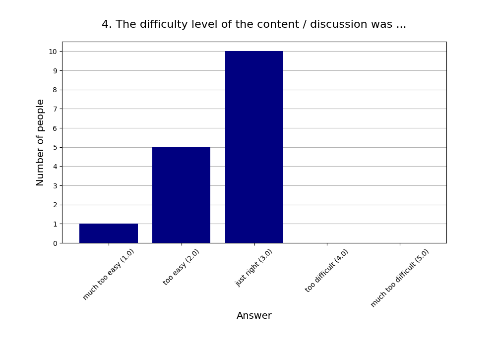
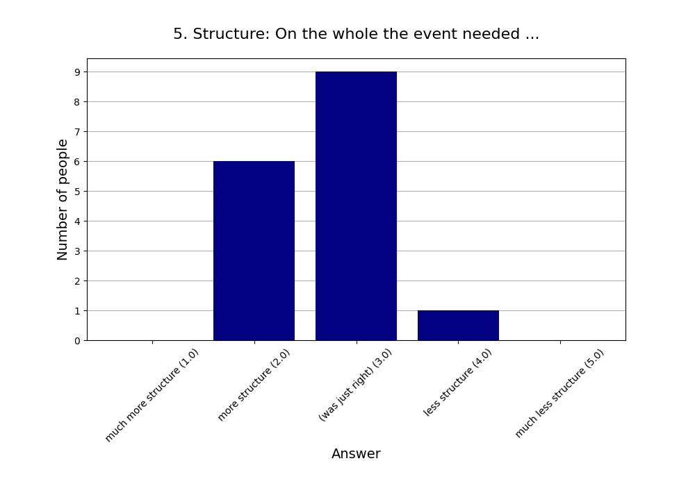
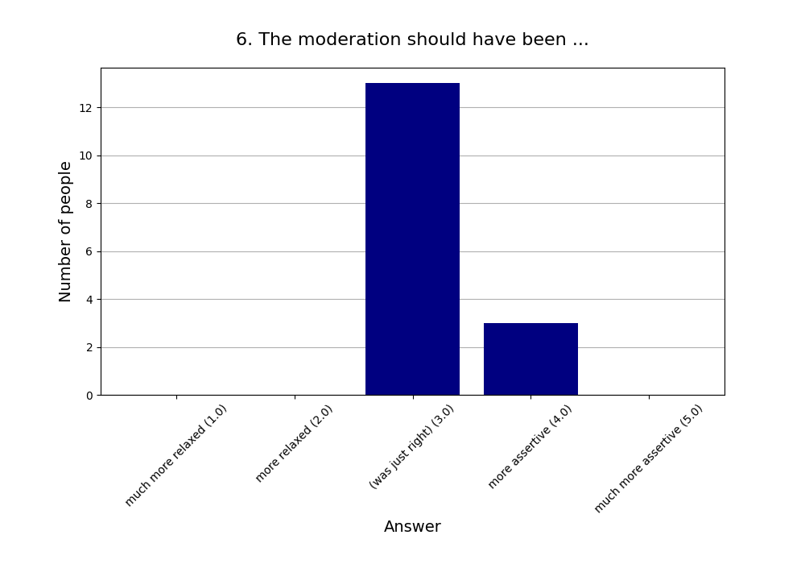
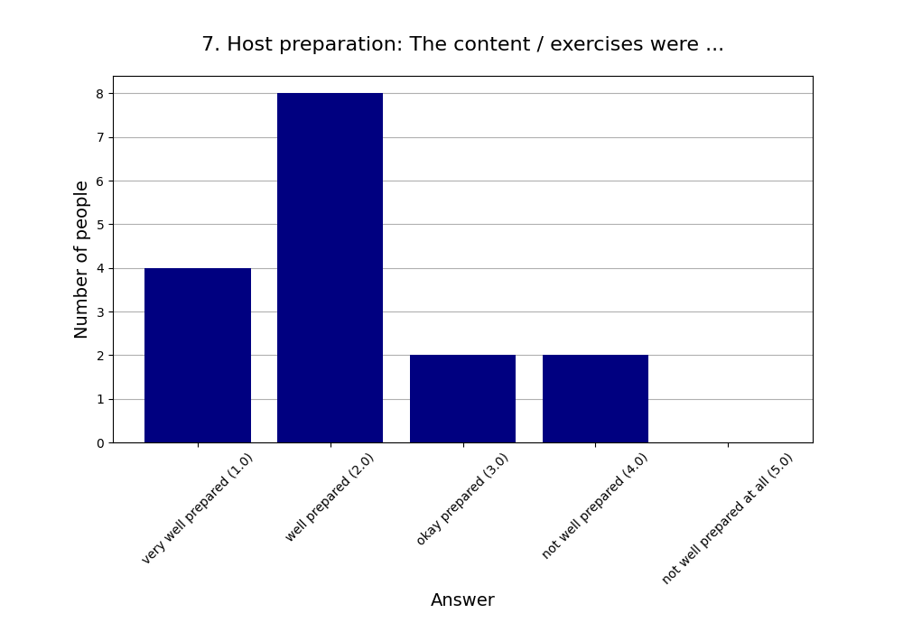
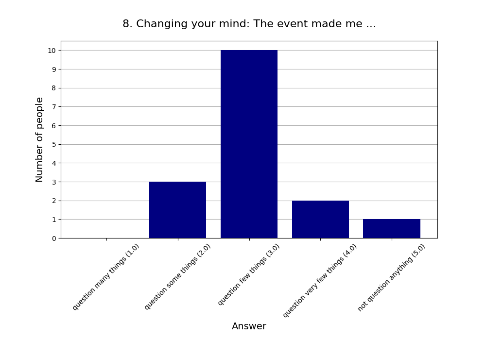
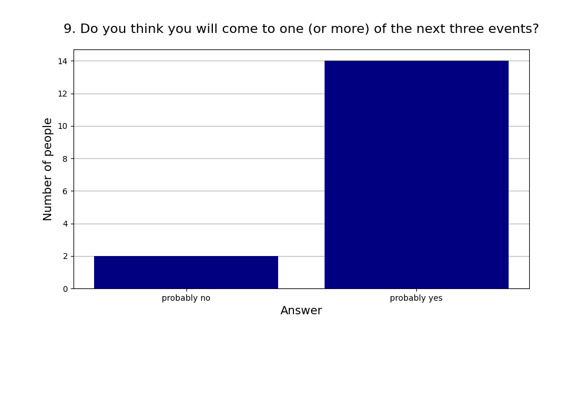
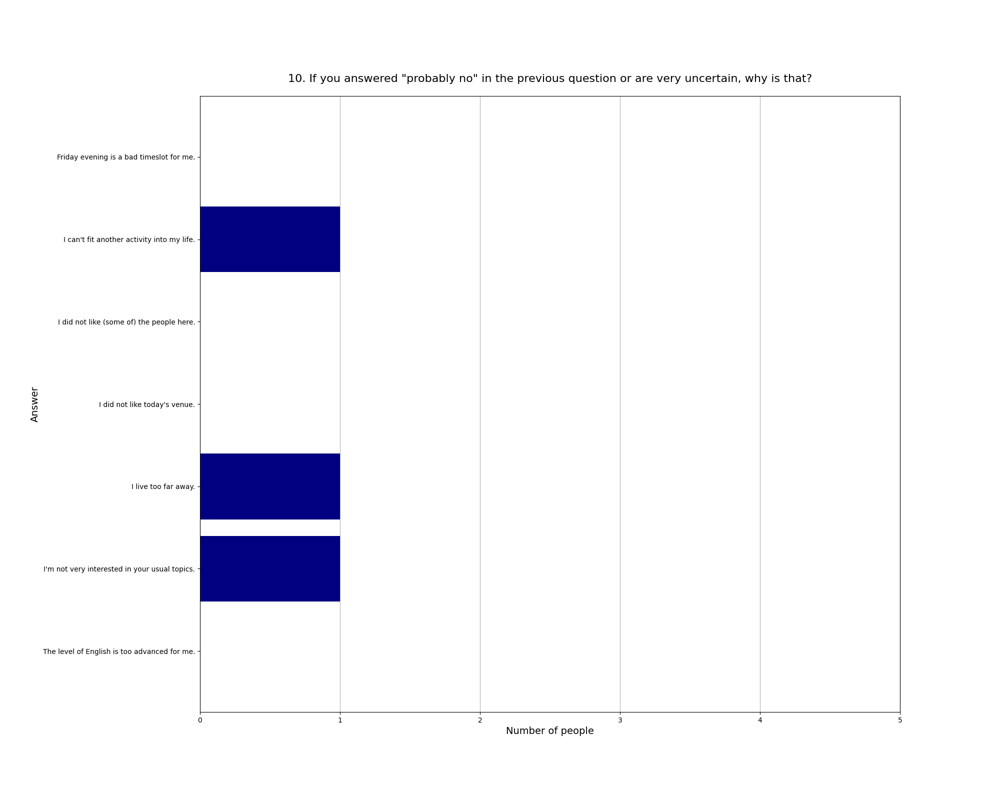

Read more about [this event]().

See also the [2025 summary]().

## Attendees

* **Total:** 19 people
* **Recurring:** 15 people
* **New:** 4 people

### 1. Practical use: For my life, what we did today will have ...

* **Responses:** 16 people (84.21% of attendees)
* **Answers:**
  * a lot of practical use (1): 0 people
  * quite a bit of practical use (2): 4 people
  * some practical use (3): 7 people
  * little practical use (4): 4 people
  * very little practical use (5): 1 person
* **Average answer:** 3.12 (σ=0.89)

### 2. The atmosphere / vibe was ...

* **Responses:** 16 people (84.21% of attendees)
* **Answers:**
  * fantastic (1): 6 people
  * good (2): 6 people
  * okay (3): 3 people
  * bad (4): 0 people
  * horrible (5): 1 person
* **Average answer:** 2.00 (σ=1.10)

### 3. The amount of content / exercises covered was ...

* **Responses:** 16 people (84.21% of attendees)
* **Answers:**
  * way too much (1): 0 people
  * too much (2): 1 person
  * just right (3): 8 people
  * too little (4): 7 people
  * way too little (5): 0 people
* **Average answer:** 3.38 (σ=0.62)

### 4. The difficulty level of the content / discussion was ...

* **Responses:** 16 people (84.21% of attendees)
* **Answers:**
  * much too easy (1): 1 person
  * too easy (2): 5 people
  * just right (3): 10 people
  * too difficult (4): 0 people
  * much too difficult (5): 0 people
* **Average answer:** 2.56 (σ=0.63)

### 5. Structure: On the whole the event needed ...

* **Responses:** 16 people (84.21% of attendees)
* **Answers:**
  * much more structure (1): 0 people
  * more structure (2): 6 people
  * (was just right) (3): 9 people
  * less structure (4): 1 person
  * much less structure (5): 0 people
* **Average answer:** 2.69 (σ=0.60)

### 6. The moderation should have been ...

* **Responses:** 16 people (84.21% of attendees)
* **Answers:**
  * much more relaxed (1): 0 people
  * more relaxed (2): 0 people
  * (was just right) (3): 13 people
  * more assertive (4): 3 people
  * much more assertive (5): 0 people
* **Average answer:** 3.19 (σ=0.40)

### 7. Host preparation: The content / exercises were ...

* **Responses:** 16 people (84.21% of attendees)
* **Answers:**
  * very well prepared (1): 4 people
  * well prepared (2): 8 people
  * okay prepared (3): 2 people
  * not well prepared (4): 2 people
  * not well prepared at all (5): 0 people
* **Average answer:** 2.12 (σ=0.96)

### 8. Changing your mind: The event made me ...

* **Responses:** 16 people (84.21% of attendees)
* **Answers:**
  * question many things (1): 0 people
  * question some things (2): 3 people
  * question few things (3): 10 people
  * question very few things (4): 2 people
  * not question anything (5): 1 person
* **Average answer:** 3.06 (σ=0.77)

### 9. Do you think you will come to one (or more) of the next three events?

* **Responses:** 16 people (84.21% of attendees)
* **Answers:**
  * probably no: 2 people
  * probably yes: 14 people

### 10. If you answered "probably no" in the previous question or are very uncertain, why is that?

* **Responses:** 3 people (15.79% of attendees)
* **Answers:**
  * Friday evening is a bad timeslot for me.: 0 people
  * I can't fit another activity into my life.: 1 person
  * I did not like (some of) the people here.: 0 people
  * I did not like today's venue.: 0 people
  * I live too far away.: 1 person
  * I'm not very interested in your usual topics.: 1 person
  * The level of English is too advanced for me.: 0 people

### 11. What did you like the most today?

* **Responses:** 12 people (63.16% of attendees)

**Note:** Anything contained in square brackets [] is an edit by the organizers.

> Interesting conversation and insight. 

> Neue Worte für Dinge finden die ich schon weis

> Rationality Taboo

> The small group discussion- rationality taboo

> Learning about not just HPMOR but adjacent and related works, how the presentation gave an overview of messages to expect from the book as well as style and flavor 

> Presentation, discussion, hearing about rationality taboo

> I'll actually listen to the audiobook now

> Discussion

> I became more convinced that HPMOR is interesting

> Small talk about science fiction 

> I was motivated to read HPMOR

> Discussion and interceptions
### 12. What did you like the least?

* **Responses:** 12 people (63.16% of attendees)

**Note:** Anything contained in square brackets [] is an edit by the organizers.

> Could have been a bit faster paced for me. Yet overall really lovely. 

> Nich genug Zeit um meine Gedanken zwischendrin zu sortieren 

> Today we were lacking a bit of interactivity 

> Hearing negative/debatable Things about harry Potter and the author

> Some activity to complement the presentation, maybe as half of the session could have been good. Though the impromptu discussion session was also nice.

> One chapter to read beforehand might have been interesting

> spoilers

> The topic felt like a cult favourite

> The presentation was good albeit a bit slow at times. It would also have been better to prepare something additional e.g. an exercise or something interactive related to HPMOR.

> Beginning and waiting 

> Duration

> Lower amount of regulars, than I expected
