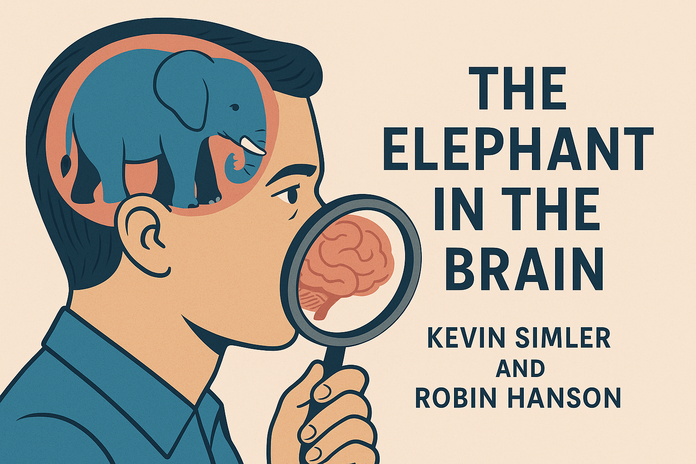

## Vorbereitung

Keine Vorbereitung notwendig.

## Was machen wir?

In dieser Gruppe diskutieren wir und praktizieren Übungen, um unser Verständnis der Welt zu verbessern oder näher an die „Wahrheit“ heranzukommen.

Dabei übersehen wir jedoch oft, dass wir als soziale Wesen Selbsttäuschung einsetzen, um soziale Interaktionen effektiv zu meistern. Die "Wahrheit" wird damit schwer oder unmöglich erreichbar.

Dieser Vortrag beschäftigt sich mit den Ideen, die Robin Hanson und Kevin Simler in „The Elephant in the Brain“ präsentieren. Hanson und Simler argumentieren, dass es für Menschen vorteilhaft sein kann, die wahren Beweggründe ihrer Handlungen nicht vollständig zu verstehen. Stattdessen konstruieren wir plausible Motive, die vom eigentlichen Entscheidungsprozess getrennt sind.

Außerdem bieten sie Erklärungen für scheinbar irrationale Aspekte menschlichen Verhaltens wie Kunst, Wohltätigkeit, Bildung, Politik und Religion anhand der oben genannten Konzepte.

## Organisation

Du hast Sorge, nichts beitragen zu können? Keine Sorge! Jede*r ist willkommen!

Es gibt immer eine Mischung aus deutsch- und englischsprachigen Teilnehmer*innen,
und wir gestalten die Diskussionsrunden so, dass sich alle wohlfühlen. Die
Hauptsprache ist Englisch.

Dieses Meetup wird von Jakob moderiert.

Es wird Snacks und Getränke geben.

Nach dem Meetup gehen wir gemeinsam essen. Wer Zeit hat, ist herzlich eingeladen mitzukommen.

<small>Auf der obigen Karte ist der Fahrradabstellplatz blau markiert, der Eingang (am Ende der Metallrampe) mit einem roten Kreuz.</small>

## Sonstiges

[Erfahre mehr über uns]().

<small>Bild erstellt mit _GPT 4o_.</small>
