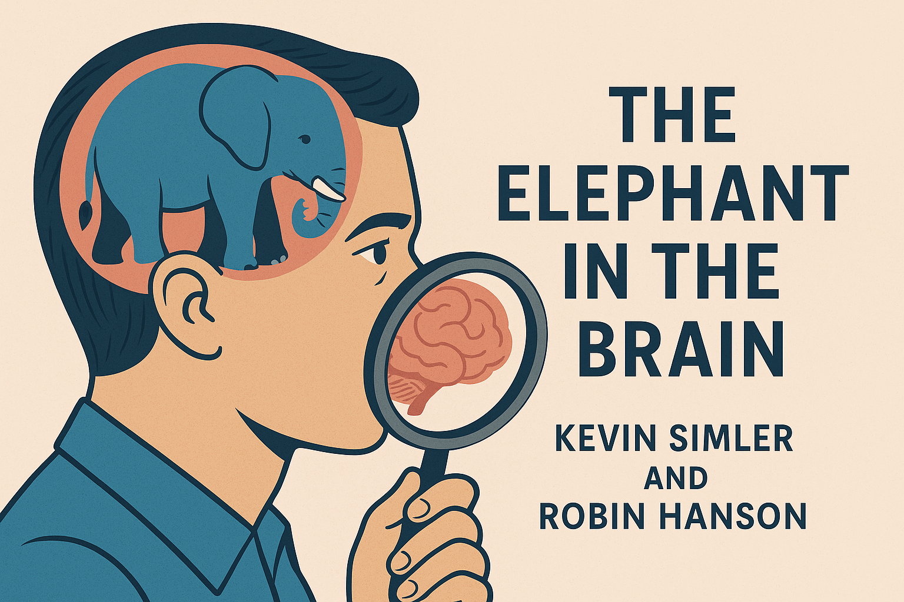

## Update 24.05

* Slides Jakob: [whywelietoourselves.pdf](./whywelietoourselves.pdf) .
* [Truthseeking is the ground in which other principles grow - Elizabeth Van Nostrand](https://www.lesswrong.com/posts/kbnJHpapusMJZb6Gs)

## Preparation

No preparation necessary.

## What will we do?

In this group, we often discuss and practice exercises aimed at improving our understanding of the world or moving closer to the "truth."

However, in these discussions, we frequently overlook the fact that we, as social creatures, employ self-deception to effectively navigate social interactions. Thus the "truth" become something difficult or impossible to grasp.

This talk explores ideas presented in Robin Hanson and Kevin Simler's "The Elephant in the Brain." Hanson and Simler argue that it can be beneficial for humans not to fully understand the true motivations behind their actions. Instead, we construct plausible motivations that are separate from our actual decision-making processes.

Furthermore, they offer explanations for seemingly irrational aspects of human behavior, such as art, charity, education, politics, and religion, using the concepts mentioned above.

## Organization

You are worried you have nothing to contribute? No worries! Everyone is
welcome!

There always is a mix of German and English speakers and we configure the
discussion rounds so that everyone feels comfortable participating. The primary
language is English.

This meetup will be hosted by Jakob.

There will be snacks and drinks.

We will go and get dinner after the meetup. Anyone who has time is welcome to
join.

<small>In the above map the location where you should leave your bikes is marked
in blue and the entrance (at the end of the metal ramp) with a red cross.</small>

## Other

[Learn more about us]().

<small>Image generated with _GPT 4o_.</small>
