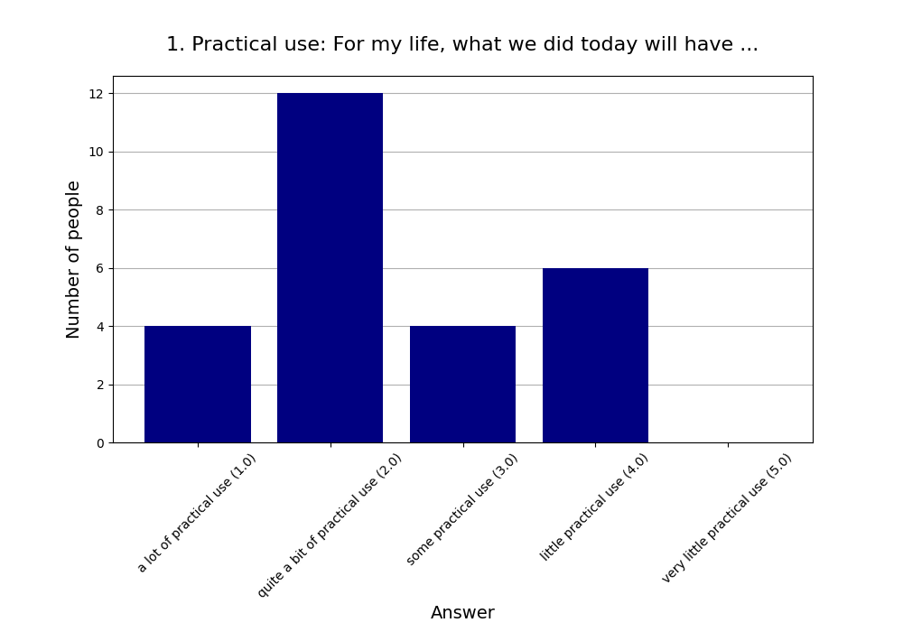
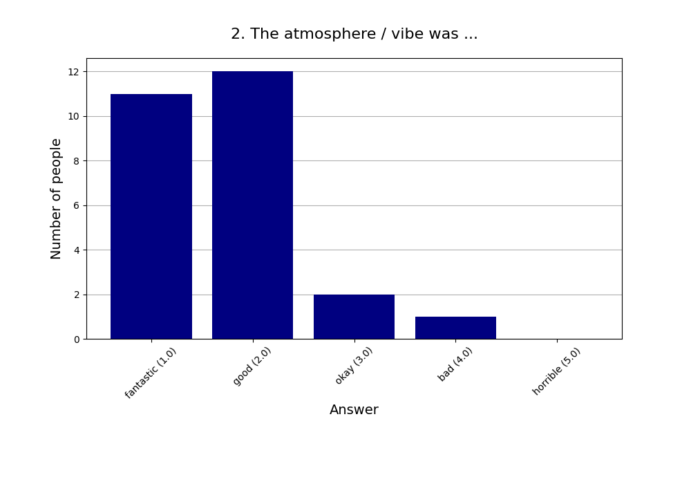
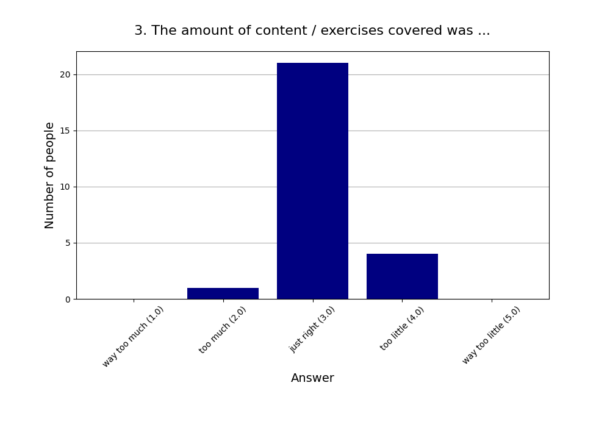
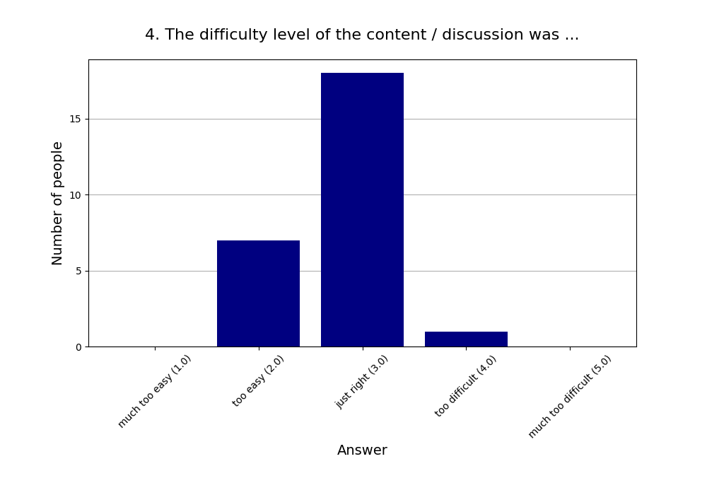
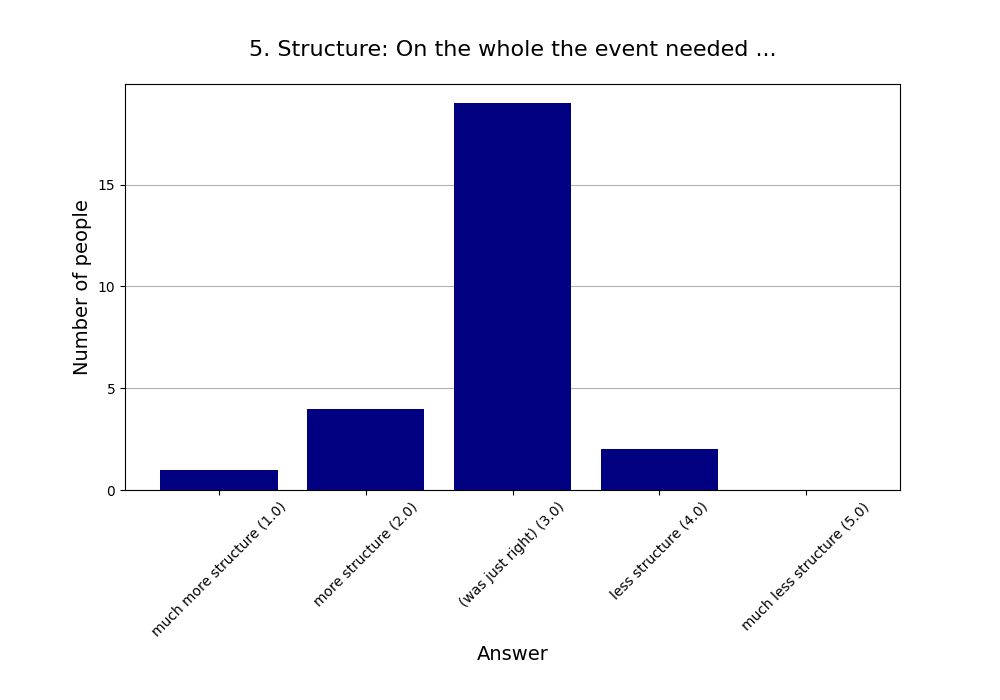
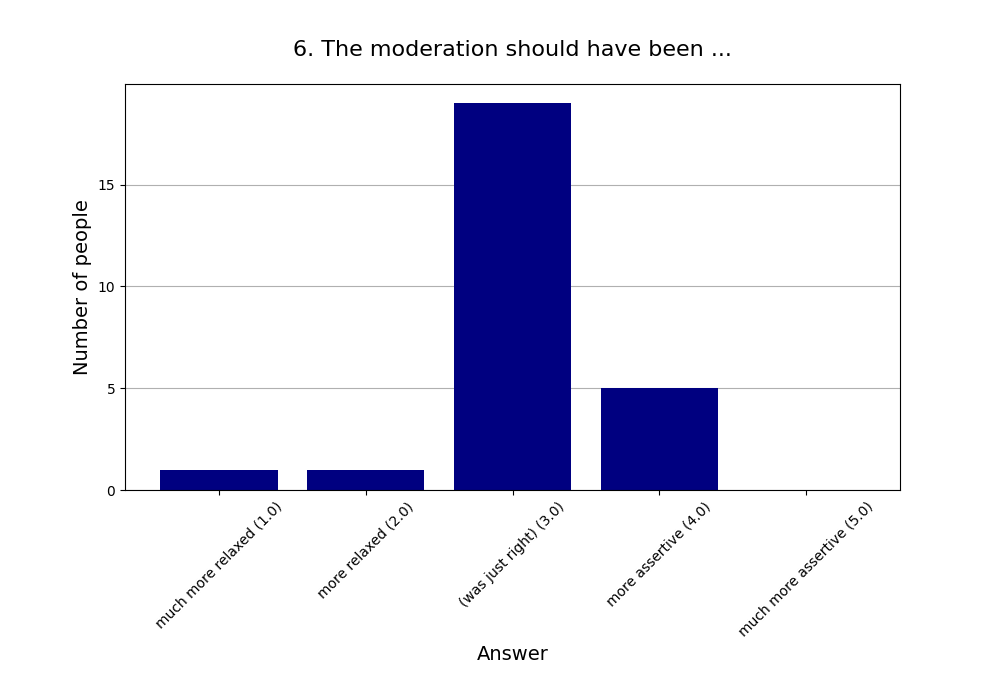
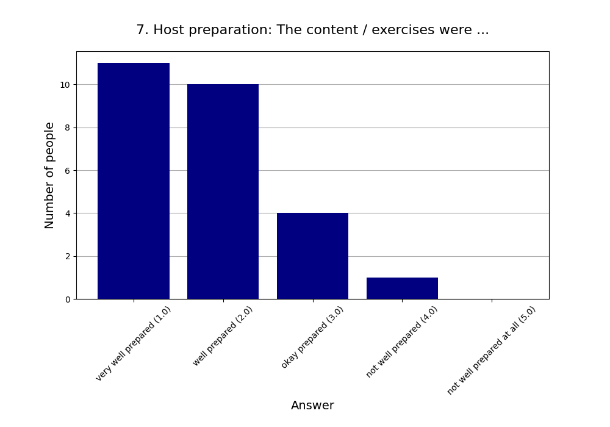
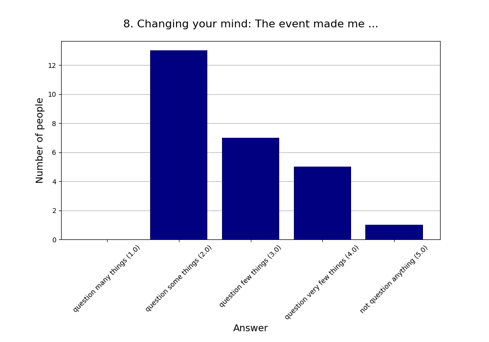
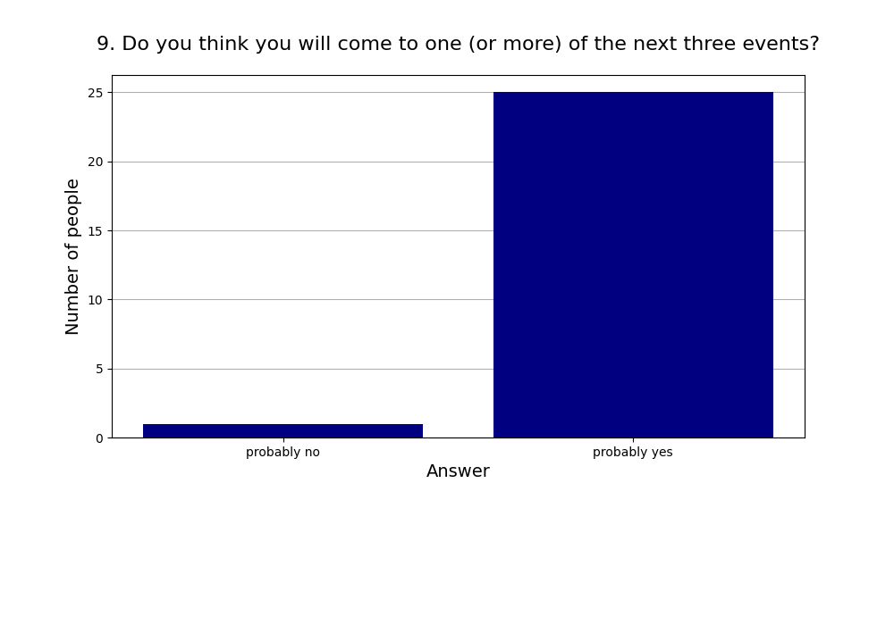
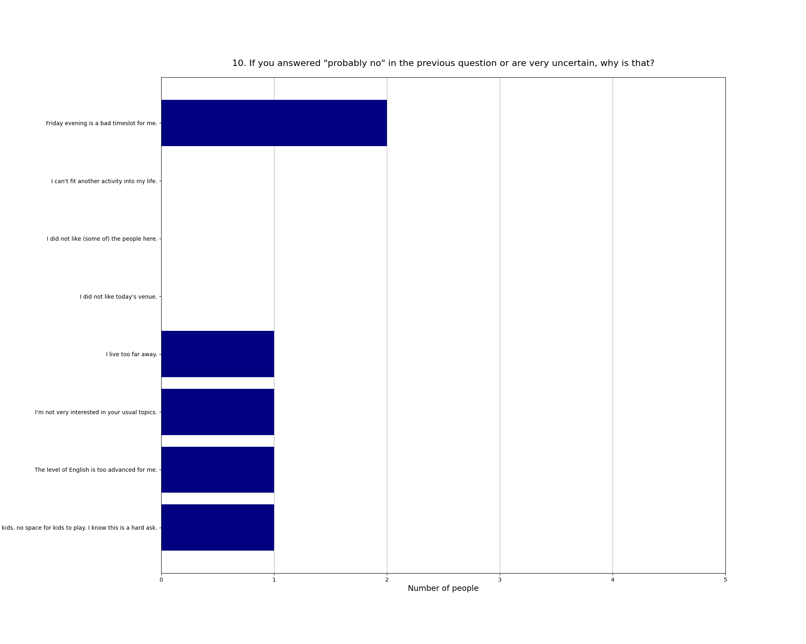

Read more about [this event]().

See also the [2025 summary]().

## Attendees

* **Total:** 29 people
* **Recurring:** 26 people
* **New:** 3 people

### 1. Practical use: For my life, what we did today will have ...

* **Responses:** 26 people (89.66% of attendees)
* **Answers:**
  * a lot of practical use (1): 4 people
  * quite a bit of practical use (2): 12 people
  * some practical use (3): 4 people
  * little practical use (4): 6 people
  * very little practical use (5): 0 people
* **Average answer:** 2.46 (σ=1.03)

### 2. The atmosphere / vibe was ...

* **Responses:** 26 people (89.66% of attendees)
* **Answers:**
  * fantastic (1): 11 people
  * good (2): 12 people
  * okay (3): 2 people
  * bad (4): 1 person
  * horrible (5): 0 people
* **Average answer:** 1.73 (σ=0.78)

### 3. The amount of content / exercises covered was ...

* **Responses:** 26 people (89.66% of attendees)
* **Answers:**
  * way too much (1): 0 people
  * too much (2): 1 person
  * just right (3): 21 people
  * too little (4): 4 people
  * way too little (5): 0 people
* **Average answer:** 3.12 (σ=0.43)

### 4. The difficulty level of the content / discussion was ...

* **Responses:** 26 people (89.66% of attendees)
* **Answers:**
  * much too easy (1): 0 people
  * too easy (2): 7 people
  * just right (3): 18 people
  * too difficult (4): 1 person
  * much too difficult (5): 0 people
* **Average answer:** 2.77 (σ=0.51)

### 5. Structure: On the whole the event needed ...

* **Responses:** 26 people (89.66% of attendees)
* **Answers:**
  * much more structure (1): 1 person
  * more structure (2): 4 people
  * (was just right) (3): 19 people
  * less structure (4): 2 people
  * much less structure (5): 0 people
* **Average answer:** 2.85 (σ=0.61)

### 6. The moderation should have been ...

* **Responses:** 26 people (89.66% of attendees)
* **Answers:**
  * much more relaxed (1): 1 person
  * more relaxed (2): 1 person
  * (was just right) (3): 19 people
  * more assertive (4): 5 people
  * much more assertive (5): 0 people
* **Average answer:** 3.08 (σ=0.63)

### 7. Host preparation: The content / exercises were ...

* **Responses:** 26 people (89.66% of attendees)
* **Answers:**
  * very well prepared (1): 11 people
  * well prepared (2): 10 people
  * okay prepared (3): 4 people
  * not well prepared (4): 1 person
  * not well prepared at all (5): 0 people
* **Average answer:** 1.81 (σ=0.85)

### 8. Changing your mind: The event made me ...

* **Responses:** 26 people (89.66% of attendees)
* **Answers:**
  * question many things (1): 0 people
  * question some things (2): 13 people
  * question few things (3): 7 people
  * question very few things (4): 5 people
  * not question anything (5): 1 person
* **Average answer:** 2.77 (σ=0.91)

### 9. Do you think you will come to one (or more) of the next three events?

* **Responses:** 26 people (89.66% of attendees)
* **Answers:**
  * probably no: 1 person
  * probably yes: 25 people

### 10. If you answered "probably no" in the previous question or are very uncertain, why is that?

* **Responses:** 6 people (20.69% of attendees)
* **Answers:**
  * Friday evening is a bad timeslot for me.: 2 people
  * I can't fit another activity into my life.: 0 people
  * I did not like (some of) the people here.: 0 people
  * I did not like today's venue.: 0 people
  * I live too far away.: 1 person
  * I'm not very interested in your usual topics.: 1 person
  * The level of English is too advanced for me.: 1 person
  * too little kids. no space for kids to play. I know this is a hard ask.: 1 person

### 11. What did you like the most today?

* **Responses:** 15 people (51.72% of attendees)

**Note:** Anything contained in square brackets [] is an edit by the organizers.

> Misch aus Input und Diskussion 

> People 

> Great open discussion round.  
> Great impulses for discussions from both presentations.

> The presentation 

> Dass Omar zwischen normativen und deskriptiven Aussagen unterschieden hat 🙂

> The topic was great. Also at the meta level given it's also related to the core group topic of truthseeking

> Gute Vorbereitung

> Topic 

> Rationalist Taboo

> Omars short talk

> very good nice of discussions/questions during the talk. not too much. not too little

> Gruppendiskussion, Neues Thema 

> Snacks, könnten mehr salzige geben

> Vibe

> Knowing about the content of the book
### 12. What did you like the least?

* **Responses:** 8 people (27.59% of attendees)

**Note:** Anything contained in square brackets [] is an edit by the organizers.

> Zu viele Diskussionen zwischendrin 

> Die Diskussion in der großen Gruppe ist für meinen Geschmack etwas ausgeartet 

> A final whole group debrief at the end could have been great. To at least hear of what was discussed in the other groups.

> Zuviele Zwischenrufe, Nebendiskussion 

> Ventilation. [Edit: Removed a slightly personal criticism about one participant since publishing this seems to add no value.]

> group discussion could have used some structure. Like a couple of prompting questions related to the talk(s) could have made the discussion a lot more fun/valuable

> Lautstärke am Ende / nach der Veranstaltung 

> Long interruptions during the presentations
