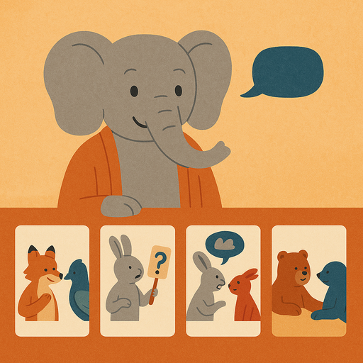

## Preparation

To be defined.

## What will we do?

Camille, a guest speaker who coming for this event, will teach a workshop on
"Effectively Handling Disagreement" based on the following techniques:

* Deep Canvassing
* Street Epistemology
* Narrative Transportation
* Cooling Conversations (Smart Politics)

The goal is to practice the ability to communicate effectively with people who
disagree with you. This includes skills such as managing an angry interlocutor,
creating contact with someone who is hostile and discussing respectfully yet
rigorously.

## Organization

You are worried you have nothing to contribute? No worries! Everyone is
welcome!

There always is a mix of German and English speakers and we configure the
discussion rounds so that everyone feels comfortable participating. The primary
language is English.

This meetup will be hosted by Camille.

There will be snacks and drinks.

We will go and get dinner after the meetup. Anyone who has time is welcome to
join.

<small>In the above map the location where you should leave your bikes is marked
in blue and the entrance (at the end of the metal ramp) with a red cross.</small>

## Other

[Learn more about us]().

<small>Image generated with _GPT 4o_.</small>
