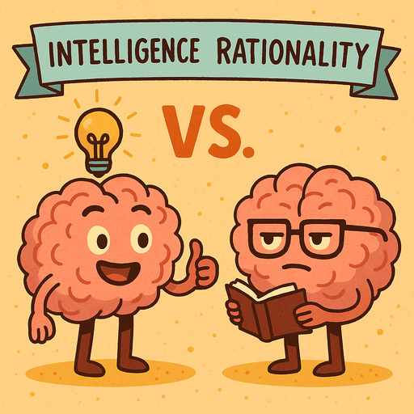

## Vorbereitung

Keine.

## Was machen wir?

Omar wird eine interaktive Präsentation zu den Themen **Intelligenz und Rationalität** halten – was sie jeweils sind, warum sie oft verwechselt werden und warum diese Unterscheidung wichtig ist.

* Misst der IQ überhaupt etwas Sinnvolles?
* Warum tun kluge Menschen manchmal dumme Dinge?
* Gibt es kognitive Fähigkeiten jenseits von Intelligenz?

Nach der Präsentation werden wir in kleinere Gruppen aufgeteilt und die Inhalte gemeinsam diskutieren.

Diese Veranstaltung ist zugleich der Auftakt zu einer Reihe von Treffen über die Arbeiten des US-amerikanischen Forschers, Kognitionswissenschaftlers und Psychologen [Keith Stanovich](https://de.wikipedia.org/wiki/Keith_Stanovich) (Englisch), der sich intensiv mit den kognitiven Grundlagen von Rationalität beschäftigt hat.

## Organisation

Du hast Sorge, nichts beitragen zu können? Kein Problem – **alle sind willkommen!**

Bei unseren Treffen gibt es immer eine Mischung aus deutsch- und englischsprachigen Teilnehmer\:innen. Wir organisieren die Diskussionsrunden so, dass sich jede\:r wohlfühlt. Die Hauptsprache ist Englisch.

Dieses Meetup wird von Omar geleitet.

Es gibt Snacks und Getränke.

Nach dem Meetup gehen wir gemeinsam essen – wer Zeit und Lust hat, ist herzlich eingeladen mitzukommen.

<small>Auf der obigen Karte ist der Fahrradabstellplatz blau markiert, der Eingang (am Ende der Metallrampe) mit einem roten Kreuz.</small>

## Sonstiges

[Mehr über uns erfahren]().

<small>Bild erstellt mit *GPT 4o*.</small>
