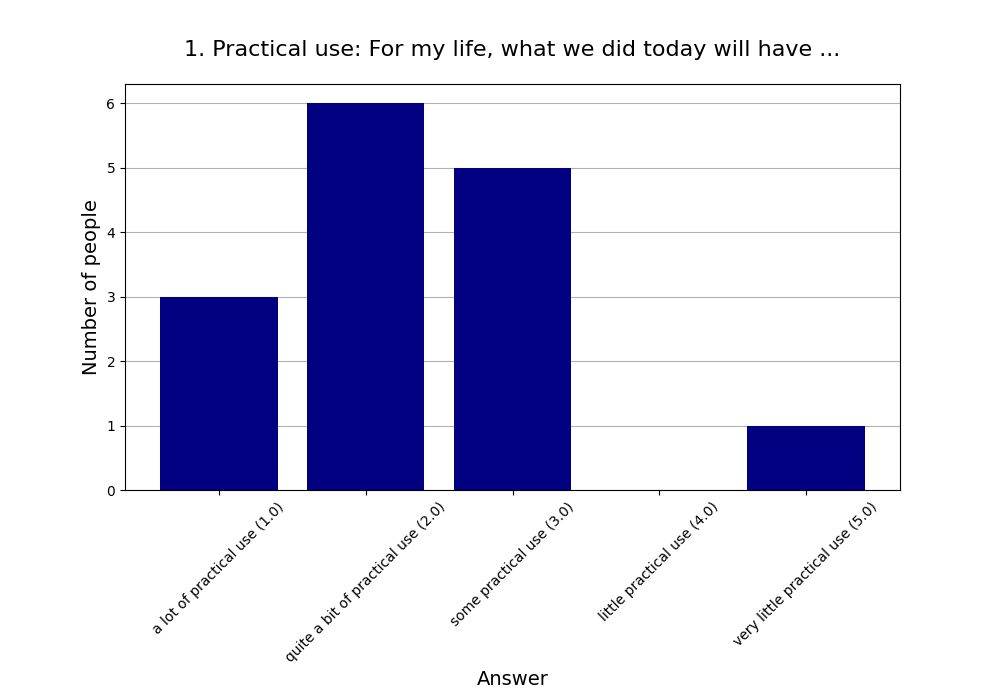
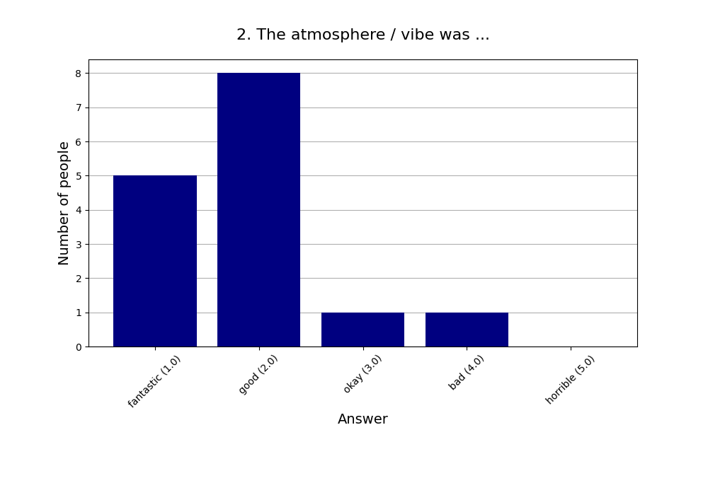
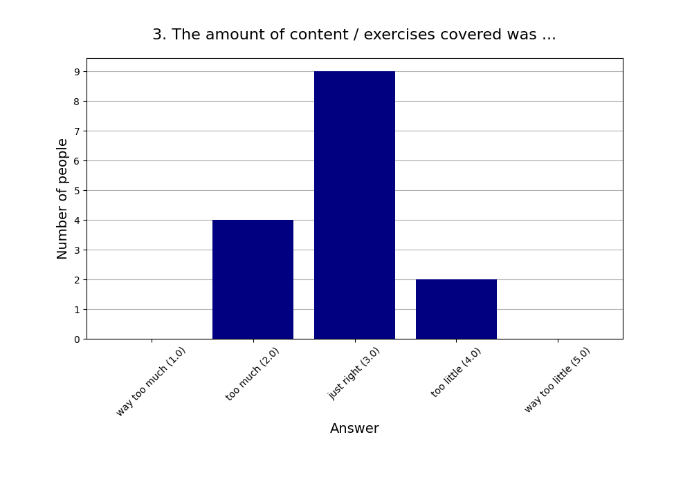
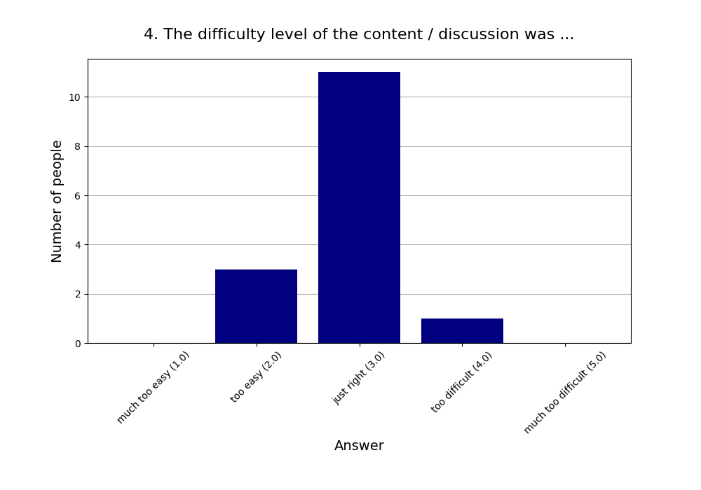
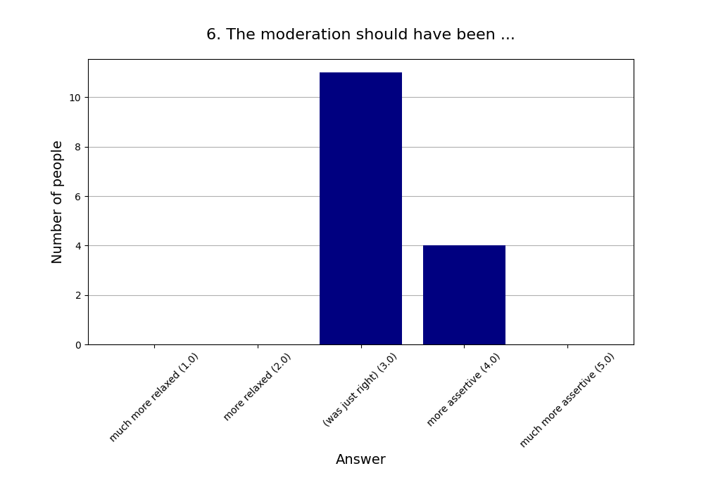
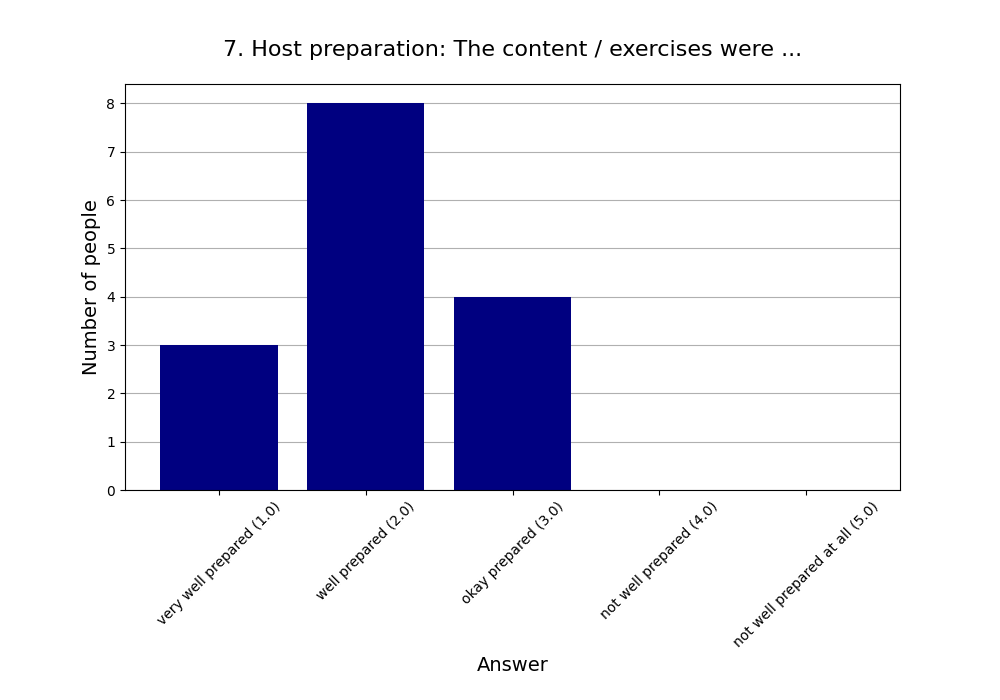
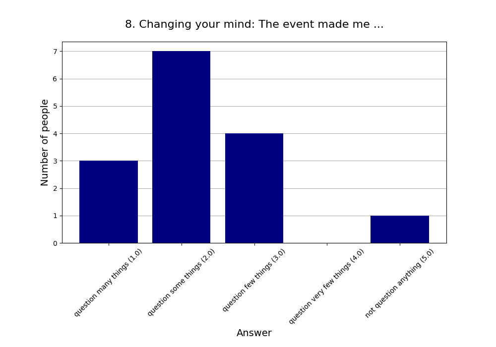
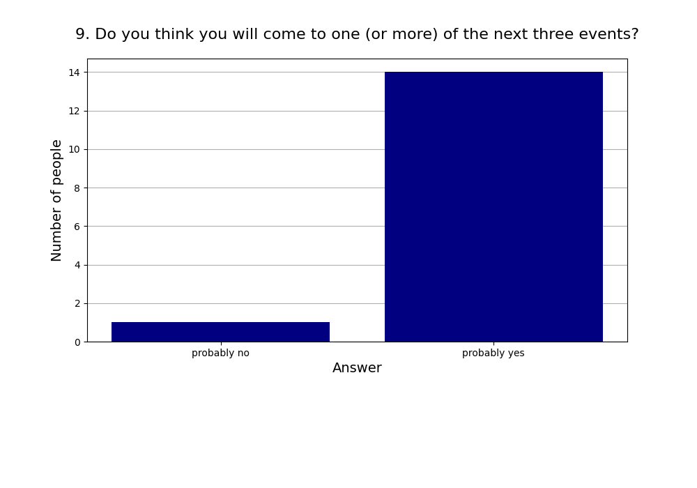
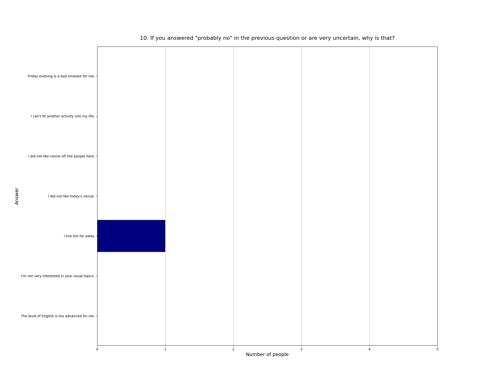

Read more about [this event]().

See also the [2025 summary]().

## Attendees

* **Total:** 19 people
* **Recurring:** 15 people
* **New:** 4 people

### 1. Practical use: For my life, what we did today will have ...

* **Responses:** 15 people (78.95% of attendees)
* **Answers:**
  * a lot of practical use (1): 3 people
  * quite a bit of practical use (2): 6 people
  * some practical use (3): 5 people
  * little practical use (4): 0 people
  * very little practical use (5): 1 person
* **Average answer:** 2.33 (σ=1.05)

### 2. The atmosphere / vibe was ...

* **Responses:** 15 people (78.95% of attendees)
* **Answers:**
  * fantastic (1): 5 people
  * good (2): 8 people
  * okay (3): 1 person
  * bad (4): 1 person
  * horrible (5): 0 people
* **Average answer:** 1.87 (σ=0.83)

### 3. The amount of content / exercises covered was ...

* **Responses:** 15 people (78.95% of attendees)
* **Answers:**
  * way too much (1): 0 people
  * too much (2): 4 people
  * just right (3): 9 people
  * too little (4): 2 people
  * way too little (5): 0 people
* **Average answer:** 2.87 (σ=0.64)

### 4. The difficulty level of the content / discussion was ...

* **Responses:** 15 people (78.95% of attendees)
* **Answers:**
  * much too easy (1): 0 people
  * too easy (2): 3 people
  * just right (3): 11 people
  * too difficult (4): 1 person
  * much too difficult (5): 0 people
* **Average answer:** 2.87 (σ=0.52)

### 5. Structure: On the whole the event needed ...

* **Responses:** 15 people (78.95% of attendees)
* **Answers:**
  * much more structure (1): 0 people
  * more structure (2): 3 people
  * (was just right) (3): 11 people
  * less structure (4): 1 person
  * much less structure (5): 0 people
* **Average answer:** 2.87 (σ=0.52)

### 6. The moderation should have been ...

* **Responses:** 15 people (78.95% of attendees)
* **Answers:**
  * much more relaxed (1): 0 people
  * more relaxed (2): 0 people
  * (was just right) (3): 11 people
  * more assertive (4): 4 people
  * much more assertive (5): 0 people
* **Average answer:** 3.27 (σ=0.46)

### 7. Host preparation: The content / exercises were ...

* **Responses:** 15 people (78.95% of attendees)
* **Answers:**
  * very well prepared (1): 3 people
  * well prepared (2): 8 people
  * okay prepared (3): 4 people
  * not well prepared (4): 0 people
  * not well prepared at all (5): 0 people
* **Average answer:** 2.07 (σ=0.70)

### 8. Changing your mind: The event made me ...

* **Responses:** 15 people (78.95% of attendees)
* **Answers:**
  * question many things (1): 3 people
  * question some things (2): 7 people
  * question few things (3): 4 people
  * question very few things (4): 0 people
  * not question anything (5): 1 person
* **Average answer:** 2.27 (σ=1.03)

### 9. Do you think you will come to one (or more) of the next three events?

* **Responses:** 15 people (78.95% of attendees)
* **Answers:**
  * probably no: 1 person
  * probably yes: 14 people

### 10. If you answered "probably no" in the previous question or are very uncertain, why is that?

* **Responses:** 1 person (5.26% of attendees)
* **Answers:**
  * Friday evening is a bad timeslot for me.: 0 people
  * I can't fit another activity into my life.: 0 people
  * I did not like (some of) the people here.: 0 people
  * I did not like today's venue.: 0 people
  * I live too far away.: 1 person
  * I'm not very interested in your usual topics.: 0 people
  * The level of English is too advanced for me.: 0 people

### 11. What did you like the most today?

* **Responses:** 9 people (47.37% of attendees)

**Note:** Anything contained in square brackets [] is an edit by the organizers.

> Very interesting aspects for discussion. 

> Augen von allen und Gefühl der Gemeinschaft zwischen diversen Leuten, die einander nicht kennen.

> The topic was quite interesting and thought-provoking

> New concepts and tools: Dysrationalia and Split/commit

> New information

> Nice, welcoming vibe for newcomers

> Topic and discussions 

> Here is open to discuss platform and no one judge..

> Atmosphere, Vibe
### 12. What did you like the least?

* **Responses:** 8 people (42.11% of attendees)

**Note:** Anything contained in square brackets [] is an edit by the organizers.

> Making definitions on beforehand might have been useful to avoid or reduce blurry discussion contributions. 

> Wenig Sauerstoff im Zimmer

> Appreciated most of the in-presentation discussions but sometimes felt it got sidetracked

> We got stuck too often in discussions during the presentation 

> The presentation and the interactive parts could have been more intermixed

> We spend too much time arguing about terminologies without discussing what to do about differences in intelligence in people at a social level

> Didn’t get more time for discussions. Multiple rounds of discussions would have helped

> Stale Air
