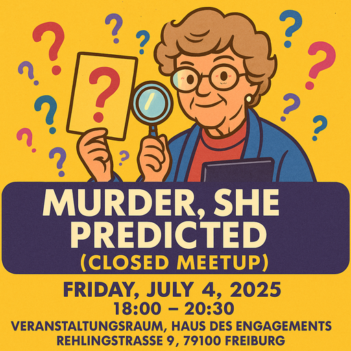

**IMPORTANT:** This is a closed meetup, meaning it is only meant for people who
have attended at least ONE previous event. Please do not come if this does not
apply to you! [Why? Read this.]() Check the
[list of events]() to find the next public event, where
everyone is welcome. Anything listed there is 100% open to anyone.

## Preparation

Optional: Create an account on [Manifold](https://manifold.markets/). Manifold
is a free prediction market that uses play-money currency (called Mana) that
**cannot** be converted to cash. All new users start with 1,000 Mana.

## What will we do?

We will watch a murder mystery film (very little violence, no gore) and all
viewers will predict and keep updating who they think the murderer is as the
film progresses.

If anyone has already watched the film they will get the opportunity to predict
other things (e.g. how long will it take until the murderer is predicted at 50%
probability or more by other viewers).

If someone does not want to use Manifold that is fine, they'll write down
private predictions on paper and then share them.

We will of course also discuss the underlying ideas of prediction markets and
how they could benefit society.

## Organization

You are worried you have nothing to contribute? No worries! Everyone is
welcome!

There always is a mix of German and English speakers and we configure the
discussion rounds so that everyone feels comfortable participating. The primary
language is English.

This meetup will be hosted by Omar.

There will be snacks and drinks.

We will go and get dinner after the meetup. Anyone who has time is welcome to
join.

<small>In the above map the location where you should leave your bikes is marked
in blue and the entrance (at the end of the metal ramp) with a red cross.</small>

## Other

[Learn more about us]().

<small>Image generated with _GPT 4o_.</small>
