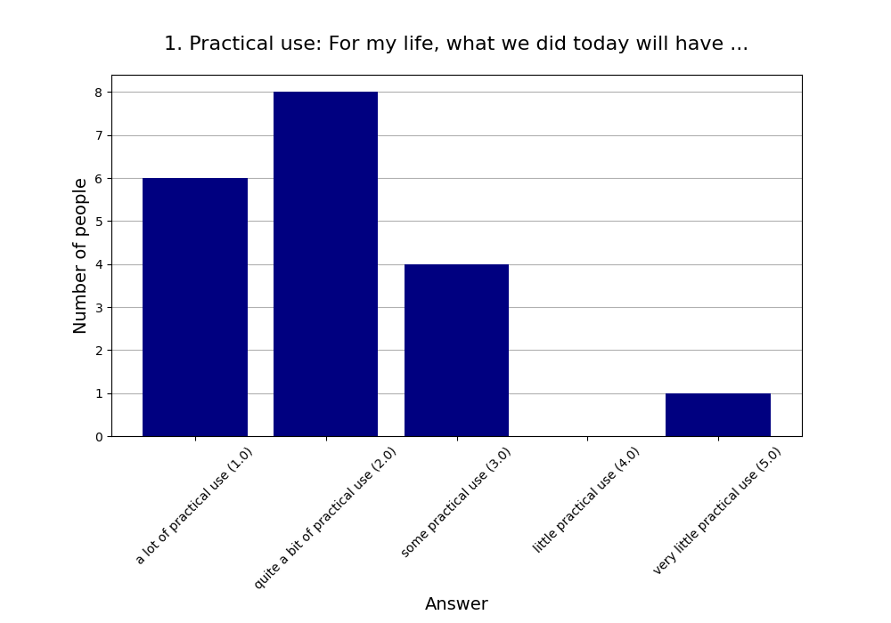
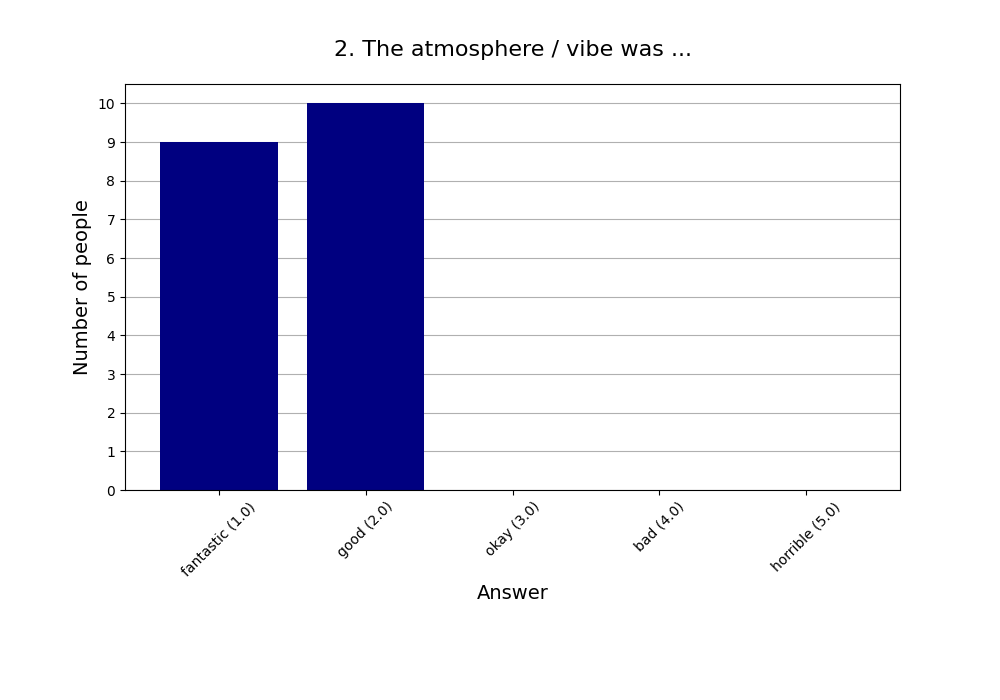
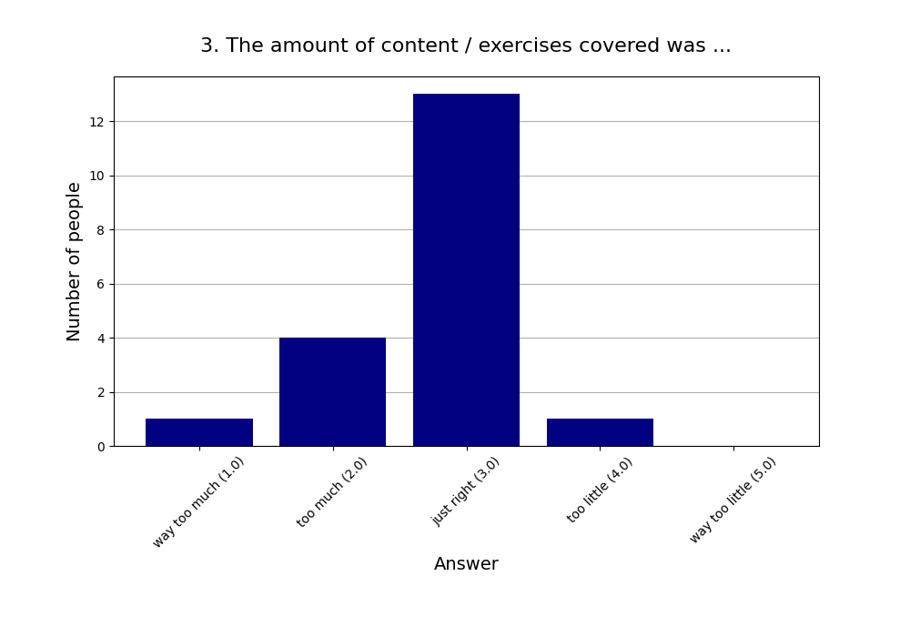
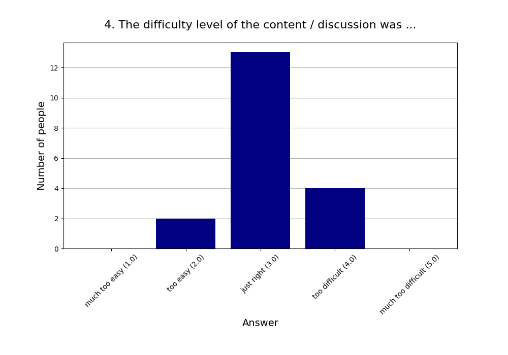
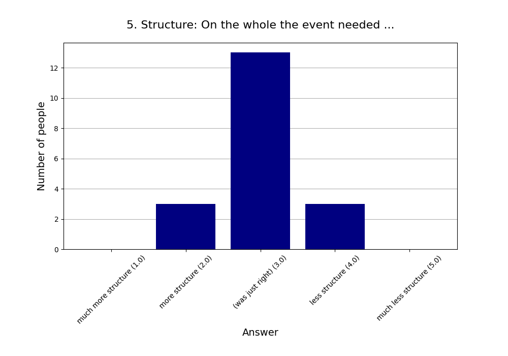
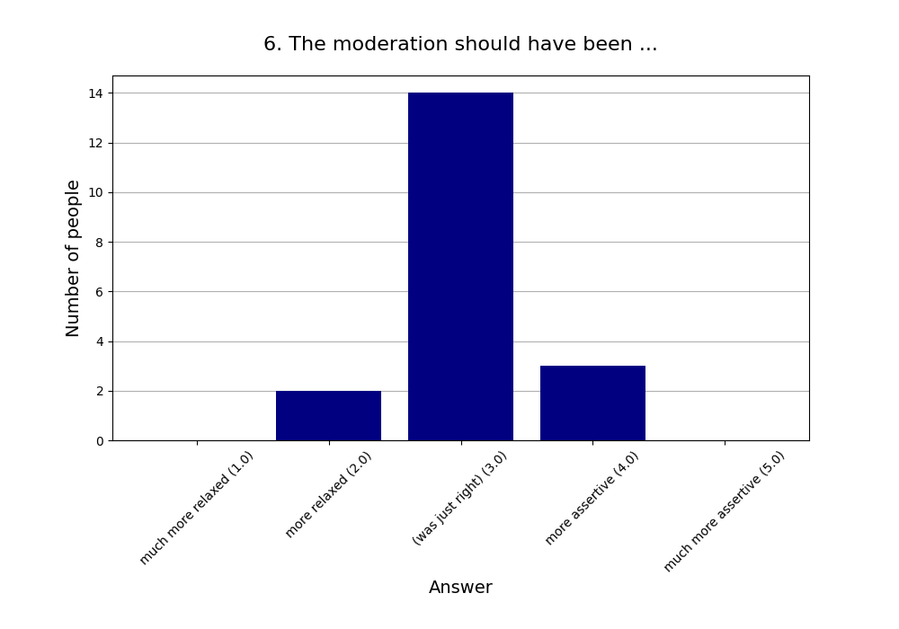
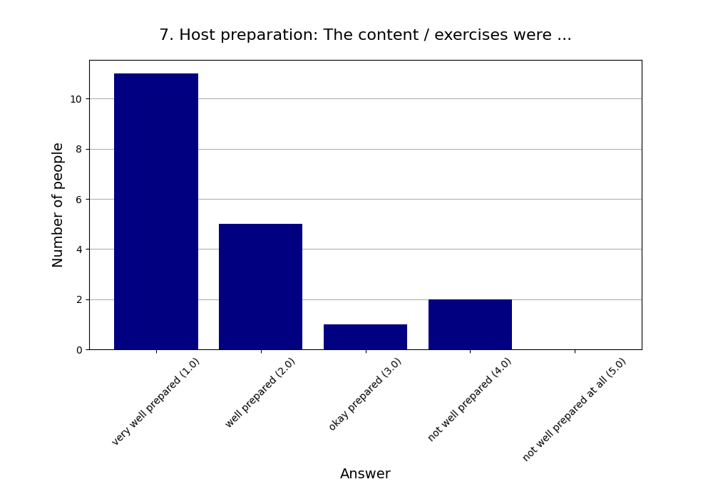
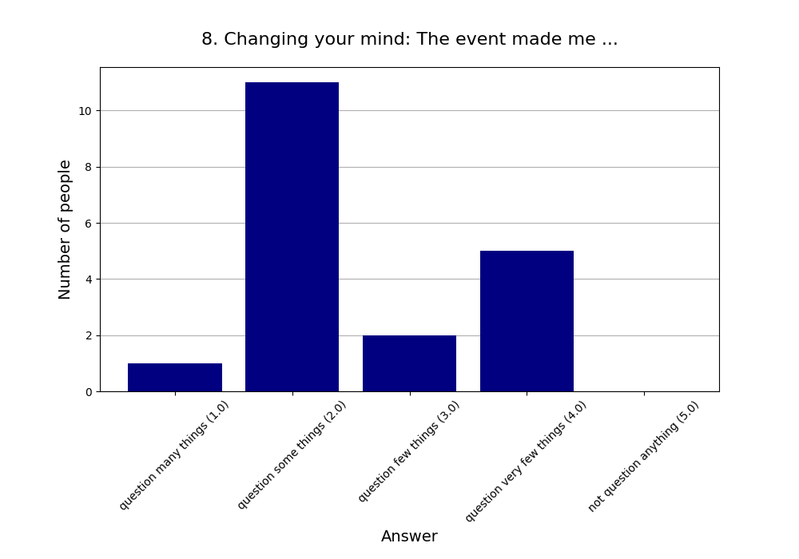
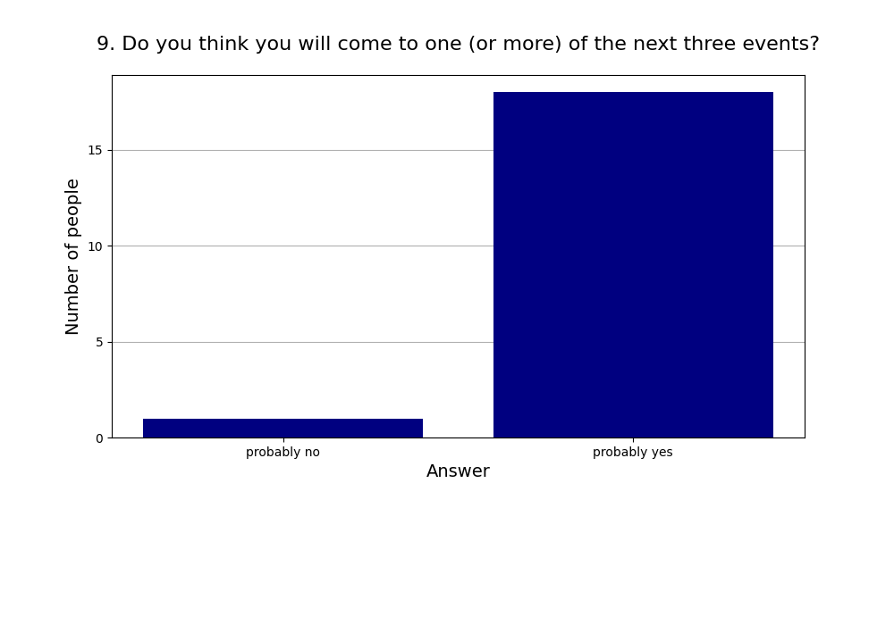
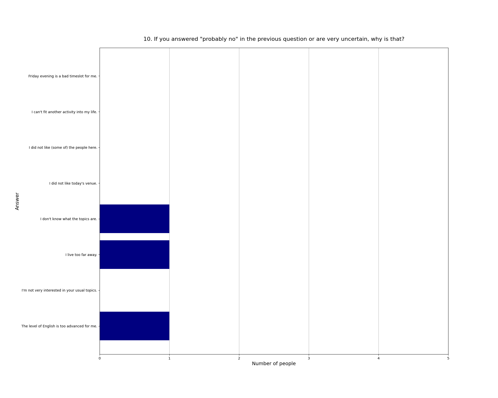

Read more about [this event]().

See also the [2025 summary]().

## Attendees

* **Total:** 24 people
* **Recurring:** 16 people
* **New:** 8 people

### 1. Practical use: For my life, what we did today will have ...

* **Responses:** 19 people (79.17% of attendees)
* **Answers:**
  * a lot of practical use (1): 6 people
  * quite a bit of practical use (2): 8 people
  * some practical use (3): 4 people
  * little practical use (4): 0 people
  * very little practical use (5): 1 person
* **Average answer:** 2.05 (σ=1.03)

### 2. The atmosphere / vibe was ...

* **Responses:** 19 people (79.17% of attendees)
* **Answers:**
  * fantastic (1): 9 people
  * good (2): 10 people
  * okay (3): 0 people
  * bad (4): 0 people
  * horrible (5): 0 people
* **Average answer:** 1.53 (σ=0.51)

### 3. The amount of content / exercises covered was ...

* **Responses:** 19 people (79.17% of attendees)
* **Answers:**
  * way too much (1): 1 person
  * too much (2): 4 people
  * just right (3): 13 people
  * too little (4): 1 person
  * way too little (5): 0 people
* **Average answer:** 2.74 (σ=0.65)

### 4. The difficulty level of the content / discussion was ...

* **Responses:** 19 people (79.17% of attendees)
* **Answers:**
  * much too easy (1): 0 people
  * too easy (2): 2 people
  * just right (3): 13 people
  * too difficult (4): 4 people
  * much too difficult (5): 0 people
* **Average answer:** 3.11 (σ=0.57)

### 5. Structure: On the whole the event needed ...

* **Responses:** 19 people (79.17% of attendees)
* **Answers:**
  * much more structure (1): 0 people
  * more structure (2): 3 people
  * (was just right) (3): 13 people
  * less structure (4): 3 people
  * much less structure (5): 0 people
* **Average answer:** 3.00 (σ=0.58)

### 6. The moderation should have been ...

* **Responses:** 19 people (79.17% of attendees)
* **Answers:**
  * much more relaxed (1): 0 people
  * more relaxed (2): 2 people
  * (was just right) (3): 14 people
  * more assertive (4): 3 people
  * much more assertive (5): 0 people
* **Average answer:** 3.05 (σ=0.52)

### 7. Host preparation: The content / exercises were ...

* **Responses:** 19 people (79.17% of attendees)
* **Answers:**
  * very well prepared (1): 11 people
  * well prepared (2): 5 people
  * okay prepared (3): 1 person
  * not well prepared (4): 2 people
  * not well prepared at all (5): 0 people
* **Average answer:** 1.68 (σ=1.00)

### 8. Changing your mind: The event made me ...

* **Responses:** 19 people (79.17% of attendees)
* **Answers:**
  * question many things (1): 1 person
  * question some things (2): 11 people
  * question few things (3): 2 people
  * question very few things (4): 5 people
  * not question anything (5): 0 people
* **Average answer:** 2.58 (σ=0.96)

### 9. Do you think you will come to one (or more) of the next three events?

* **Responses:** 19 people (79.17% of attendees)
* **Answers:**
  * probably no: 1 person
  * probably yes: 18 people

### 10. If you answered "probably no" in the previous question or are very uncertain, why is that?

* **Responses:** 3 people (12.50% of attendees)
* **Answers:**
  * Friday evening is a bad timeslot for me.: 0 people
  * I can't fit another activity into my life.: 0 people
  * I did not like (some of) the people here.: 0 people
  * I did not like today's venue.: 0 people
  * I don't know what the topics are.: 1 person
  * I live too far away.: 1 person
  * I'm not very interested in your usual topics.: 0 people
  * The level of English is too advanced for me.: 1 person

### 11. What did you like the most today?

* **Responses:** 11 people (45.83% of attendees)

**Note:** Anything contained in square brackets [] is an edit by the organizers.

> The examples, e.g. for narratives. Also the exercises, though we did not manage to stick to the script 

> The combination of theory and practice.

> Great presentation and content.

> The exercises were great, and had a nice mix / variation 

> Interactive example round when we split up [Deliberate Practice]

> The subject an explanation 

> Practice exercises in small group or partner 

> Die Strukturiertheit & die Leute:)

> schnelle praktische Runde

> The facilitation and examples

> Seeing so many new people.  
> Seeing that doing such events works, even with payment.
### 12. What did you like the least?

* **Responses:** 10 people (41.67% of attendees)

**Note:** Anything contained in square brackets [] is an edit by the organizers.

> Overall the workshop was way too big for my taste. I would limit it to 10- 12 people. Also when we split the group it was still too big.

> It would probably be better to spread the content out over more time (e.g. multiple sessions). Also some of the exercises would probably benefit from more precise step by step instructions.

> Sometimes it was too less time to dive into some more details about things presented.  
> +1h would have eben perfekt.

> The end kind of petered out

> too short  
> how to be less conflict avoidant would've interested me too

> They speak to fast

> Es fällt mir nichts ein...

> Verpaaste Inhalte durch Zeitmangel

> It was hard to implement some of the changes 

> Not enough breaks, too intense.
