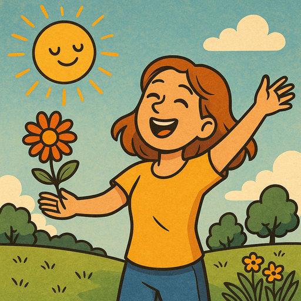

## Vorbereitung

Lies:

* [(Englisch) Ureshiku Naratai](https://www.lesswrong.com/posts/xnPFYBuaGhpq869mY/ureshiku-naritai)
* [(Englisch) Joy in the Merely Real](https://www.lesswrong.com/posts/x4dG4GhpZH2hgz59x/joy-in-the-merely-real)

## Was machen wir?

Was würdest du tun, wenn du glücklicher sein möchtest?

Das ist die Frage, die wir bei diesem Meetup erkunden werden. Es ist nicht als tiefgründige oder abstrakte Frage gemeint. Was machst du, das dich glücklich macht und vielleicht auch andere glücklich machen könnte? Bring etwas mit, das dir ein Lächeln ins Gesicht zaubert oder dich zum Lachen bringt, in einer Form, die du mit anderen teilen möchtest. Ein Stressball, den du gerne knetest, Papier, das sich gut zum Falten oder Zeichnen eignet, ein Lied, das dich zum Tanzen bringt – all das sind gute Ideen, aber keines davon ist abschließend. Dieses Meetup wird ein bisschen wie „Zeigen und Erzählen“ sein, bei dem du hoffentlich eine gute Zeit hast und mit Ideen für mehr Spaß in der Zukunft nach Hause gehst.

## Organisation

Du machst dir Sorgen, dass du nichts beitragen kannst? Keine Sorge! Jede*r ist willkommen!

Es gibt immer eine Mischung aus deutsch- und englischsprachigen Teilnehmer*innen, und wir gestalten die Diskussionsrunden so, dass sich alle wohlfühlen. Die Hauptsprache ist Englisch.

Dieses Meetup wird von Omar moderiert.

Es gibt Snacks und Getränke.

Nach dem Meetup gehen wir gemeinsam essen. Wer Zeit hat, ist herzlich eingeladen, mitzukommen.

<small>Auf der obigen Karte ist der Ort, an dem ihr eure Fahrräder abstellen könnt, blau markiert, und der Eingang (am Ende der Metallrampe) mit einem roten Kreuz.</small>

## Sonstiges

[Erfahre mehr über uns]().

<small>Bild generiert mit _GPT 4o_.</small>
