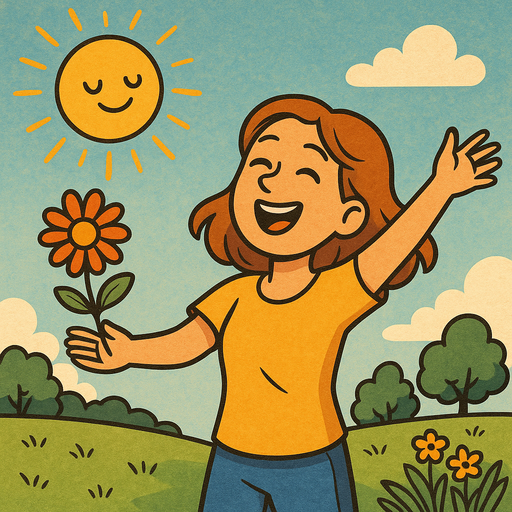

## Preparation

Read:

* [Ureshiku Naratai](https://www.lesswrong.com/posts/xnPFYBuaGhpq869mY/ureshiku-naritai)
* [Joy in the Merely Real](https://www.lesswrong.com/posts/x4dG4GhpZH2hgz59x/joy-in-the-merely-real)

## What will we do?

What would you do if you wanted to be happier?

That’s the question we’ll be exploring in this meetup. It’s not meant as a deep or abstract question. What do you do that makes you happy, and you think might make others happy too? Bring something that makes you smile or laugh in a form you’re willing to share with others. A stress toy you like to mold, paper that's good for folding or drawing on, a song that makes you want to dance, all of these are good ideas but none of them are exhaustive. This meetup is going to be a little like show and tell, where hopefully you’ll walk away having had a good time and with ideas for how to have more fun in the future.

## Organization

You are worried you have nothing to contribute? No worries! Everyone is
welcome!

There always is a mix of German and English speakers and we configure the
discussion rounds so that everyone feels comfortable participating. The primary
language is English.

This meetup will be hosted by Omar.

There will be snacks and drinks.

We will go and get dinner after the meetup. Anyone who has time is welcome to
join.

<small>In the above map the location where you should leave your bikes is marked
in blue and the entrance (at the end of the metal ramp) with a red cross.</small>

## Other

[Learn more about us]().

<small>Image generated with _GPT 4o_.</small>
