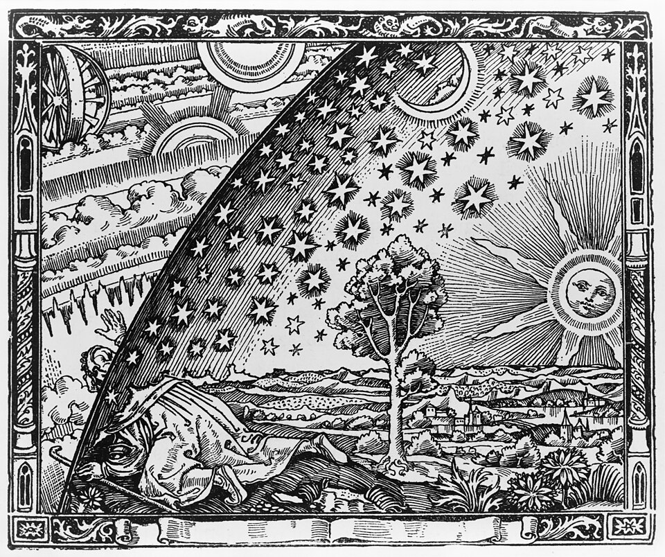

## Vorbereitung

Bitte unvorbereitet kommen!

## Was machen wir?

Woher wissen wir wie weit entfernt der Mond ist? Wie haben wir die Planetenbahnen entdeckt? 

Beginnend in der Antike und ausgerüstet mit den Werkzeugen ihrer Zeit, werden wir Schritt für Schritt die 
Größenverhältnisse unseres Sonnensystems erschließen. Dabei werden wir auf einige bemerkenswerte Erkentnisse stoßen, 
die das Fundament unseres heutigen Verständnisses gelegt haben.

## Organisation

Du machst dir Sorgen, dass du nichts beitragen kannst? Keine Sorge! Jede*r ist willkommen!

Es gibt immer eine Mischung aus deutsch- und englischsprachigen Teilnehmer*innen, und wir gestalten die Diskussionsrunden so, dass sich alle wohlfühlen. Die Hauptsprache ist Englisch.

Dieses Meetup wird von Nawid moderiert.

Es gibt Snacks und Getränke.

Nach dem Meetup gehen wir gemeinsam essen. Wer Zeit hat, ist herzlich eingeladen, mitzukommen.

<small>Auf der obigen Karte ist der Ort, an dem ihr eure Fahrräder abstellen könnt, blau markiert, und der Eingang (am Ende der Metallrampe) mit einem roten Kreuz.</small>

## Sonstiges

[Erfahre mehr über uns]().

<small>Bild entnommen von Wikipedia.</small>
