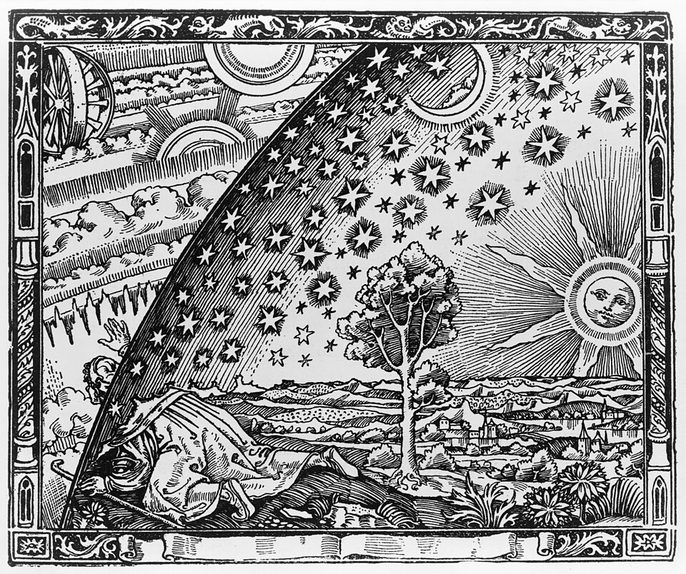

## Preparation

Please come unprepared!

## What will we do?

How much should we care about the impact of our actions on future generations — those who may live decades, centuries, or even millennia from now?

This event explores the philosophy of Longtermism, the idea that protecting and improving the long-term future is one of the most urgent moral challenges of our time. We'll examine through short presentations and two rounds of small-group discussion both the compelling arguments in its favor and the strongest critiques.

## Organization

You are worried you have nothing to contribute? No worries! Everyone is
welcome!

There always is a mix of German and English speakers and we configure the
discussion rounds so that everyone feels comfortable participating. The primary
language is English.

This meetup will be hosted by Ben, Felicio, Gabe and Randolf.

There will be snacks and drinks.

We will go and get dinner after the meetup. Anyone who has time is welcome to
join.

<small>In the above map the location where you should leave your bikes is marked
in blue and the entrance (at the end of the metal ramp) with a red cross.</small>

## Other

[Learn more about us]().

<small>Image sourced from wikipedia.</small>
