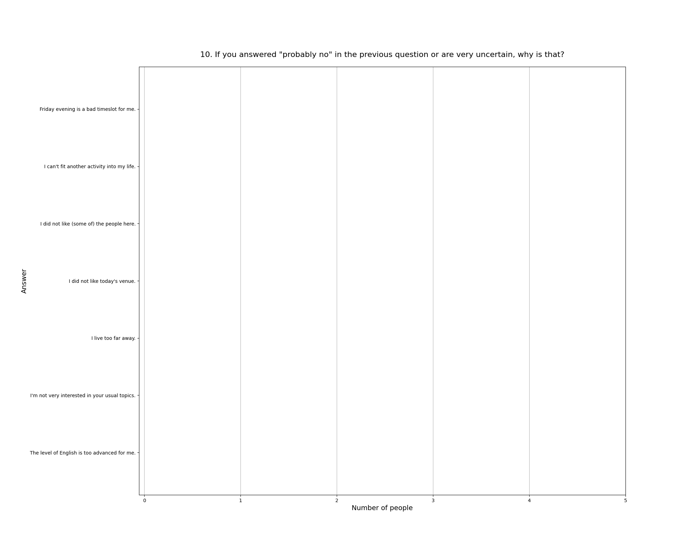

Read more about [this event]().

See also the [2025 summary]().

## Attendees

* **Total:** 13 people
* **Recurring:** 12 people
* **New:** 1 person

### 1. Practical use: For my life, what we did today will have ...

* **Responses:** 10 people (76.92% of attendees)
* **Answers:**
  * a lot of practical use (1): 2 people
  * quite a bit of practical use (2): 2 people
  * some practical use (3): 3 people
  * little practical use (4): 2 people
  * very little practical use (5): 1 person
* **Average answer:** 2.80 (σ=1.32)

### 2. The atmosphere / vibe was ...

* **Responses:** 10 people (76.92% of attendees)
* **Answers:**
  * fantastic (1): 6 people
  * good (2): 3 people
  * okay (3): 1 person
  * bad (4): 0 people
  * horrible (5): 0 people
* **Average answer:** 1.50 (σ=0.71)

### 3. The amount of content / exercises covered was ...

* **Responses:** 10 people (76.92% of attendees)
* **Answers:**
  * way too much (1): 0 people
  * too much (2): 3 people
  * just right (3): 7 people
  * too little (4): 0 people
  * way too little (5): 0 people
* **Average answer:** 2.70 (σ=0.48)

### 4. The difficulty level of the content / discussion was ...

* **Responses:** 10 people (76.92% of attendees)
* **Answers:**
  * much too easy (1): 0 people
  * too easy (2): 0 people
  * just right (3): 5 people
  * too difficult (4): 5 people
  * much too difficult (5): 0 people
* **Average answer:** 3.50 (σ=0.53)

### 5. Structure: On the whole the event needed ...

* **Responses:** 10 people (76.92% of attendees)
* **Answers:**
  * much more structure (1): 0 people
  * more structure (2): 0 people
  * (was just right) (3): 9 people
  * less structure (4): 1 person
  * much less structure (5): 0 people
* **Average answer:** 3.10 (σ=0.32)

### 6. The moderation should have been ...

* **Responses:** 9 people (69.23% of attendees)
* **Answers:**
  * much more relaxed (1): 0 people
  * more relaxed (2): 0 people
  * (was just right) (3): 8 people
  * more assertive (4): 1 person
  * much more assertive (5): 0 people
* **Average answer:** 3.11 (σ=0.33)

### 7. Host preparation: The content / exercises were ...

* **Responses:** 10 people (76.92% of attendees)
* **Answers:**
  * very well prepared (1): 7 people
  * well prepared (2): 3 people
  * okay prepared (3): 0 people
  * not well prepared (4): 0 people
  * not well prepared at all (5): 0 people
* **Average answer:** 1.30 (σ=0.48)

### 8. Changing your mind: The event made me ...

* **Responses:** 10 people (76.92% of attendees)
* **Answers:**
  * question many things (1): 2 people
  * question some things (2): 5 people
  * question few things (3): 2 people
  * question very few things (4): 0 people
  * not question anything (5): 1 person
* **Average answer:** 2.30 (σ=1.16)

### 9. Do you think you will come to one (or more) of the next three events?

* **Responses:** 10 people (76.92% of attendees)
* **Answers:**
  * probably no: 0 people
  * probably yes: 10 people

### 10. If you answered "probably no" in the previous question or are very uncertain, why is that?

* **Responses:** 0 people (0.00% of attendees)
* **Answers:**
  * Friday evening is a bad timeslot for me.: 0 people
  * I can't fit another activity into my life.: 0 people
  * I did not like (some of) the people here.: 0 people
  * I did not like today's venue.: 0 people
  * I live too far away.: 0 people
  * I'm not very interested in your usual topics.: 0 people
  * The level of English is too advanced for me.: 0 people

### 11. What did you like the most today?

* **Responses:** 5 people (38.46% of attendees)

**Note:** Anything contained in square brackets [] is an edit by the organizers.

> That I questioned how much we take it for granted, and we forgot how much effort has been put into. 

> Very well prepared and interesting topic 

> The topic was great and also the format of trying to guess and then see the answer. Very interactive but also then satisfying and inspiring to see the answer / visuals

> Very interesting topic, extremely entertaining,  extremely well prepared! Thanks, Nawid!

> Vibe, especially Practical Hour 
### 12. What did you like the least?

* **Responses:** 5 people (38.46% of attendees)

**Note:** Anything contained in square brackets [] is an edit by the organizers.

> That I didn’t knew much before 🥲

> Snacks

> Not really on the Meetup. Just I think we started running out of ideas except parallax towards the end

> That I'm too stupid to instantaneously understand all the underlying geometry, math and physics! :-D

> Temperature in the room
