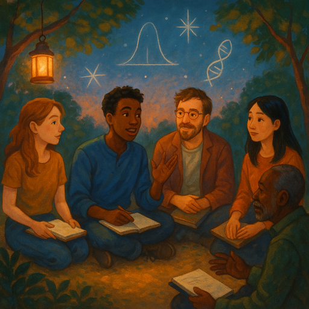

**Hintergrund:** [ACX (Astral Codex Ten)](https://www.astralcodexten.com) ist ein
Blog von Scott Alexander. Einmal im Jahr kündigt er "Meetups Everywhere" an, bei
denen Fans des Blogs zusammenkommen. Komm gerne auch, wenn du (noch) kein Fan
bist!

## Vorbereitung

Lies mindestens einen der folgenden Artikel, am besten zwei:

* [(Englisch) What Is Man, That Thou Art Mindful Of Him?](https://www.astralcodexten.com/p/what-is-man-that-thou-art-mindful)
* [(Englisch) Suddenly, Trait-Based Embryo Selection](https://www.astralcodexten.com/p/suddenly-trait-based-embryo-selection)
* [(Englisch) Bayes For Everyone](https://www.astralcodexten.com/p/bayes-for-everyone)
* [(Englisch) My Heart Of Hearts](https://www.astralcodexten.com/p/my-heart-of-hearts)

Bring schriftliche Antworten zu folgenden Fragen mit:

* Das wusste ich bereits **vorher**
* Das habe ich **nicht verstanden**
* Das möchte ich gerne **diskutieren**
* Das sind **meine Ideen** zu diesem Thema

Teilnehmende, die keine Zeit zur Vorbereitung hatten, lesen während des Treffens 
den Artikel „My Heart Of Hearts" und nehmen erst danach an einer Diskussionsgruppe teil.

## Was werden wir tun?

Wir werden uns je nach gelesenem Artikel in Diskussionsgruppen aufteilen und dann die Antworten der Teilnehmenden besprechen.

## Organisation

Du machst dir Sorgen, dass du nichts beitragen kannst? Keine Sorge! Jede*r ist willkommen!

Es gibt immer eine Mischung aus deutsch- und englischsprachigen Teilnehmer*innen, und wir gestalten die Diskussionsrunden so, dass sich alle wohlfühlen. Die Hauptsprache ist Englisch.

Dieses Meetup wird von Omar moderiert.

Es gibt Snacks und Getränke.

Nach dem Meetup gehen wir gemeinsam essen. Wer Zeit hat, ist herzlich eingeladen, mitzukommen.

<small>Auf der obigen Karte ist der Ort, an dem ihr eure Fahrräder abstellen könnt, blau markiert, und der Eingang (am Ende der Metallrampe) mit einem roten Kreuz.</small>

## Sonstiges

[Erfahre mehr über uns]().

<small>Bild generiert mit _DALL·E_.</small>
