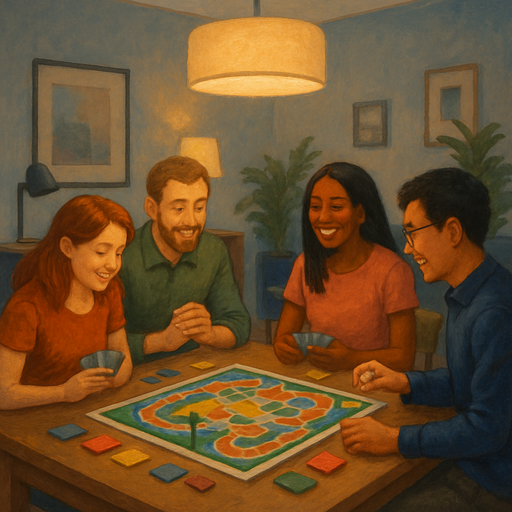

## Preparation

Bring your favorite board game if you have one! But don't worry if you don't have any games - we'll have plenty to choose from.

## What will we do?

We'll play board games! This is a relaxed social evening where we'll enjoy various board games together. Whether you prefer strategy games, party games, or cooperative games, there will be something for everyone. We'll form groups based on the number of participants and the games people bring or want to play.

This is a great opportunity to meet fellow rationality enthusiasts in a casual, fun environment while exercising strategic thinking and social skills through gaming.

## Organization

You are worried you have nothing to contribute? No worries! Everyone is
welcome!

There always is a mix of German and English speakers and we configure the
discussion rounds so that everyone feels comfortable participating. The primary
language is English.

This meetup will be hosted by Céline.

There will be snacks and drinks.

We will go and get dinner after the meetup. Anyone who has time is welcome to
join.

<small>In the above map the location where you should leave your bikes is marked
in blue and the entrance (at the end of the metal ramp) with a red cross.</small>

## Other

[Learn more about us]().

<small>Image generated with _GPT 4o_.</small>
