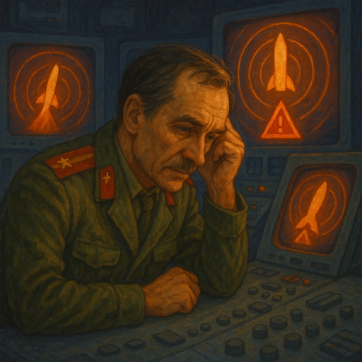

**WICHTIG:** Dies ist ein geschlossenes Treffen, das nur für Personen gedacht ist, die bereits mindestens EINE frühere Veranstaltung besucht haben. Bitte komm nicht, wenn dies nicht auf dich zutrifft! [Warum? Lies hier nach.]() Überprüfe die [Liste der Veranstaltungen](), um das nächste öffentliche Ereignis zu finden, zu dem jeder willkommen ist. Alles, was dort aufgeführt ist, steht zu 100 % allen offen.

## Vorbereitung

Lass den Gastgeber wissen, dass du teilnimmst, z.B. über Signal, falls du bereits in der Gruppenchat bist, oder per E-Mail an omar@ratfr.de.

## Was werden wir machen?

Wir werden den Petrov-Tag begehen.

Stanislaw Petrow war ein sowjetischer Militäroffizier, der am 26. September 1983 eine kritische Entscheidung traf, die möglicherweise einen Atomkrieg verhinderte. An diesem Tag erkannten die Frühwarnsysteme der Sowjetunion scheinbar einen Raketenangriff aus den Vereinigten Staaten. Trotz der Alarme und Warnungen beurteilte Petrow, dass die Berichte wahrscheinlich Fehlalarme waren und entschied sich, die Situation nicht zu eskalieren, indem er sie seinen Vorgesetzten meldete. Seine Entscheidung erwies sich später als richtig, da es sich um eine Fehlfunktion im Erkennungssystem handelte.

**Hinweis:** Nach diesem Event folgen die [Brettspiele]() um 18:00 im selben Gebäude (anderer Raum). Du bist herzlich eingeladen, an beiden Events teilzunehmen!

## Organisation

Du machst dir Sorgen, dass du nichts beitragen kannst? Keine Sorge! Jeder ist willkommen!

Es gibt immer eine Mischung aus deutschen und englischen Sprechern und wir gestalten die Gesprächsrunden so, dass sich jeder wohl dabei fühlt zu partizipieren. Die Hauptsprache ist Englisch.

Dieses Meetup wird von Omar geleitet.

Es wird Snacks und Getränke geben.

<small>In der obigen Karte ist der Ort, an dem ihr eure Fahrräder abstellen solltet, blau markiert und der Eingang (am Ende der Metallrampe) mit einem roten Kreuz.</small>

## Sonstiges

[Erfahre mehr über uns]().

<small>Bild generiert mit _GPT 4o_.</small>