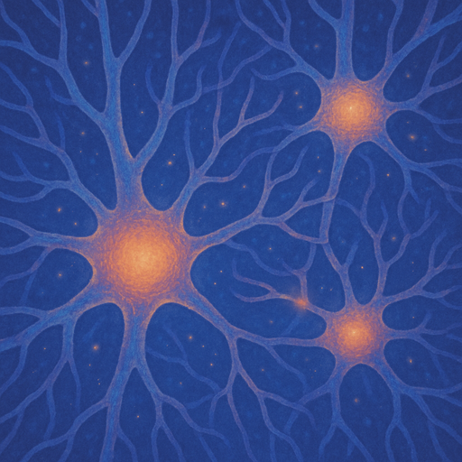

## Preparation

None.

## What will we do?

Have you ever wondered what the brain really looks like up close? In this talk, we'll explore the amazing variety of brain cells and see how their structure makes thinking, remembering, and moving possible. We'll also look at what happens when this structure is disrupted, and how that can affect the way we experience the world.

## Organization

You are worried you have nothing to contribute? No worries! Everyone is
welcome!

There always is a mix of German and English speakers and we configure the
discussion rounds so that everyone feels comfortable participating. The primary
language is English.

This meetup will be hosted by Catarina.

There will be snacks and drinks.

We will go and get dinner after the meetup. Anyone who has time is welcome to
join.

<small>In the above map the location where you should leave your bikes is marked
in blue and the entrance (at the end of the metal ramp) with a red cross.</small>

## Other

[Learn more about us]().

<small>Image generated with _AI_.</small>