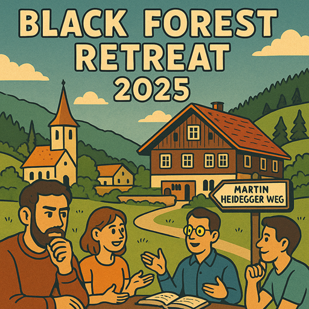

* **Registration** is required to participate! See details below. 
* The number of participants is **limited**.
* Participants are **expected to agree** with the following
  self-characterizations:
  * "I'm open to changing my mind on some of my core beliefs."
  * "I'm happy to delay saying what I think if it can help being cooperative."

## Preparation

None. If you would like to run your own session, please get in touch with Omar. 

## What will we do?

We will spend the weekend with a series of workshops, talks and social activities surrounded by the beautiful landscape of the Black Forest. The content will be participant driven in an unconference style. On Friday afternoon we put up daily planners and by Saturday morning the attendees fill them up with session ideas. Some sessions are prepared upfront, but when inspiration hits some are just made up on the spot.

Current ideas for sessions include
* Improv Theatre
* How to Achieve the Flow State
* Effectively Handling Disagreement
* Sunset Hike
* Board Games

## Organization

The venue is a charming old Black Forest mansion in Todtnauberg, over 1000 meters above sea level. It has 24 beds in total (2-5 per room), a large common room and smaller TV room to use for the workshops. For more information about the venue, check the [Scheuermatthof website](https://ferienhaus-schwarzwald-todtnauberg.de/).

We will prepare our own meals. If you are interested to help, please get in touch with Catarina. 

We will start Friday late afternoon with flexible arrival from 18:00. On Sunday, we will continue with sessions until lunch time and then start cleaning up. We have to return the keys by 18:00. 

## Do I need to bring anything?
Please bring your own bed linen (fitted sheet, duvet cover, and pillowcase) and towels, as these are not provided. Apart from this, just curiosity and good mood is needed!

## Registration
* **Costs** are estimated at 245€ per person (incl. 35€ refundable deposit) including 2 nights of accommodation and all meals, drinks and snacks. A final calculation will be made after the event and the difference will be reimbursed or paid by the participant. 
* The deposit is required by the landlord and will be refunded provided there is no damage. 
* Registration and full payment (245€) is required by **August 15th, 2025**. 
* Cancellation policy: Cancellation is free of charge, as long as a suitable replacement can be found. If no replacement can be found, we can look into it on a case-by-case basis. Note that most of the cost of the event is fixed independent of the number of participants, hence giving a full refund in case of cancellation would imply every other participant has to pay more. 
* To register, please get in touch with David or send an email to [retreat@rationality-freiburg.de](mailto:retreat@rationality-freiburg.de). 

## Other

[Learn more about us]().

<small>Image generated with _GPT 4o_.</small>