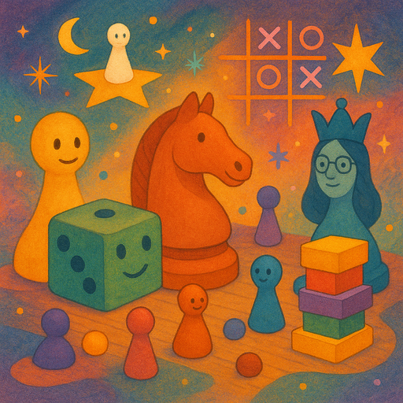

**Hinweis:** Das ursprünglich geplante Event "Die Wissenschaft der Zellkultur" wurde auf den [16. Januar 2026]() verschoben. Falls du dich auf dieses Event gefreut hast, trag dir bitte den neuen Termin im Kalender ein!

## Vorbereitung

Bring deine Lieblings-Brettspiele oder Kartenspiele mit, wenn du welche hast! Aber keine Sorge, wenn du keine hast - wir haben normalerweise genügend Spiele zur Verfügung.

## Was werden wir machen?

Wir werden Spiele spielen! Dies ist ein entspannter sozialer Abend, an dem wir gemeinsam verschiedene Brettspiele, Kartenspiele und Partyspiele genießen werden. Egal, ob du Strategiespiele, Social-Deduction-Spiele oder kooperative Spiele bevorzugst, es wird für jeden etwas dabei sein. Wir bilden Gruppen basierend auf der Teilnehmerzahl und den Spielen, die die Leute mitbringen oder spielen möchten.

Dies ist eine großartige Gelegenheit, andere Rationalitäts-Enthusiasten in einer lockeren, spaßigen Umgebung kennenzulernen und dabei strategisches Denken und soziale Fähigkeiten durch Spielen zu trainieren.

## Organisation

Du machst dir Sorgen, dass du nichts beitragen kannst? Keine Sorge! Jeder ist willkommen!

Es gibt immer eine Mischung aus deutschen und englischen Sprechern und wir gestalten die Gesprächsrunden so, dass sich jeder wohl dabei fühlt zu partizipieren. Die Hauptsprache ist Englisch.

Dieses Meetup wird von Omar geleitet.

Es wird Snacks und Getränke geben.

Wir werden nach dem Meetup gemeinsam essen gehen. Jeder, der Zeit hat, ist herzlich eingeladen mitzukommen.

<small>In der obigen Karte ist der Ort, an dem ihr eure Fahrräder abstellen solltet, blau markiert und der Eingang (am Ende der Metallrampe) mit einem roten Kreuz.</small>

## Sonstiges

[Erfahre mehr über uns]().

<small>Bild generiert mit _GPT 5.1_.</small>
