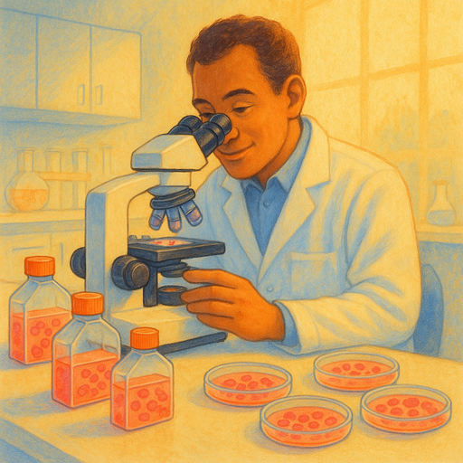

**Note:** This event was originally scheduled for November 21st, 2025 but has been postponed to January 16th, 2026.

**Looking for Digital Democracy?** The Digital Democracy event that was originally scheduled for January 16th, 2026 has been postponed to a later date. We apologize for any inconvenience.

## Preparation

None.

## What will we do?

How do scientists grow human cells outside the body, and why has this been such a game-changer for medicine? In this talk, we'll explore the fascinating principles of cell culture, from the Hayflick limit and immortal cell lines, to modern 3D culture systems. We'll also look at how researchers isolate and grow different types of cells and even keep slices of living tissue alive in the lab. Cell culture may sound technical, but it underpins some of the most important discoveries in biology and medicine. Join us for a clear and accessible introduction to how this works, why it matters, and what it means for the future of science and health.

## Organization

You are worried you have nothing to contribute? No worries! Everyone is
welcome!

There always is a mix of German and English speakers and we configure the
discussion rounds so that everyone feels comfortable participating. The primary
language is English.

This meetup will be hosted by Catarina.

There will be snacks and drinks.

We will go and get dinner after the meetup. Anyone who has time is welcome to
join.

<small>In the above map the location where you should leave your bikes is marked
in blue and the entrance (at the end of the metal ramp) with a red cross.</small>

## Other

[Learn more about us]().

<small>Image generated with _AI_.</small>